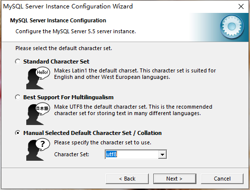
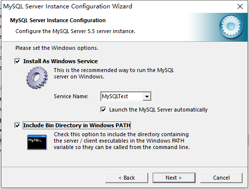
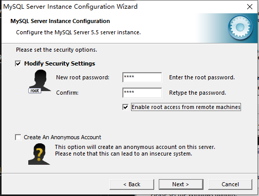
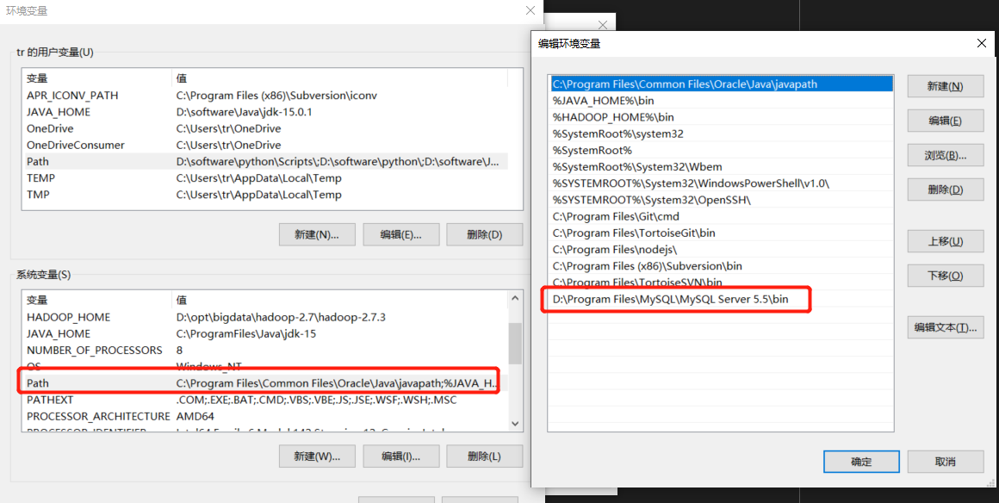
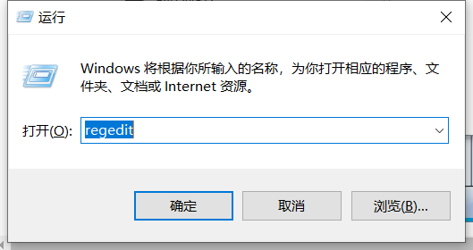
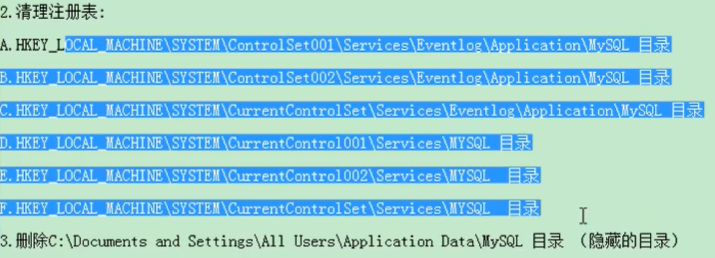

# 一、 安装

## 1.数据库的相关概念

* DB：数据库（database）：存储数据的仓库，保存一系列有组织的数据
* DBMS：数据库管理系统（数据库管理软件）常见的有：MySQL，Oracle,DB2,SqlServer
* SQL：不是特定数据库管理系统的专有语言，几乎所有的DBMD都支持SQL

## 2.数据库管理系统的安装与使用

### DBMS分为两类

* 基于共享文件系统的DBMS（Access）不需要安装两端
* 基于C/S架构的（客户机/服务端）的DBMS：如：MySQL，Oracle，SQLServer

### 服务端安装

* 下载：http://dev.mysql.com/downloads/mysql

### 配置

  

  

  

### 环境变量配置

  

### 卸载

* 控制面板 程序  中卸载程序
* 安装路径删除文件
* C盘中ProgramData的MySQL文件删除
* 清除注册表（少数情况）运行中 打开regedit
  

  

### 启动和停止

以管理员身份打开cmd：命令提示符

* net start MySQLTest(服务名称)
* net stop MySQLTest(服务名称)

### 登录

mysql -h localhost -P3306 -u root -p（参数后的空格可以省略）
