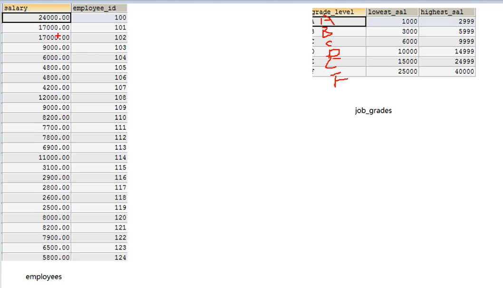
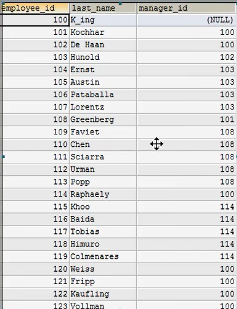
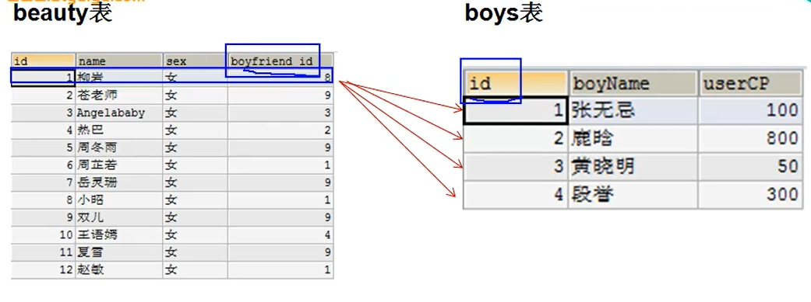
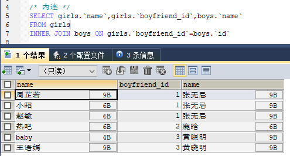
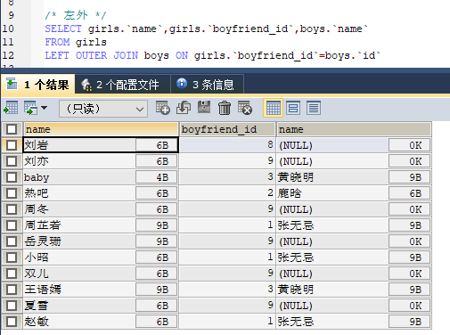
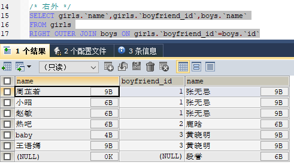
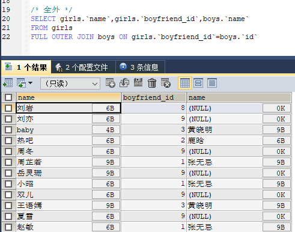
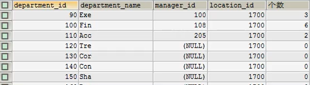
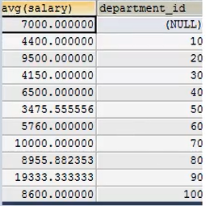
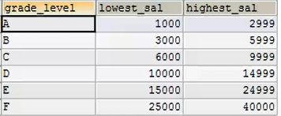

# 二、DQL语言的学习

Sqlyog中F12 可以选中代码格式化，选中代码执行部分代码

## 进阶1：基础查询

语法：SELECT 查询列表 FROM 表名;

特点：

* 查询列表可以是：表中的字段、常量值、表达式、函数
* 查询的结果是一个虚拟的表格

use myemployees;

### 1.查询表中的单个字段

SELECT name FROM employees;

### 2.查询表中的多个字段

SELECT name,salary,email FROM employees;

### 3.查询表中的所有字段

SELECT * FROM employees;

### 4.查询常量值

SELECT 100;

SELECT 'join;

### 5.查询表达式

SELECT 100%98;

### 6.查询函数

SELECT version();

### 7.起别名

* 便于理解
* 可以区分重名字段

SELECT 100%98 AS 结果;

SELECT last_name AS 姓,first_name AS 名 FROM employees;

SELECT last_name 姓,first_name 名 FROM employees;

SELECT last_name AS "out put" FROM employees;

### 8.去重

SELECT DISTINCT department_id FROM employees;

### 9.+的作用

+号只有运算符功能，而没有字符串拼接作用

* SELECT 100+90;两个操作数都是数值型 190
* SELECT '123'+100;会转换成数值型相加 223
* SELECT 'join'+90;相当于0+90 90
* SELECT null+10;只要有一方是null，结果就是null

拼接要使用CONCAT('a','b');结果ab，其中有一项为null，就返回null

## 进阶2：条件查询

语法：select 查询列表 from 表名 where 筛选条件

分类：

* 1.按条件表达式筛选 >  <  =  !=  <>  >=  <=
* 2.逻辑运算  &&  ||  !  and  or  not
* 3.模糊查询  like,between and,in,is null
  * like一般和通配符一起使用 %（任意多个字符，包含0个字符），\_任意单个字符，也可以指定转义符 WHERE name LIKE '_$_%' ESCAPE '$';($为转义符)
  * between and 两个临界值不能换序
  * in('a','b')判断某字段的值是否属于in列表中的某一项，in列表的值类型必须一致或兼容
  * is null:只能判断null值
* 4.安全等于 <=>,可以判断null值，且可以判断其他值
* 5.IFNULL(字段名，如果是null的值)

## 进阶3：排序查询

语法：select 查询列表 from 表名 【where 筛选条件】 order by 排序列表【asc|desc】

* 1、asc升序，desc降序，不写默认是升序
* 2.order by后可以是别名，可以是表达式，可以按函数（LENGTH(字段名)）
* 3.按多个字段排序select 查询列表 from 表名 【where 筛选条件】 order by 排序列表【asc|desc】，排序列表【asc|desc】;
* 一般放在查询语句最后（limit）除外

## 进阶4：常见函数

* 概念：将一组逻辑语句封装在方法体重，对外暴露方法名
* 好处：1.隐藏了实现的细节 2.提高代码的重用性
* 调用：select 函数名（实参列表） 【from 表】
* 函数可以嵌套使用

### 分类

* 单行函数，如concat、length、ifnull
  * 字符函数
  * 数学函数
  * 日期函数
  * 其他函数
  * 流程控制函数
* 分组函数：做统计使用，又称为统计函数、聚合函数

### **==1.单行函数==**

#### 1.字符函数

* length("张3"); utf-8中汉字占3个字节  10
* concat(last_name,'-',first_name); 拼接字符串
* upper()、lower()  大小写转换
* substr|substring('string',1) 截取从指定索引处后面的所有字符（索引从1开始）
* substr|substring('string',1,3) 截取从指定索引处指定字符长度的字符
* instr('String',substring) 返回substring在String中首次出现的索引，找不到返回0
* trim('String') 去除空格
* trim(a FROM 'String') 去除String中的所有a
* lpad('String',10,'*'); 用指定的字符填充String的左边，直到指定的长度
* rpad('String,10,'*');右填充
* repalce('String','n','g');String中的n换成g

#### 2.数学函数

* round() 四舍五入，如果是负数，就先对绝对值四舍五入后加上负号
* cell() 向上取整，返回大于等于该参数的最小整数
* floor() 向下取整，返回小于等于该参数的最大整数
* truncate(1.65,1) 截断，小数点后保留指定位数
* mod() 取余

#### 3.日期函数

* now() 当前系统日期+时间
* curdate() 返回当前系统的日期
* curtime() 返回系统当前的时间
* 获取指定的部分:年月日时分秒
  * year(now()) 返回年
  * month(now()) | monthname(now()) 返回月
* str_to_date('9-13-1999','%m-%d-%Y')
  

* date_format('2018/6/6','%Y年%m月%d日') :将日期转换成字符
* DATEDIFF(时间1，时间2)，计算两个日期相差多少天

#### 4.其他函数

* select version() 查看版本
* select database() 查看数据库
* select user() 查看用户

#### 5.流程控制函数

* 1.if函数 ：if else的效果 select if(10<5,'大','小');
* 2.case结构：
  * 使用一：switch case的效果：case 要判断的字段或表达式 when 常量1 then 要显示的值1或语句1;when 常量2 then 要显示的值2或语句2;...else 要显示的值n或语句n;end as 结果
  * 使用二：类似于多重if ：case when 条件1 then 要显示的值1或语句1;when 条件2 then 要显示的值2或语句2;...else 要显示的值n或语句n;end as 结果

### **==2.分组函数==**

用作统计作用，又称为聚合函数或统计函数或组函数

#### 1.简单的使用

SELECT SUM(salary) FROM employees;//所有人的工资和

SUM 求和，avg 平均值，max 最大值，min 最小值，count 计算个数（非空值有几个）

* SUM 参数数值型
* max，min，count 参数任何类型
* 所有分组函数都忽略null值
* 可以和distinct组合使用 SELECT(DISTINCT salary) FROM employees;
* count统计行数
  * SELECT COUNT(*) FROM employees;（通常使用该方式）
  * SELECT COUNT(1) FROM employees;是同样的效果，前者效率最高
  * MYISAM存储引擎下，count(*) 效率最高
  * INNODB存储引擎下，count(*)和count(1)的效率差不多，比count("字段")的效率高
* 和分组函数一同查询的字段要求是group by后的字段

## 进阶5：分组查询

语法：

```sql
SELECT [DISTINCT] 字段名 AS othername,function(字段名) AS othername,  流程控制函数 AS othername | 分组函数([DISTINCT] column) AS othername, 
FROM table 
WHERE 筛选条件
GROUP BY 分组的列表
ORDER BY 子句 【asc|desc】;
```

* 查询列表必须特殊，要求是分组函数或group by后出现的字段
* 理解的时候是：先考虑where，再考虑分组
* 分组函数做条件的一定在HAVING中，能有分组前筛选的尽量用分组前筛选（性能）
* group by 支持单个字段，函数，表达式，多个字段分组（多个字段逗号隔开，没有顺序要求）

```sql
/* 案例1：查询每个工种的最高工资 */
SELECT MAX(salary),job_id
FROM employees
GROUP BY job_id;

/* 案例2：查询每个位置上的各个部门 */
SELECT count(*) ,location_id
FROM departments
GROUP BY location_id;

/* 案例3：查询邮箱中包含a字符的，每个部门的平均工资 */
SELECT department_id,avg(salary)
FROM employees
WHERE email LIKE '%a%'
GROUP BY department_id;

/* 案例4：查询每个领导手下有奖金的员工的最高工资 */
SELECT manage_id,max(salary)
FROM employees
WHERE commission_pct IS NOT NULL
GROUP BY manage_id;

```

### 复杂的筛选条件

```sql
/* 案例1：查询那个部门的员工个数>2
1.查询每个部门的员工个数
2.根据1的结果进行筛选出》2的
*/
SELECT count(*)
FROM employees
GROUP BY department_id
HAVING count(*)>2;

/* 案例2：查询每个工种有奖金的员工的最高工资>12000的工种编号和最高工资
1.查询每个工种有奖金的员工的最高工资
2.最高工资>12000
*/
SELECT max(salary),job_id
FROM employees
WHERE commission_pct IS NOT NULL
GROUP BY job_id
HAVING max(salary)>12000

/* 案例3：查询领导编号>102的每个领导手下的最低工资>5000的领导编号是哪个
1.领导编号>102,每个领导手下的最低工资
2.查询，最低工资>500
*/

SELECT min(salary),manage_id
FROM employees
WHERE manage_id>102,
GROUP BY manage_id
HAVING min(salary)>5000;
```

### 按表达式或函数分组

```sql
/* 案例：按员工姓名的长度分组，查询每一组的员工个数，筛选出员工个数>5的有哪些
1.查询每个长度的员工个数
2.筛选出员工个数>5的
*/
SELECT count(*) c,length(name) as name_len
FROM employees
GROUP BY name_len /*length(name)*/
HAVING count(*)>5  /*c*/;

/* 案例：查询每个部门每个工种的员工的平均工资*/
SELECT avg(salary)
FROM employees
GROUP BY department_id,job_id;
```

### 添加排序

```sql
/* 案例：查询每个部门每个工种的员工的平均工资，并按照平均工资排序*/
SELECT avg(salary)
FROM employees
GROUP BY department_id,job_id
ORDER BY avg(salary) DESC;
```

## 进阶6：连接查询

又称多表查询，当查询的字段来自于多个表时

### 错误的写法

* 笛卡尔乘积现象：表1 m行，表2 n行，下面的查询结果会有m*n行

SELECT girlName,boyName FROM girls,boys;

这样类似于笛卡尔乘积，每个girl都会与每个boy有一条数据

### 正确的写法

```sql
SELECT girlName,boyName FROM girls,boys
WHERE girls.boyfriend_id = boys.id;
```

### 连接查询的分类

* 内连接
  * 等值连接
  * 非等值连接
  * 自连接
* 外连接
  * 左外连接
  * 右外连接
  * 全外连接
* 交叉连接

#### 1.等值连接

* 为表起别名，提高代码简洁度
* 注意：如果为表起了别名，原先的名字不能使用了
* 表名的顺序可以调换
* 可以加筛选
* 可以加分组
* 可以加排序

  

```sql
/* 案例 ：查询女生和对应男生名字*/
SELECT girlName,boyName 
FROM girls,boys
WHERE girls.boyfriend_id = boys.id;

/* 案例 ：查询员工名与对应的部门名*/
SELECT name,department_name
FROM employees,departments
WHERE employees.department_id = departments.id;

/* 案例 ：查询员工，工种号，工种名*/
SELECT name,employees.job_id,job_title
FROM employees,jobs
WHERE employees.job_id=jobs.job_id;
  /* 取别名以后的优化*/
  SELECT name,e.job_id,job_title
  FROM employees as e,jobs j
  WHERE e.job_id=j.job_id;
  /* 添加筛选项 */
  SELECT name,department_id,commission_pct
  FROM employees as e,jobs j
  WHERE e.job_id=j.job_id
  AND e.commission_pct IS NOT NULL;

/* 查询每个城市的部门个数 */
SELECT count(*) 个数,city
FROM departmens d,location l
WHERE d.location_id=l.loaction_id
GROUP BY city;
```

#### 2、非等值连接

  

```sql
/* 查询员工的工资和工资级别 */
SELECT salary,grade_level
FROM employees e,job_grades g
WHERE salary BETWEEN g.lowest_sal AND g.highest_sal;
```

#### 3.自连接

  

```sql
/* 查询员工名及其领导名 */
SELECT e.employee_id,e.last_name,m.employee_id,m.last_name
FROM employees e,employees m
WHERE e.manager_id = m.employee_id;
```

### sql99语法

语法：

```sql
select 查询列表
from 表1 别名 【连接类型】
join 表2 别名
on 连接条件
【where 筛选条件】
【group by 分组】
【having 筛选条件】
【order by 排序列表】
```

* 内连接  ：inner
  * 等值连接
  * 非等值连接
  * 自连接
* 外连接
  * 左外连接 ： left 【outer】
  * 右外连接 ： right 【outer】
  * 全外连接 ： full 【outer】
* 交叉连接 ：cross

#### 1.内连接

* inner可以省略

##### 1.1 等值连接(表名可以换序)

```sql
/* 案例：查询员工名，部门名 */
SELECT last_name,department_name
FROM employees e
INNER JOIN departments d
ON e.department_id = d.department_id

/* 案例：查询员工，部门名，工种名,并按部门名降序 */
SELECT last_name,department_name,job_title
FROM employees e
INNER JOIN departments d ON e.department_id = d.department_id
INNER JOIN jobs j ON e.job_id = j.job_id
ORDER BY department_name DESC;
```

##### 1.2 非等值连接

```sql
/* 查询员工的工资和工资级别 */
SELECT salary,grade_level
FROM employees e
INNER JOIN job_grades g
ON salary BETWEEN g.lowest_sal AND g.highest_sal;
```

##### 1.3 自连接

```sql
/* 查询员工名及其领导名 */
SELECT e.employee_id,e.last_name,m.employee_id,m.last_name
FROM employees e 
INNER JOIN employees m
ON e.manager_id = m.employee_id;
```

#### 2.外连接

用于查询一个表中有，一个表中没有的数据

* 外连接的查询结果为主表中的所有记录，如果从表中有匹配的值，就显示匹配的值，如果没有和他匹配的，就显示null
* 左外连接，left join 左边的是主表
* 右外连接，right join 右边的是主表
* 左外和右外交换两个表的顺序，可以实现同样的效果

==**对比案例**==

    
==**inner（都不全）**==

  

==**left outer（左全）**==
   

==**right outer（右全）**==

  

==**full outer（左右都全）**==

  
  

```sql
/* 查询男朋友不在boys表中的女生 */
SELECT girls.name,boys.*
FROM grils
LEFT OUTER JOIN boys
ON girls.boyfriend_id=boys.id
WHERE boys.id IS NULL
```

#### 3.交叉连接

实现笛卡尔乘积

```sql
SELECT g.*,b.*
FROM girls g
CROSS JOIN boys b;
```

## 进阶7：子查询

出现在其他语句中的select语句，称为子查询或内查询

分类：

* 按子查询出现的位置
  * select后面
    * 仅仅支持 标量子查询
  * from后面
    * 支持表子查询
  * where或having后面
    * 标量子查询
    * 列子查询
    * 行子查询
  * exists后面（相关子查询）
    * 表子查询
* 按结果集的行列数不同分
  * 标量子查询（结果集中只有一列一行）
  * 列子查询（结果集中只有一列多行）
  * 行子查询（结果集中有一行多列）
  * 表子查询（结果集一般为多行多列）

### 1. 标量子查询（查询出的数据只有一列一行）

单行比较操作符  > < >= <= <> = 之类的

==**where或having后面**==

```sql
/* 案例:谁的工资比Abel高 */
SELECT *
FROM employees
WHERE salary>(
  SELECT salary
  FROM employees
  WHERE last_name='Abel'
)
```

==**select后面**== 仅仅支持 标量子查询

```sql
/* 查询每个部门的员工个数 */
SELECT d.*,(
  SELECT count(*)
  FROM employee e
  WHERE e.departmen_id = d.department_id
) 个数
FROM departments d
```

  

### 2.列子查询(查询出的数据有一列多行)

==**where或having后面**==

多行比较操作符

* IN/NOT IN：等于列表中的任意一个
* ANY|SOME :和子查询返回的某一个值比较
* ALL ： 和子查询返回的所有值比较

几个相互替换

* IN 与 =ANY
* NOT IN 与 <>ALL

### 3.行子查询（结果集中有一行多列）

==**where或having后面**==

```sql
/* 查询员工编号最小且工资最高的员工信息 */
SELECT *
FROM employees
WHERE (employee_id,salary)=(
  SELECT MIN(employee_id),MAX(salary)
  FROM employees
)
```

### 4.表子查询

==**from后面**== 支持表子查询:将子查询结果充当一张表，要求必须起别名

```sql
/* 查询每个部门的平均工资拿的工资等级 */
/* ①查询每个部门的平均工资 */
SELECT avg(salary),department_id
FROM employees
GROUP BY department_id;

SELECT * FROM job_grades;
```

    

```sql
/* ② 连接1的结果集与job_grades表，筛选条件平均工资 */
SELECT res.*, j.grade_level
FROM (SELECT avg(salary) ag,department_id
FROM employees
GROUP BY department_id) res
LEFT OUTER JOIN job_grades j
ON res.ag BETWEEN j.lowest_sal AND j.highest_sal
```

### 5.EXIST

语法：

```sql
exists (完整的查询语句)
结果：1或者0
```

```sql
/* 案例：查询有员工的部门名 */
SELECT department_name
FROM departments d
WHERE EXISTS(
  SELECT *
  FROM employees e
  WHERE d.department_id = e.department_id
)
```

## 进阶8 分页查询

语法：

```sql
select 查询列表
···
limit [offset,]size;
```

offset通常为(page-1)*size，默认是从0开始

## 进阶9 联合查询

将多条查询语句的结果合并成一个结果

语法：

```sql
查询语句1
UNION
查询语句2
UNION
查询语句3
```

要求：

* 1.多条语句的查询列数一致
* 2.多条语句的查询含义以及顺序一致
* 3.会自动去重（UNION ALL 不会去重）

```sql
/* 案例：查询部门编号＞90或者邮箱包含a的员工信息 */
SELECT * FROM employees WHERE email LIKE '%a%'
UNION
SELECT * FROM employees WHERE department_id>90;
```
