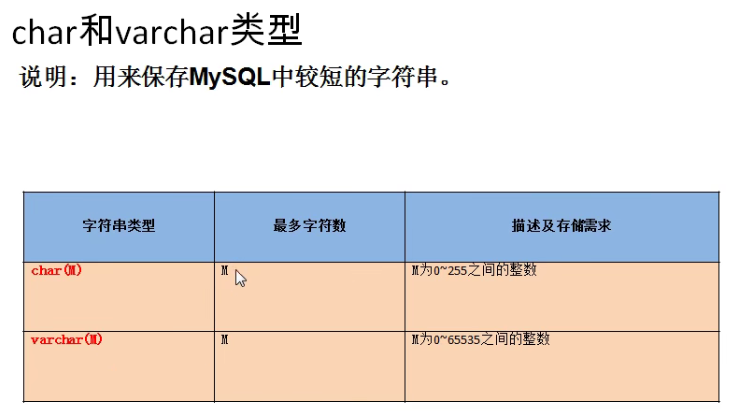

# DDL语言（数据定义语言，库和表的管理）

## 1.库的管理

### 1.1 库的创建

create database if not exists 库名;

### 1.2 库的修改

改库名：rename database 库名 to 新库名;

改字符集：alert database 库名 character set 字符集;

### 1.3 库的删除

drop database if exists 库名;

## 2.表的管理

查看表结构的详细信息: desc table_name

### 2.1 表的创建

```sql
CREATE TABLE 表名(
    列名 列的类型【（长度）约束】,
  
)

/* 举例 */
CREATE TABLE book(
    id INT,#编号
    bName VARCHAR(20),#书名的最大长度
    price DOUBLE,#价格
    authorId INT,#作者
    publishdate DATETIME,#出版时间
)
```

### 2.2 表的修改

* 修改列名
ALTER TABLE book CHANGE COLUMN publishdate pubDate DATETIME;
* 修改列的类型和约束
ALTER TABLE book MODIFY COLUMN pubdate TIMESTAMP;
* 添加新列
ALTER TABLE book ADD COLUMN annual DOUBLE;
* 删除列
ALTER TABLE book DROP COLUMN annual;
* 修改表名
ALTER TABLE book RENAME TO books;

### 2.3 表的删除

DROP TABLE IF EXISTS 表名;

SHOW TABLES;

通用的写法：

DROP DATABASE IF EXISTS 旧库名;
CREATE DATABASE 新库名;
DROP TABLE IF EXISTS 旧表名;
CREATE TABLE 新表名;

### 2.4 表的复制

```sql
INSERT INTO author VALUES
(1,'莫言','中国'),
(2,'金庸','中国'),
(3,'冯唐','中国'),
```

* 仅仅复制表的结构

```sql
CREATE TABLE copy LIKE author;
```

* 复制表的结构+数据

```sql
CREATE TABLE copy2
SELECT * FROM author;
```

* 只复制部分数据

```sql
CREATE TABLE copy3
SELECT id,au_name
FROM author
WHERE nation='中国'
```

* 仅仅复制某些字段且没有数据

```sql
CREATE TABLE copy4
SELECT id,au_name
FROM author
WHERE 0;
```

## 3.常见的数据类型

* 数值型
  * 整型
  * 小数
    * 定点数
    * 浮点数
* 字符型
  * 较短的文本:char、varchar
  * 较长的文本：text、blob（较长的二进制数据）
* 日期型

### 3.1 整型

  

==**特点**==

1. 如果不设置，默认是有符号，如果想设置无符号，需要加 UNSIGNED 关键字
2. 如果插入的数值超出了范围，会报异常，且插入的是临界值
3. 如果不设置长度，无符号的默认是10位，有符号的默认11位。
4. 长度代表了显示的最大宽度，如果不够，会用0在左边填充，需要搭配zerofill使用，且会变为无符号的整型。

* 如何设置无符号和有符号

```sql
CREATE TABLE tab_int(
    t1 INT,
    t2 INT UNSIGNED
)
```

### 3.2 小数

  

* 浮点型 float(M,D),double(M,D)

特点：

1. （M,D）可以省略,D代表小数点后的位数，超出的话会四舍五入，M代表 整数部分+小数部分的最大长度，超出会插入临界值
2. 如果是decimal，（M,D）默认是（10,0）
3. 定点型的精确度较高，如果要求插入的数值的精确度高，如货币运算等则考虑使用

### 3.3 字符型

  

* char是固定长度M的字符，varchar是可变长度的字符，最大长度是M
* 存储的数据是固定的，如性别，用char，存储姓名等长度不固定的字符用varchar

### 3.4 二进制字符串类型

binary 和varbinary

### 3.5 枚举类型

Enum

```sql
CREATE TABLE tab_char(
  cl ENUM('a','b','c')
);
INSERT INTO tab_char VALUES('a');
```

### 3.6 Set 集合类型

```sql
CREATE TABLE tab_set(
  cl SET('a','b','c')
);
INSERT INTO tab_set VALUES('a','b');
```

### 3.7 日期类型

  

* datetime 8个字节  1000-9999 不受时区影响
* timestamp 4个字节  1970-2038  受时区影响

-----------

* 对于TIMESTAMP，它把客户端插入的时间从当前时区转化为UTC（世界标准时间）进行存储。查询时，将其又转化为客户端当前时区进行返回。
* 而对于DATETIME，不做任何改变，基本上是原样输入和输出。

-----------

* 查看时区 SHOW VARIABES LIKE 'time_zone';
* 修改时区 time_zone='+9:00';

## 4.约束

1. 非空约束 NOT NULL
2. 默认约束 DEFAULT
3. 主键约束 PRIMARY KEY （非空且唯一）
4. 唯一约束 UNIQUE （唯一但可空）
5. 检查约束 CHECK（mysql中不支持）
6. 外键约束 REFERENCES (FOREIGN KEY REFERENCES)：用于限制两个表的关系，用于保证该字段的值必须来自于主表的关联列的值

* 约束的分类
  1. 列级约束（六大语法上都支持，但外键约束没有效果）
  2. 表级约束（除了非空、默认，其他的都支持）

  

* 主键和唯一的对比
  * 一个表中只能有一个主键，可以有多个唯一键
  * 可以组合主键 PRIMARY(id,name);实际上还是一个主键
  * 唯一键也可以组合 UNIQUE(name,seat);
  * 唯一键的值除去null以外的值不能重复。
* 外键
  * 要求在从表设置外键关系
  * 从表的外键列的类型和主表的关联列的类型要求一致或兼容，名称无要求
  * 主表的关联列必须是一个key（一般是主键或唯一）
  * 插入数据时，先插入主表，再插入从表，删除数据时，反过来

语法

```sql
CREATE TABLE 表名(
  字段名 字段类型 列级约束，
  表级约束
)
```

### 4.1 创建表时添加约束

#### 4.1.1 添加列级约束

```sql
CREATE TABLE stuinfo(
  id INT PRIMARY KEY,# 主键
  stuName VARCHAR(20) NOT NULL,# 非空
  gender CHAR(1) CHECK(gender='男' OR gender='女'),# 检查
  seat INT UNIQUE,# 唯一
  age INT DEFAULT 18,# 默认
  majorId INT REFERENCES major(id), # 外键(Oracle,SQL Server)
);
```

* 查看stuinfo中的所有索引，包括主键、外键、唯一
* SHOW INDEX FROM stuinfo;

#### 4.1.2 添加表级约束

语法：

```sql
在各个字段的最下面
【CONSTRAINT 约束名】 约束类型（字段名）
```

例子：

```sql
CREATE TABLE stuinfo(
  id INT PRIMARY KEY,# 主键
  stuName VARCHAR(20) NOT NULL,# 非空
  gender CHAR(1) CHECK(gender='男' OR gender='女'),# 检查
  seat INT UNIQUE,# 唯一
  age INT DEFAULT 18,# 默认
  majorId INT REFERENCES major(id), # 外键(Oracle,SQL Server)
  Foreign Key (majorId) references major(id), # 外键(MySQL)
  
  CONSTRAINT pk PRIMARY KEY(id),#主键
  CONSTRAINT uq UNIQUE(seat),#唯一键
  CONSTRAINT ck CHECK(gender='男' OR gender='女'),# 检查
  CONSTRAINT fk_stuinfo_major Foreign Key (majorId) references major(id), # 外键(MySQL)
);
SHOW INDEX FROM stuinfo; 
```

### 4.2 修改表时添加约束

1. 添加非空约束
ALTER TABLE stuinfo MODIFY COLUMN stuname VARCHAR(20) NOT NULL;
2. 添加默认约束
ALTER TABLE stuinfo MODIFY COLUMN age INT DEFUALT 18;
3. 添加主键
ALTER TABLE stuinfo MODIFY COLUMN id INT PRIMARY KEY;
4. 添加唯一
ALTER TABLE stuinfo MODIFY COLUMN seat INT UNIQUE;

ALTER TABLE stuinfo ADD UNIQUE(seat);
5. 添加外键
ALTER TABLE stuinfo ADD CONSTRAINT fk_stuinfo_major FOREIGN KEY(majorid) REFERENCES major(id);

### 4.3 修改表时删除约束

1. 添加非空约束
ALTER TABLE stuinfo MODIFY COLUMN stuname VARCHAR(20) NULL;
2. 添加默认约束
ALTER TABLE stuinfo MODIFY COLUMN age INT ;
3. 添加主键
ALTER TABLE stuinfo DROP PRIMARY KEY;
4. 添加唯一
ALTER TABLE stuinfo DROP INDEX seat;
5. 删除外键
ALTER TABLE stuinfo DROP FOREIGN KEY majorid;

SHOW INDEX FROM stuinfo;

## 5.标识列

* 又称自增长列
* 标识列需要与key搭配使用，但不一定是主键
* 一个表至多有一个标识列
* 标识列的类型只能是 数值型

### 5.1 创建表时设置标识列

* 设置：id INT PRIMARY KEY AUTO_INCREMENT;
* 查看自增长相关的变量：SHOW VARIABLES LIKE '%auto_increment%';
  
  * auto_increment_increment 步长
  * auto_increment_offset 起始值
  * SET auto_increment_increment=3;(修改步长)

### 5.2 修改表时设置标识列

ALTER TABLE tab_identity MODIFY COLUMN id INT PRIMARY KEY AUTO_INCREMENT;

### 5.3 修改表时删除标识列

ALTER TABLE tab_identity MODIFY COLUMN id INT;
