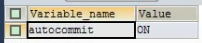
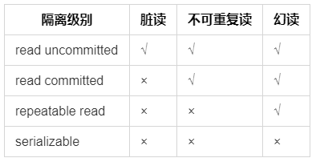

# TCL 语言

## 1.TCL语言 概念

事务控制语言

### 事务

一个或一组sql语句组成一个执行单元，这个执行单元要么全部执行，要么全部不执行

### 存储引擎

* 通过show engines 查看引擎
* 其中 innodb支持事务，而myisam，memory等不支持

### 事务的属性(ACID)

* 原子性（Atomicity）
原子性是指事务是一个不可分割的工作单位，要么都发生，要么都不发生

* 一致性 （Consistency）
事务必须使数据库从一个一致性状态变换到另外一个一致性状态

* 隔离性
事务的隔离性是指一个事务的执行不能被其他事务干扰，即一个事务内部的操作及使用的数据对并发的其他事务是隔离的，并发执行的各个事务之间不能互相干扰。

* 持久性
指一个事务一旦被提交，它对数据库中的改变就是永久的。

## 2.事务的创建

* 隐式事务：事务没有明显的开启和结束的标记，如insert，update，delete

SHOW VARIABLES LIKE 'autocommit';

  

意味着：默认自动提交是开启的。

* 显示事务：事务具有明显的开启和结束的标记
前提：必须先设置自动提交功能为禁用

* 步骤：
  * 步骤1：开启事务set autocommit=0;start transaction;(可选的)
  * 步骤2：编写事务中的sql语句（select insert update delete）
  * 步骤3：结束事务 commit;(提交事务）   rollback;（回滚事务）

## 3. 事务的隔离级别

  

* 脏读：读取的是另一个事务修改后但是没有提交的假数据
* 不可重复读：在一个事务中，两次读到的数据是不一致的（两次读的中间间隔时，另一个事务修改并提交了数据）
* 幻读：（针对插入的）在一个事务执行过程中间，另一个事务插入了一条数据，并且提交了事务。那么事务1读取的本来是两条，但是update的时候改变了3条数据，就是出现了幻读。

注意：

* mysql中默认 第三个隔离级别 repeatable read
* oracle中默认第二个隔离级别 read committed

设置：

* 查看隔离级别 select @@tx——isolation
* 设置隔离级别 set session|global transaction isolation level 隔离级别

## 4.演示

### 4.1 演示事务的使用步骤

```sql
/* 开启事务 */
SET autocommit=0;
START TRANSACTION;
/* 编写一组事务语句 */
UPDATE account SET balance=1000 WHERE username='张';
UPDATE account SET balance=1000 WHERE username='赵';
/* 结束事务(回滚)*/
ROLLBACK;
/* commit; 结束事务(提交)*/
```

### 4.2 演示delete和truncate在事务使用时的区别

* 演示delete（支持回滚）

```sql
SET autocommit=0;
START TRANSACTION;
DELETE FROM account;
ROLLBACK;
/* 数据还在，成功回滚*/
```

* 演示truncate（不支持回滚）

```sql
SET autocommit=0;
START TRANSACTION;
TRUNCATE TABLE account;
ROLLBACK;
/* 数据不在了，成功回滚*/
```

### 4.3 演示savepoint的使用

```sql
SET autocommit=0;
START TRANSACTION;
DELETE FROM account where id=25;
SAVEPOINT a;# 设置保存点
DELETE FROM account where id=28;
ROLLBACK TO a;#回滚到a点
```
