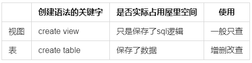

# 视图

## 1.视图的概念

含义：虚拟表，和普通表一样使用

  

## 2.创建视图

```sql
create view 视图名
as
查询语句;

SELECT * FROM 视图名 WHERE lastname LIKE '%a%';
```

## 3.修改视图

```sql
/*方法1：*/
CREATE OR REPLACE VIEW 视图名
as
查询语句;
/*方法2：*/
ALTER VIEW 视图名
as
查询语句;
```

## 4.删除视图

```sql
DROP VIEW 视图1，视图2;
```

## 5.查看视图

```sql
/*方法1：*/
DESC 视图名;

/*方法2：*/
SHOW CREATE VIEW 视图名;
```

## 6.视图的更新

* 简单时可更新视图中的数据，且原始表也更新了，更新操作有插入、修改、删除
* 具备以下特点的视图不允许更新
  * 包含以下关键字的sql语句：分组函数、distinct、group by、having、union或者union all
  * 常量视图
  * select中包含子查询
  * join 可以update，不能insert
  * from一个不能更新的视图(FROM 一个视图，且该视图是不能更新的)
  * where子句中的子查询引用了from子句中的表
