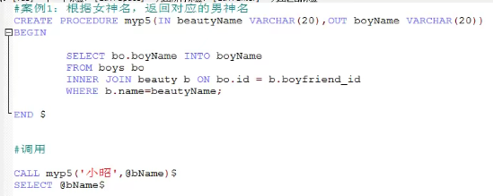
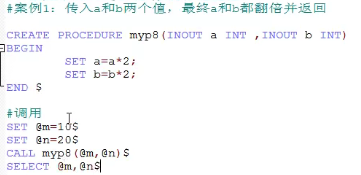

# 存储过程和函数

存储过程和函数：类似于java中的方法

好处：

* 提高代码的重用性
* 简化操作

## 1.存储过程

含义：一组预先编译好的SQL语句的集合，理解成批处理语句。

* 提高代码的重用性
* 简化操作
* 减少编译次数，减少了与服务器的连接次数

### 1.1 创建语法

```sql
CREATE PROCEDURE 存储过程名（参数列表）
BEGIN
    存储过程体（一组合法的SQL语句）
END
```

注意：

* 参数列表包含三部分：参数模式  参数名  参数类型。例如：IN stuname VARHAR(20);其中 参数模式包括
  * IN：该参数可以作为输入，也就是该参数需要调用方传入值
  * OUT：该参数可以作为输出，也就是该参数可以作为返回值
  * INOUT该参数既可以作为输入又可以作为输出，也就是该参数既需要传入值，又可以返回值
* 如果存储过程体仅仅只有一句话，BEGIN END可以省略。
存储过程体重的每条SQL语句的结尾要求必须加分号。存储过程的结尾可以使用DELIMITER 重新设置。（SELIMITER 结束标记）

### 1.2 调用语法

```sql
CALL 存储过程名（实参列表）;
```

### 1.3 举例

1. 无参数
  
    红色框中的需要在命令提示符的运行框中执行。

2. 创建带in模式参数的存储过程
  
  

3. 创建带out模式参数的存储过程
  
  

4. 创建带inout模式参数的存储过程
  

### 1.4 存储过程的删除

DROP PROCEDURE 名称;

DROP PROCEDURE p2,p3;//×错误写法

### 1.5 查看存储过程的信息

SHOW CREATE PROCEDURE p1;

## 2.函数

含义：一组预先编译好的SQL语句的集合，理解成批处理语句。

* 提高代码的重用性
* 简化操作
* 减少编译次数，减少了与服务器的连接次数

区别：

* 存储过程：可以有0个返回，也可以有多个返回，适合做批量插入、批量更新
* 函数：有且只有一个返回，适合做处理数据后返回一个结果

### 2.1 创建语法

```sql
CREATE FUNCTION 函数名（参数列表） RETURNS 返回类型
BEGIN
  函数体
END
```

注意：

1. 其中参数列表：参数名 参数类型
2. 函数体中肯定会有return语句，如果没有回报错，且建议放在最后
3. 函数体中只有一句话时，则可以省略BEGIN END
4. 使用 delimiter 语句设置结束标记  delimiter $

### 2.2 调用函数

SELECT 函数名（参数列表）

1. 无参有返回
  

2. 有参有返回
  
  

### 2.3 查看函数

SHOW CREATE FUNCTION 函数名;

可视化查询所有的FUNCTION和PROCDURE：
系统库中->mysql->proc->右键打开表

### 2.4 删除函数

DROP FUNCTION 函数名;
