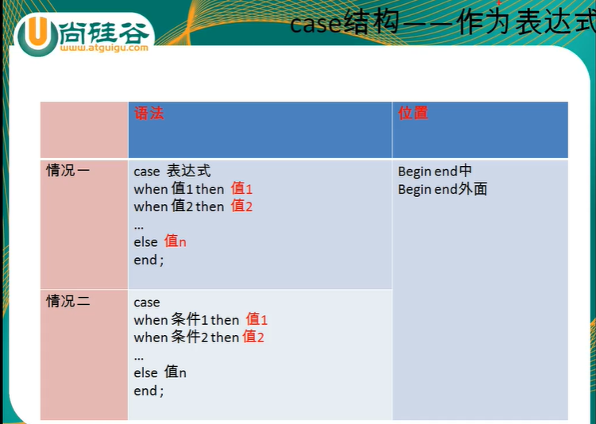
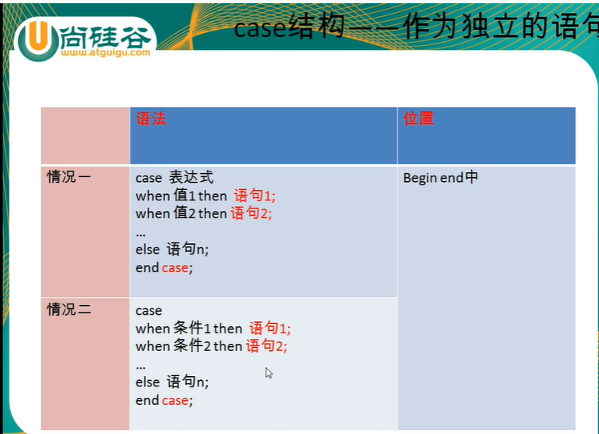
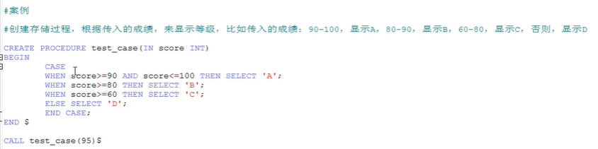
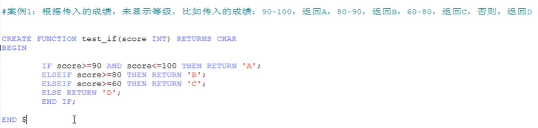

# 流程控制结构

* 顺序结构：程序从上往下依次执行
* 分支结构：程序从两条或者多条路径中选择一条去执行
* 循环结构：程序在满足一定条件的基础上，重复执行一段代码

## 1.分支结构

### 1.1 if函数

if（表达式1，表达式2，表达式3）

* 执行顺序：如果表达式1成立，则if函数返回表达式2的值，否则返回表达式3的值
* 应用：任何地方

### 1.2 case结构

* 情况1：类似于java中的switch语句，实现等值判断

* 情况2：类似于java中的多重if语句，一般用于实现区间判断

特点：

* 作为表达式，嵌套在其他语句中使用，可以放在任何地方，且end后不加case。
  

* 可以作为独立的语句去使用，只能放在BEGIN END中，且end后需要加case
  

* 如果WHEN中的值或者条件成立，则执行对应的THEN后面的语句，并且结束CASE
* ELSE可以省略，如果ELSE省略了，且前面的条件都不满足，则返回null

  

### 1.3 if结构

```sql
IF 条件1 THEN 语句1;
ELSEIF 条件2 THEN 语句2;
···
END IF;
```

应用场合：只能在BEGIN END中

  

## 2.循环结构

* 分类：while loop repeat
* 循环控制：iterate（类似于continue）  leave（类似于break）

```sql
/* 1.while */
【标签：】 while 循环条件 do
    循环体;
end while 【标签】;

/* 2.loop(可以模拟简单的死循环) */
【标签：】 loop
    循环体;
 end loop 【标签】;

/* 3.repeat */
【标签：】 repeat
    循环体;
 until 结束循环的条件
 end repeat 【标签】;
```
