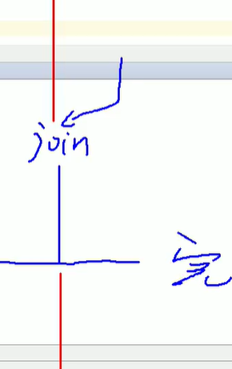
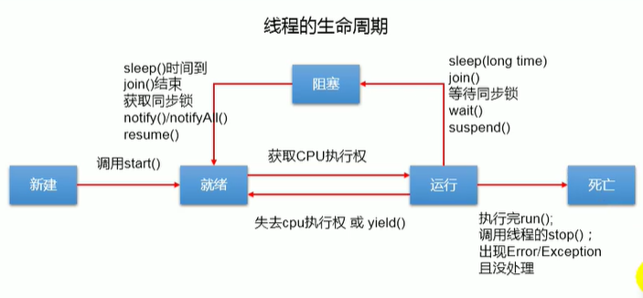
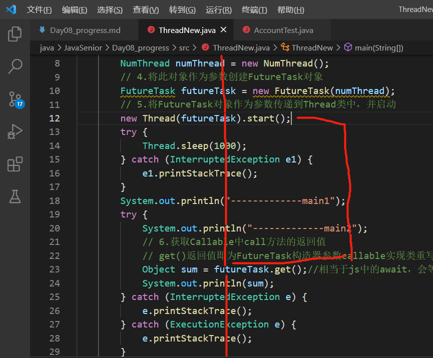

# 程序、进程、线程

## 1. 基本概念：程序、进程、线程

### 1.1程序

是为了完成特定任务，用某种语言编写的一组指令的合计，即一段静态的代码，静态对象。

### 1.2进程

是程序的一次执行过程，或是正在运行的一个程序，是一个动态的过程，有它自身的产生、存在和消亡的过程-----生命周期。

* 进程作为资源分配的单位，系统在运行时会为每个进程分配不同的内存区域。

### 1.3线程

进程可进一步细化为线程，是一个程序内部的一条执行路径。

* 若一个进程同一时间并行执行多个线程，就是支持多线程的，
* 线程作为调度和执行的单位，每个线程拥有独立的运行栈和程序计数器，线程切换的开销小
* 一个进程中的多个线程共享 堆和方法区

### 1.4 单核cpu和多核cpu的理解

* 一个java应用程序java.exe，其实至少有三个线程：main()主线程，gc()垃圾回收线程，异常处理线程

### 1.5并行与并发

* 并行：多个cpu同事执行多个任务，多个人同时做不同的事
* 并发：一个cpu（采用时间片）同时执行多个任务。比如：秒杀

### 1.6使用多线程的优点

* 提高应用的响应。对图形化界面更有意义，课增强用户的体验
* 提高计算机的系统cpu的利用率
* 改善程序结构，将既长又复杂的进程分为多个线程，独立运行，利于理解和修改

## 2. 线程的创建和使用

### 2.1创建方式1

``` java
public class ThreadTest {
    public static void main(String[] args) {
        // 3.创建Thread子类的对象
        MyThread myThread = new MyThread();
        // 4.通过此对象调用start()
        myThread.start();

        System.out.println("hello");
    }
}

// 1.创建一个继承Thread的子类
class MyThread extends Thread {
    // 2.重写Thread类的run()方法
    @Override
    public void run() {
        for (int i = 0; i < 100; i++) {
            if (i % 2 == 0) {
                System.out.println(Thread.currentThread().getName()+":"+ i);
            }
        }
    }
}
```

### 2.2创建方式2

``` java
// 创建Thread类的匿名子类的方式
new Thread(){
    public void run(){
        // todo1
    }
}.start();

new Thread(){
    public void run(){
        // todo2
    }
}.start();
```

### 2.3注意

* 如果直接执行myThread.run()，不会报错，但是仍然在主线程中执行，不会在另一个线程中执行
* Thread.currentThread().getName()获取当前线程的名称
* myThread.start()不能调用两次，即线程不能启动两次。需要再new一个线程去start

### 2.4 Thread的常用方法

* start()启动当前线程，调用当前线程的run()
* run()通常需要重写Thread类中的此方法，将创建的线程要执行的操作声明在此方法中
* currentThread()静态方法，返回执行当前代码的线程
* getName()获取当前线程的名字
* setName()设置当前线程的名字
* yield() 释放当前cpu的执行权（在run中使用this.yield()）----==**不释放锁**==
* join() 在线程a中调用线程b的join()，此时线程a就进入阻塞状态，直到线程b执行完成后，线程a才结束阻塞状态，等待cpu的分配
  

* sleep(long millitime) 让当前线程阻塞指定的时间，结束后等待cpu分配资源后继续执行
* isAlive() 判断该线程是否还存活

``` java
public class ThreadTest {
    public static void main(String[] args) {
        Thread.currentThread().setName("主线程");//修改main线程的名称
        System.out.println(Thread.currentThread().getName());//输出 主线程
        
        // 修改线程名称方法1
        MyThread myThread = new MyThread();
        myThread.setName("线程一");//修改myThread线程的名称
        myThread.start();

        // 修改线程名称方法2
        MyThread myThread = new MyThread2("线程二");
        myThread.start();

        for(int i=0;i<100;i++){
            if(i==20){
                try{
                    myThread.join();//等待myThread进程执行完再继续执行
                }catch(InterruptedException e){
                    e.printStackTrace();
                }
                
            }
        }
        System.out.println(myThread.isAlive());

    }
}

class MyThread extends Thread {
    @Override
    public void run() {
        System.out.println(Thread.currentThread().getName()+"执行");
        this.yield();
    }
}

class MyThread2 extends Thread {
    @Override
    public void run() {
        System.out.println(Thread.currentThread().getName()+"执行");

        try{
            sleep(millis:1000);
        }catch(InterruptedException){
            e.printStackTrace();
        }
    }
    public MyThread2(String name){
        super(name);
    }
}
```

### 2.5线程的调度

* 调度策略
  * 时间片
    
  * 抢占式：高优先级的线程抢占cpu
* 调度方法
  * 同优先级线程组成先进先出队列，使用时间片策略
  * 对高优先级，使用优先调度的抢占式策略
* 线程的优先级
  * MAX_PRIORITY；10
  * MIN_PRIORITY：1
  * NORM_PRIORITY：5
* 涉及的方法
  * getPriority() 获取线程的优先级
  * setPriority(int p) 设置线程的优先级
  说明：高优先级的线程要抢占低优先级线程cpu的执行权，但是只是从概率上讲，高优先级的线程高概率的情况下被执行，并不意味着只有当高优先级的线程执行完以后，低优先级的线程才执行。

### 2.6 买票模拟

```java
public class TicketsTest {
    public static void main(String[] args) {
        Window window1 = new Window();
        Window window2 = new Window();
        Window window3 = new Window();
        window1.setName("窗口1");
        window2.setName("窗口2");
        window3.setName("窗口3");
        window1.start();
        window2.start();
        window3.start();
    }
}

class Window extends Thread {
    private static int ticket = 100;

    @Override
    public void run() {
        while (ticket > 0) {
            System.out.println(getName() + ":票号为：" + ticket);
            ticket--;
        }
    }
}
```

### 2.7多线程的创建3

```java
public class ThreadTest1 {
    public static void main(String[] args) {
        // 3.创建实现类的对象
        MThread mThread=new MThread();
        // 4.将此对象作为参数传递到Thread类的构造器中，创建Thread类的对象
        Thread thread = new Thread(mThread);
        // 5.通过Thread的对象调用start方法
        thread.start();

        Thread thread2 = new Thread(mThread);
        thread2.setName("线程2");
        thread2.start();
    }
}

// 1.创建一个实现了Runnable接口的类
class MThread implements Runnable{

    // 2.实现类去实现Runnable中的抽象方法：run()
    @Override
    public void run() {
        for (int i = 0; i < 100; i++) {
           System.out.println(i);
        }

    }
}
```

### 3.8买票模拟2

```java
public class TicketsTest2 {
    public static void main(String[] args) {
        Window1 w = new Window1();//因为只new了一个Window1，所以仍然是共用同一个ticket
        Thread t1=new Thread(w);
        Thread t2=new Thread(w);
        Thread t3=new Thread(w);
        t1.setName("窗口1");
        t2.setName("窗口2");
        t3.setName("窗口3");
        t1.start();
        t2.start();
        t3.start();
    }
}
class Window1 implements Runnable{
    private int ticket=100;
    @Override
    public void run() {
    while(ticket>0){
            System.out.println(Thread.currentThread().getName()+":票号 "+ticket);
            ticket--;
        }
    }
}
```

### 2.9 买票模拟的两种方式比较

* 开发中：优先选择：实现Runnable接口的方式
* 原因：
  1. 实现的方式没有类的单继承性的局限性
  2. 实现的方式更适合来处理多个线程有共享数据的情况。
* 联系：public class Thread implements Runnable
* 相同点：两种方式都需要重写run方法，将线程要执行逻辑声明在run方法中

### 2.10 难点

```java

interface A{
    public void run();
}

class B1 implements A{

    private A target;

    @Override
    public void run() {
        if (target != null) {
            target.run();
        }
    }

    public B1(A a){
        this.target=a;
    }
}

class B2 implements A{

    @Override
    public void run() {
        System.out.println("B2");
    }

}
```

## 3. 线程的生命周期

  

## 4. 线程的同步

### 4.1 线程的安全问题如何解决

当线程a操作车票的过程中，其他线程不能参与进来，直到线程a操作完成时，线程才可以开始操作ticket，这种情况即使线程a出现了阻塞，也不能被改变。

### 4.2 同步机制解决线程的安全问题

#### 方式一：同步代码块

说明：

1. 操作共享数据的代码，即为需要被同步的代码。
2. 同步监视器：俗称锁，任何一个类的对象都可充当锁。要求：多个线程必须要共用同一把锁。

* ==**1.针对继承Thread**==

在继承Thread类创建多线程的方式中，慎用this充当同步监视器
可以考虑当前类充当监视器

```java
import static java.lang.Thread.sleep;

public class TicketTest4 {
    public static void main(String[] args) {
        Window4 t1 = new Window4();
        Window4 t2 = new Window4();
        Window4 t3 = new Window4();
        t1.setName("窗口1");
        t2.setName("窗口2");
        t3.setName("窗口3");
        t1.start();
        t2.start();
        t3.start();
    }
}

class Window4 extends Thread {
    private static int ticket = 100;
    private static Object obj = new Object();
    @Override
    public void run() {
        while (true) {
            synchronized (Window4.class){//类也是对象   synchronized (obj){
                if (ticket > 0) {
                    try {
                        sleep(100);
                    } catch (InterruptedException e) {
                        e.printStackTrace();
                    }
                    System.out.println(Thread.currentThread().getName() + ":票号 " + ticket);
                    ticket--;
                } else {
                    break;
                }
            }

        }
    }
}
```

* ==**2.针对实现Runnable**==

```java
import static java.lang.Thread.sleep;

public class TicketTest3 {
    public static void main(String[] args) {
        Window3 w = new Window3();//因为只new了一个Window3，所以仍然是共用同一个ticket
        Thread t1 = new Thread(w);
        Thread t2 = new Thread(w);
        Thread t3 = new Thread(w);
        t1.setName("窗口1");
        t2.setName("窗口2");
        t3.setName("窗口3");
        t1.start();
        t2.start();
        t3.start();
    }
} 

class Window3 implements Runnable {
    private int ticket = 100;
    private Object obj = new Object();
    @Override
    public void run() {
        while (true) {
            synchronized (this){ //这里的this是：唯一的window3对象w   synchronized (obj){
                if (ticket > 0) {
                    try {
                        sleep(10);
                    } catch (InterruptedException e) {
                        e.printStackTrace();
                    }
                    System.out.println(Thread.currentThread().getName() + ":票号 " + ticket);
                    ticket--;
                } else {
                    break;
                }
            }

        }
    }

}

```

#### 方式二：同步方法

如果操作共享数据的代码完整的声明在一个方法中，我们不妨将此方法声明成同步的。

总结：

* 同步方法仍然涉及到同步监视器，只是不需要我们显示的声明。
* 非静态的同步方法，同步监视器是：this
  静态的同步方法，同步监视器是：当前类本身

* ==**1.针对继承Thread**==

```java

public class TicketsTest6 {
    public static void main(String[] args) {
        Window6 t1 = new Window6();
        Window6 t2 = new Window6();
        Window6 t3 = new Window6();
        t1.setName("窗口1");
        t2.setName("窗口2");
        t3.setName("窗口3");
        t1.start();
        t2.start();
        t3.start();
    }
}

class Window6 extends Thread {
    private static int ticket = 100;
    @Override
    public void run() {
        while (true) {
            if(show()<=0){
                break;
            }
        }
    }
    private static synchronized int show() {//同步监视器：当前类Window6.class
    // private synchronized int show() { //同步监视器t1，t2，t3
        if (ticket > 0) {
            System.out.println(Thread.currentThread().getName() + ":票号 " + ticket);
            ticket--;
        }
        return ticket;
    }
}

```

* ==**2.针对实现Runnable**==

```java
import static java.lang.Thread.sleep;

public class TicketsTest5 {
    public static void main(String[] args) {
        Window5 w = new Window5();//因为只new了一个Window5，所以仍然是共用同一个ticket
        Thread t1 = new Thread(w);
        Thread t2 = new Thread(w);
        Thread t3 = new Thread(w);
        t1.setName("窗口1");
        t2.setName("窗口2");
        t3.setName("窗口3");
        t1.start();
        t2.start();
        t3.start();
    }
}

class Window5 implements Runnable {
    private int ticket = 100;
    @Override
    public void run() {
        while (true) {
            int result=show();
            if(result==0){
                break;
            }
        }
    }
    private synchronized int show(){//这里的锁默认是this
        if (ticket > 0) {
            try {
                sleep(10);
            } catch (InterruptedException e) {
                e.printStackTrace();
            }
            System.out.println(Thread.currentThread().getName() + ":票号 " + ticket);
            ticket--;
        }
        return ticket;
    }

}

```

### 4.3 单例懒汉式优化

使用同步机制将单例懒汉式改写为安全的

* ==**方式一**==

```java
// 效率较低
class Banks{
    private Banks(){}
    private static Banks instance = null;
    public static synchronized Banks getInstance(){
        if(instance==null){
            instance = new Banks();
        }
        return instance;
    }
}
```

* ==**方式二**==

```java
class Banks{
    private Banks(){}
    private static Banks instance = null;
    public static Banks getInstance(){
        if(instance==null){
            synchronized(Banks.class){
                if(instance == null){
                    instance = new Banks();
                }
            }
        }
        return instance;
    }
}
```

### 4.4 死锁问题

#### 4.4.1 死锁的产生

* 1.死锁的理解：不同的线程分别占用对方需要的同步资源不放弃，都在等待对方放弃自己需要的同步资源，就形成了死锁
* 2.说明
  * 1.出现死锁后，不会出现异常，不会出现提示，只是所有的线程都处于阻塞状态，无法继续
  * 2.使用同步时要避免死锁

```java
public class DeadLock {
    public static void main(String[] args) {
        StringBuffer s1 = new StringBuffer();
        StringBuffer s2 = new StringBuffer();

        new Thread() {
            @Override
            public void run() {
                synchronized (s1) {
                    s1.append("a");
                    s2.append("1");

                    try {
                        sleep(1000);
                    } catch (InterruptedException e) {
                        e.printStackTrace();
                    }
                    synchronized (s2) {
                        s1.append("b");
                        s2.append("2");
                        System.out.println(s1);
                        System.out.println(s2);
                    }
                }
            }
        }.start();

        new Thread(new Runnable() {

            @Override
            public void run() {
                synchronized (s2) {
                    s1.append("c");
                    s2.append("3");

                    try {
                        Thread.sleep(1000);
                    } catch (InterruptedException e) {
                        e.printStackTrace();
                    }
                    synchronized(s1){
                        s1.append("d");
                        s2.append("4");
                        System.out.println(s1);
                        System.out.println(s2);
                    }
                }
            }

            private void sleep(int i) {
            }
            
        }).start();
    }
}
```

### 4.5 解决线程问题方式三:Lock锁---JDK5.0新增

```java
import java.util.concurrent.locks.ReentrantLock;

public class LockTest {
    public static void main(String[] args) {
        Window7 w = new Window7();
        Thread t1 = new Thread(w);
        Thread t2 = new Thread(w);
        Thread t3 = new Thread(w);
        t1.setName("窗口1");
        t2.setName("窗口2");
        t3.setName("窗口3");
        t1.start();
        t2.start();
        t3.start();
    }
}

class Window7 implements Runnable {
    private int ticket = 100;

    //  1.实例化ReentrantLock
    private ReentrantLock lock = new ReentrantLock(true);

    @Override
    public void run() {
        while (true) {
            try {
                // 2.调用锁定方法lock()
                lock.lock();
                if (ticket > 0) {
                    try {
                        Thread.sleep(100);
                    } catch (InterruptedException e) {
                        e.printStackTrace();
                    }
                    System.err.println(Thread.currentThread().getName() + "票号为：" + ticket);
                    ticket--;
                } else {
                    break;
                }
            } finally {
                // 3.解锁方法： unlock()
                lock.unlock();
            }
        }
    }
}
```

### 4.6 synchronized和ReentrantLock方法的区别

* 相同：二者都可以解决线程安全问题
* 不同：
  synchronized机制在执行完相应的同步代码以后，自动的释放同步监视器
  ReentrantLock：需要手动的启动同步，同时结束同步也需要手动的实现
* 优先顺序：ReentrantLock->同步代码块->同步方法

### 4.7 例题

有两个储户分别向同一个账户存3000元，每次存1000，存3次

```java
public class AccountTest {
    public static void main(String[] args) {
        Account account = new Account(0);
        User u1 = new User(account);
        User u2 = new User(account);
        u1.start();
        u2.start();
    }
}

class Account {
    private int balance;

    public Account(int balance) {
        this.balance = balance;
    }

    public synchronized void deposit(int money) {//这里的监视器是this，因为两个user操作的是同一个account
        if (money > 0) {
            balance += money;
            System.out.println(Thread.currentThread().getName() + "存款成功，余额为" + balance);
        }
    }
}

class User extends Thread {
    private Account account;

    public User(Account account) {
        this.account = account;
    }

    @Override
    public void run() {
        for (int i = 0; i < 3; i++) {
            try {
                sleep(100);
            } catch (InterruptedException e) {
                e.printStackTrace();
            }
            account.deposit(1000);
        }
    }
}
```

## 5. 线程的通信

线程通信的例子：使用两个线程打印1-100，线程1，线程2交替打印

涉及到的三个方法：

* wait():一旦执行此方法，当前进程就进入阻塞状态，并释放同步监视器。
* notify():一旦执行此方法，就会唤醒wait的一个进程，如果有多个线程被wait，就唤醒优先级高的线程
* notifyAll():一旦执行此方法，就会唤醒所有被wait的线程。

说明：

1. wait(),notify(),notifyAll()三个方法必须使用在同步代码块或同步方法中。
2. wait(),notify(),notifyAll()三个方法的调用者必须是同步代码块或同步方法中的同步监视器，否则会出现IllegalMonitorStateException异常
3. wait(),notify(),notifyAll()三个方法是定义在java.lang.Object类中。

```java
public class InterReaction {
    public static void main(String[] args) {
        Number number = new Number();
        Thread t1 = new Thread(number);
        Thread t2 = new Thread(number);
        t1.setName("01号窗口--");
        t2.setName("02号窗口--");
        t1.start();
        t2.start();
    }
}

class Number implements Runnable {

    private int num = 0;

    @Override
    public void run() {
        while (true) {
            synchronized (this) {
                notify();//唤醒wait
                if (num <= 100) {
                    System.out.println(Thread.currentThread().getName() + " " + num);
                    num++;

                    try {
                        wait();
                    } catch (InterruptedException e) {
                        e.printStackTrace();
                    }
                    System.out.println("wait结束");
                }else{
                    break;
                }
            }
        }
        
    }

}

```

### sleep()与wait()的异同

* 相同点：一旦执行方法，都可以使得当前的线程进入阻塞状态。
* 不同点：
  * 两个方法声明的位置不同：Thread类中声明sleep() object类中声明wait()
  * 调用的要求不同：sleep()可以在任何需要的场景下调用，wait()必须使用在同步代码块或同步方法中
  * 关于是否释放同步监视器：如果两个方法都使用在同步代码块或同步方法中，sleep不会释放不同监视器，wait释放同步监视器。

### 关于释放锁的问题

* 释放锁的操作
  * 当前同步代码块或者同步方法执行结束
  * 同步代码块、同步方法中遇到beak或者return终止了该代码
  * 同步代码块、同步方法中出现了未处理的Error或exception，导致异常结束
  * wait()方法

* 不会释放锁的操作
  * Thread.sleep(),Thread.yield()（暂时释放cpu的操作权）等方法暂停当前线程的执行
  * 其他线程调用了该线程的suspend方法将该线程挂起（应尽量避免使用suspend和resume来控制线程


### 线程通信的应用：生产者消费者问题

生产者（productor）将产品交给店员（clerk），消费者（customer）从店员处取走产品，店员一次只能持有固定数量的产品（20），如果多余20，生产者需要wait，如果少于0，消费者需要wait

```java
public class ProductTest {
    public static void main(String[] args) {
        Goods goods = new Goods();
        Productor productor = new Productor(goods);
        Customer customer = new Customer(goods);
        productor.setName("生产者");
        customer.setName("消费者");
        productor.start();
        customer.start();
    }
}

// 消费者和生产者都要操作productCount，所以将该数据封装在一个类中
class Goods {
    private int productCount = 0;

    public synchronized void add() {
        if (productCount < 20) {
            productCount++;
            System.out.println(Thread.currentThread().getName() + ":商品增加" + productCount + "个产品");
            notify();
        } else {
            try {
                wait();
            } catch (InterruptedException e) {
                e.printStackTrace();
            }
        }
    }

    public synchronized void sub() {
        if (productCount > 0) {
            System.out.println(Thread.currentThread().getName() + ":商品减少" + productCount + "个产品");
            productCount--;
            notify();
        } else {
            try {
                wait();
            } catch (InterruptedException e) {
                e.printStackTrace();
            }
        }
    }
}

class Productor extends Thread {// 生产者

    private Goods goods;

    public Productor(Goods goods) {
        this.goods = goods;
    }

    @Override
    public void run() {
        System.out.println(getName() + "开始生产....");
        while (true) {
            try {
                sleep(1000);
            } catch (InterruptedException e) {
                e.printStackTrace();
            }
                goods.add();
            }
        }
}
class Customer extends Thread{//消费者
    private Goods goods;
    public Customer(Goods goods){
        this.goods=goods;
    }
    @Override
    public void run() {
        System.out.println(getName() + "开始购买....");
        while (true) {
            try {
                sleep(10);
            } catch (InterruptedException e) {
                e.printStackTrace();
            }
            goods.sub();
        }
    }
}
```

## 6.jdk 5.0新增线程创建方式

### 6.2 创建线程的方式三：实现Callable接口

* 与Runable相比，Callable功能更强大
  * 相比run()方法，可以有返回值
  * 方法可以抛出异常
  * 支持泛型的返回值
  * 需要借助Future Task类，比如获取返回结果

```java
import java.util.concurrent.Callable;
import java.util.concurrent.ExecutionException;
import java.util.concurrent.FutureTask;

public class ThreadNew {
    public static void main(String[] args) {
        // 3.创建callabel接口实现类的对象
        NumThread numThread = new NumThread();
        // 4.将此对象作为参数创建FutureTask对象
        FutureTask futureTask = new FutureTask(numThread);
        // 5.将FutureTask对象作为参数传递到Thread类中，并启动
        new Thread(futureTask).start();
        try {
            Thread.sleep(1000);
        } catch (InterruptedException e1) {
            e1.printStackTrace();
        }
        System.out.println("-------------main1");
        try {
            System.out.println("-------------main2");
            // 6.获取Callable中call方法的返回值
            // get()返回值即为FutureTask构造器参数callable实现类重写的call方法的返回值
            Object sum = futureTask.get();//相当于js中的await，会等待执行完后才执行后续代码
            System.out.println(sum);
        } catch (InterruptedException e) {
            e.printStackTrace();
        } catch (ExecutionException e) {
            e.printStackTrace();
        }
        System.out.println("-------------3");//等待futureTask.get()的结果

    }
}

// 1.创建一个实现Callable的实现类
class NumThread implements Callable {
    // 2.实现call方法，将此线程需要执行的操作声明在call()中
    @Override
    public Object call() throws Exception {
        int sum = 0;
        for (int i = 0; i <= 100; i++) {
            Thread.sleep(100);
            System.out.println(i);
            sum += i;
        }
        return sum;
    }
}
```

  

### 6.2 创建线程的方式四：使用线程池

* 好处
  * 1.提高响应速度（减少了创建新线程的时间）
  * 2.降低资源消耗（重复利用线程池中线程，不需要每次都创建）
  * 3.便于线程管理
    * corePoolSize：核心池的大小
    * maximumPoolSize：最大线程数
    * keepAliveTime：线程没有任务时最多保持多长时间会终止

```java
import java.util.concurrent.Callable;
import java.util.concurrent.ExecutionException;
import java.util.concurrent.ExecutorService;
import java.util.concurrent.Executors;
import java.util.concurrent.Future;
import java.util.concurrent.ThreadPoolExecutor;

public class ThreadPool {
    public static void main(String[] args) {
        // 1.提供指定线程数量的线程池
        ExecutorService service = Executors.newFixedThreadPool(10);   //ExecutorService是接口
        // AbstractExecutorService实现接口

        // 2.管理
        // 强制类型转换
        ThreadPoolExecutor service1 = (ThreadPoolExecutor)service;  //ThreadPoolExecutor继承于  AbstractExecutorService  实现了ExecutorService
        service1.setCorePoolSize(15);

        // 3.执行指定的线程的操作。需要提供实现Runnable接口或Callable接口实现类的对象
        service.execute(new NumberThread());// 适用于Runnable
        Future future = service.submit(new NumberThread2());// 适用于Callable，Runnable

        try {
            Thread.sleep(1000);
        } catch (InterruptedException e1) {
            e1.printStackTrace();
        }
        System.out.println("main--------main1"); 
        try {
            System.out.println(future.get());//await到结果再继续后面的
        } catch (InterruptedException e) {
            e.printStackTrace();
        } catch (ExecutionException e) {
            e.printStackTrace();
        }

        // 4.关闭线程池
        service.shutdown();

    }
}

class NumberThread implements Runnable {
    @Override
    public void run() {
        for (int i = 0; i < 20; i++) {
            if (i % 2 == 0)
                System.out.println(Thread.currentThread().getName() + "----" + i);
        }
    }
}
class NumberThread2 implements Callable {
    @Override
    public Object call() throws Exception {
        int sum=0;
        for (int i = 0; i < 20; i++) {
            Thread.sleep(200);
            if (i % 2 != 0){
                sum+=i;
                System.out.println(Thread.currentThread().getName() + "----" + i);
            }
        }
        return sum;
    }
}
```
