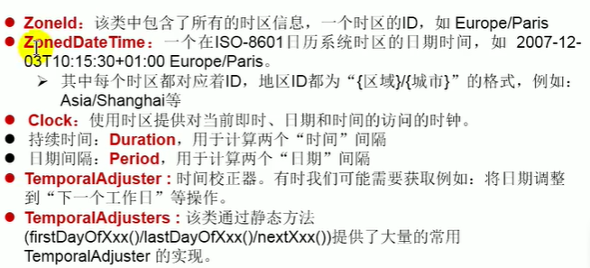
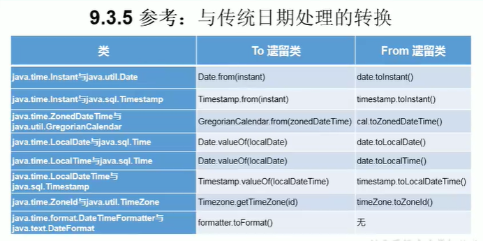

# 常用类

## 1. 字符串相关的类

### 1.1 String类及其常用方法

#### 1.2.1 通过字面量定义的方式实例化

* String声明为final的，不可被继承
* String实现了Serializable接口：表示字节符是支持序列化的。
  * 实现了Comparable接口：表示String可以比较大小
* String内部定义了final byte[] value用于存储字符串数据
* String：代表不可变的字符序列。简称：不可变性。
  * 当对字符串重新赋值时，需要重新制定内存区域赋值，不能使用原有的value赋值。
  * 当对现有的字符串进行连接操作时，也需要重新指定内存区域赋值，不能使用原有的value赋值
  * 当调用String的replace方法修改字符或字符串时，也需要重新制定内存区域赋值
* 通过字面量的方式给字符串赋值，此时的字符串值声明在字符串常量池中。
* 字符串常量池中是不会存储相同内容的字符串的。

#### 1.1.2 通过new+构造器的方式实例化

变量保存的地址值，是数据在堆空间中开辟空间以后对应的地址值

注意：

* 常量与常量的拼接结果在常量池，且常量池中不会存在相同内容的常量。(final修饰的变量也是常量)
* 只要其中有一个是变量 ，结果就在堆中
* 如果拼接的结果调用intern()方法，返回值就在常量池中

```java
public class StringTest {
    public void test2() {
        String s1 = "abc";
        String s2 = "def";

        String s3 = "abcdef";
        String s4 = "abc" + "def";
        String s5 = s1 + "def";
        String s6 = "abc" + s2;
        String s7 = s1 + s2;

        String s8 = s5.intern();//返回值得到的s8在常量池中已经存在的abcdef
    }
}
```

#### 1.1.3 常用方法

* int length() :返回字符串的长度
* char charAt(int index):返回某索引处的字符
* boolean isEmpty() :判断是否是空字符串 return value.length == 0
* String toLowerCase():返回一个转换成小写
* String toUpperCase()：返回一个转换为大写
* String trim()：返回字符串的副本，忽略前导空白和尾部空白
* boolean equals(Object obj)：比较字符串的内容是否相同
* boolean equalsIgnoreCase(String anotherString):与equals方法类似，忽略大小写
* String concat(String str):将指定字符串连接到此字符串结尾
* int compareTo(String antherString):比较两个字符串的大小，负数：当前对象小
* String substring(int beginIndex,int endIndex):返回一个新的字符串，包含beginIndex，不包含endIndex的子串

* boolean endWith(String suffix):测试此字符串是否是以指定的后缀结束
* boolean startsWith(String suffix):测试此字符串是否是以指定的前缀开始
* boolean startsWith(String suffix,int toffset):测试此字符串从指定索引开始的子字符串是否是以指定的前缀开始

* boolean contains(charSequence s):当且仅当此字符串包含指定的char值序列时，返回true
* int indexOf(String str[,int fromIndex]):返回指定子字符串第一次出现的索引，如果没找到，返回-1
* int lastIndexOf(String str[,int fromIndex]):返回指定子字符串最后一次出现的索引，未找到返回-1

* String replace(char oldChar,char newChar):返回一个新的字符串，用new替换old
* String replace(CharSequence target,CharSequence replacement):使用指定字面值替换序列，替换此字符串所有匹配字面值目标序列的子字符串
* String replaceAll(String regex,String replacement):使用给定的replacement替换所有匹配给定的正则表达式的字符串。
* String replaceFirst(String regex,String replacement):使用给定的replacement替换匹配给定的正则表达式的第一个字符串。

* boolean matches(String regex):告知此字符串是否匹配给定的字符串
* String[] split(String regex):根据给定正则表达式的匹配拆分此字符串
* String[] split(String regex,int limit):根据给定正则表达式的匹配拆分此字符串,最多不超过limit个，如果超过了，剩下的全部都放在最后一个元素中

#### 1.1.4 String与基本类型，包装类之间的转换

```java
import java.nio.charset.StandardCharsets;
import java.util.Arrays;

class ChangeTest {
    public void test() {
        //String->num
        String str = "123";
        int num = Integer.parseInt(str1);

        //num->String
        String str = String.valueOf(num);
        String str2 = num + "";

        //String-->char[]
        String str1 = "abc123";
        char[] charArray = str1.toCharArray();

        //字符数组->String
        char[] arr = new char[]{'h', 'e', 'l', 'l', 'o'};
        String str2 = new String(arr);

        //String->byte[] 编码
        String str1 = "abc123";
        byte[] bytes = str1.getBytes();//使用默认的字符集进行转换
        System.out.println(Arrays.toString(bytes));
        byte[] gbks = str1.getBytes("gbk");//使用gbk的字符集进行转换
        System.out.println(Arrays.toString(bytes));

        //byte[]->String 解码
        String str3 = new String(bytes);//使用默认的字符集，进行解码
        String str4 = new String(gbks, "gbk");//使用gbk字符集，进行解码
    }
}

```

### 1.2 StringBuffer、StringBuilder

#### 1.2.1 String、StringBuffer、StringBuilder的区别

* string 不可变的字符序列
* StringBuffer 可变的字符序列：线程安全，效率较低
* StringBuilder 可变的字符序列：线程不安全，效率高(用于非多线程的代码中)

```java
class Test {
    public void test() {
        //StringBuffer的可变性
        StringBuilder sb1 = new StringBuilder("abc");
        sb1.setCharAt(0, 'm');
        System.out.println(sb1);//mbc

        //源码分析
        String str = new String();//char[] value=new char[0];
        String str2 = new String("abc");//char[] value = new char[]{'a','b','c'};

        StringBuffer sb1 = new StringBuffer();//char[] value=new char[16];
        sb1.append('a');//value[0]= 'a';
        sb1.append('b');//value[1]='b';
        StringBuffer sb2 = new StringBuffer("abc");//char[] value=new char["abc".length()+16];
        //问题1. length返回的是count
        System.out.println(sb1.length());//0
        //问题2. 如果要添加的数据底层数据盛不下了，那就需要扩容底层的数组，默认情况下，扩容为原来的2倍+2，同事将原有数组中的元素复制到新的数组中
        //指导意义：建议开发中：StringBuffer(int capacity)或StringBuilder(int capacity)
      
        //问题3：StringBuffer sb2 = new StringBuffer(xxx);xxx不能是null，会抛出空指针异常
    }   
}
```

总结：

* 问题1. length返回的是count
* 问题2. 如果要添加的数据底层数据盛不下了，那就需要扩容底层的数组，默认情况下，扩容为原来的2倍+2，同事将原有数组中的元素复制到新的数组中
  //指导意义：建议开发中：StringBuffer(int capacity)或StringBuilder(int capacity)
* 问题3：StringBuffer sb2 = new StringBuffer(xxx);xxx不能是null，会抛出空指针异常

#### 1.2.2 StringBuffer类的常用方法（StringBuilder同）

* StringBuffer append(xx):提供了很多的append方法，用于进行字符串拼接(xx可以是null，会转换成"null")
* StringBuffer delete(int start,int end):删除指定位置的内容
* StringBuffer replace(int start,int end,String str):把[start,end)位置的替换为str
* StringBuffer insert(int offset,xxx):在指定位置插入xxx
* StringBuffer reverse():把当前字符串序列逆序
* int indexOf(String str)
* int subString(int start,int end):返回一个从start开始到end结束的左开右闭子字符串
* int length()
* char charAt()
* void setCharAt(int n,char ch)

#### 1.2.3 String、StringBuffer、StringBuilder的效率对比

StringBuilder > StringBuffer > String

#### 1.2.4 String 与 StringBuffer、StringBuilder的转换

* String--->StringBuffer、StringBuilder:调用StringBuffer、StringBuilder的构造器
* StringBuffer、StringBuilder--->String:①调用String的构造器，②StringBuffer、StringBuilder的toString方法

#### 1.2.5 JVM中字符串常量池存放位置说明

* jdk1.6（java6.0，jdk6.0）：字符串常量池储存在方法区（永久区）
* jdk1.7 : 字符串常量池存储在堆空间
* jdk1.8 : 字符串常量池存储在方法区（元空间）

## 2. JDK8之前的日期时间API

* Date:
  * new Date()，new Date(long)
  * toString()，getTime()）
  * new java.sql.Date()，new java.sql.Date(时间戳)
* SimpleDateFormat用来格式化Date
  * new SimpleDateFormat().format(new Date())
  * new SimpleDateFormat("yyyy-MM-dd hh:mm:ss").format(new Date())
* GregorianCalendar类
  * Calendar.getInstance()，new GregorianCalendar()
  * 获取时间： Date time = gregorianCalendar.getTime();
  * gregorianCalendar.get(Calendar.DAY_OF_MONTH)
  * 设置时间：gregorianCalendar.setTime(new Date());
  * gregorianCalendar.set(Calendar.DAY_OF_YEAR,61);
  * gregorianCalendar.add(Calendar.DAY_OF_MONTH,30);
* LocalDate、LocalTime、LocalDateTime
  * 实例化：LocalDateTime.now(),LocalDateTime.now(时区),LocalDateTime.of(2021, 3, 3, 13, 23, 43);
  * get方法：localDateTime.getDayOfYear(),getDayOfYear(),getDayOfWeek(),getMonth(),getMonthValue(),getMinute()
  * 根据当前日期获取新日期：localDateTime.withDayOfMonth(22)，plusDays(3),minusDays(4)
* DateTimeFormatter用来格式化LocalDate、LocalTime、LocalDateTime
  * 实例化：DateTimeFormatter formatter3 = DateTimeFormatter.ofPattern("yyyy-MM-dd hh:mm:ss");
  * 格式化：String format3 = formatter3.format(LocalDateTime.now());//2021-03-03 05:25:45
  * 解码：formatter3.parse(format3);
* Instant
  * 实例化：Instant.now();Instant.ofEpochMilli(1614759880439L);
  * 偏移后得到新的偏移时间：OffsetDateTime offsetDateTime = instant.atOffset(ZoneOffset.ofHours(8));
  * 获取时间戳：instant.toEpochMilli()

### 2.1 System静态方法

### 2.2 Date类

1. 两个构造器的使用
    * 构造器一：Date():创建一个当前时间的Date对象
    * 构造器二：创建指定好描述的Date对象
2. 两个方法的使用：
    * toString():显示当前的年月日时分秒
    * getTime()：显示当前Date对象的时间戳
3. java.sql.Date 对应着数据库中的日期类型的变量
    * 实例化
    * util.Date----->sql.Date

```java
package com.tian.java;

import org.junit.jupiter.api.Test;

public class DateTimeTest {

    @Test
    public void tes1() {
      //构造器一：Date():创建一个当前时间的Date对象
      Date date = new Date();
      System.out.println(date.toString());//Fri Feb 26 17:23:12 CST 2021
      System.out.println(date.getTime());//1614331446969(毫秒）

      //构造器二：创建指定好描述的Date对象
      Date date1 = new Date(1614331446969L);
      System.out.println(date1.toString());

      //创建java.sql.Date对象
      java.sql.Date date2=new java.sql.Date(1614331446969L);
      System.out.println(date2);//2021-02-26

      //util.Date----->sql.Date
      Date date3=new Date();
      java.sql.Date date4= new java.sql.Date(date3.getTime());
    }
}

```

### 2.3 SimpleDateFormat类

Date类的API不易于国际化，java.text.SimpleDateFormat类是一个与语言环境无关的方式来格式化和解析日期的具体类

SimpleDateFormat类的使用：

* 格式化：日期--->字符串
* 解析：格式化的逆过程：字符串---->日期
  * //解析的字符串格式需要与构造器参数的格式一致，否则会报错
  
```java
package com.tian.java;

import org.junit.jupiter.api.Test;

import java.text.ParseException;
import java.text.SimpleDateFormat;
import java.util.Date;

public class SimpleDateFormatTest {

    @Test
    public  void  test(){

        //方法一：使用默认构造器格式化和解析
        SimpleDateFormat simpleDateFormat = new SimpleDateFormat();
        //格式化：日期--->文本
        String format = simpleDateFormat.format(new Date());
        System.out.println(format);//2021/3/2 下午4:09
        //解析：文本--->日期
        String str="2019/08/09 上午11:34";
        try {
            Date parse = simpleDateFormat.parse(str);
            System.out.println(parse);//Fri Aug 09 11:34:00 CST 2019
        } catch (ParseException e) {
            e.printStackTrace();
        }

        //方法二：指定的方式格式化和解析
        SimpleDateFormat simpleDateFormat1 = new SimpleDateFormat("yyyy-MM-dd hh:mm:ss");
        //格式化：日期--->文本
        System.out.println(simpleDateFormat1.format(new Date()));//2021-03-02 04:09:03
        //解析：文本--->日期
        String str1="2019-08-09 11:34:30";
        try {
            Date parse = simpleDateFormat1.parse(str1);
            System.out.println(parse);//Fri Aug 09 11:34:30 CST 2019
        } catch (ParseException e) {
            e.printStackTrace();
        }
    }
}

```

### 2.4 Calendar类

java.util.Calendar(日历)类

* Calendar是一个抽象基类，主要用于完成日期字段之间相互操作的功能
* 获取Calendar实例的方法
  * 使用Calendar.getInstance()方法
  * 调用子类GregorianCalendar的构造器

```java
package com.tian.java;

import org.junit.jupiter.api.Test;

import java.util.Calendar;
import java.util.Date;

public class CalendarTest {

    @Test
    public void test() {
        //1.实例化
        Calendar instance = Calendar.getInstance();//当前的时间
        //GregorianCalendar instance = new GregorianCalendar();//实例化方法2
        System.out.println(instance);//java.util.GregorianCalendar[time=1614741744514,areFieldsSet=true,areAllFieldsSet=true,lenient=true,zone=sun.util.calendar.ZoneInfo[id="Asia/Shanghai",offset=28800000,dstSavings=0,useDaylight=false,transitions=31,lastRule=null],firstDayOfWeek=1,minimalDaysInFirstWeek=1,ERA=1,YEAR=2021,MONTH=2,WEEK_OF_YEAR=10,WEEK_OF_MONTH=1,DAY_OF_MONTH=3,DAY_OF_YEAR=62,DAY_OF_WEEK=4,DAY_OF_WEEK_IN_MONTH=1,AM_PM=0,HOUR=11,HOUR_OF_DAY=11,MINUTE=22,SECOND=24,MILLISECOND=514,ZONE_OFFSET=28800000,DST_OFFSET=0]
        
        //2.常用方法
        //get()
        System.out.println(instance.get(Calendar.DAY_OF_MONTH));//这个月的第几天
        System.out.println(instance.get(Calendar.DAY_OF_YEAR));//这一年的第几天

        //set()
        instance.set(Calendar.DAY_OF_YEAR,61);

        //add()
        instance.add(Calendar.DAY_OF_MONTH,30);

        //getTime() 日历类--->Date
        Date time = instance.getTime();

        //setTime():Date--->日历类
        Date date = new Date();
        instance.setTime(date);

    }
}

```

缺陷：

* 可变性：像日期和时间这样的类应该是不可变的
* 偏移量：Date中的年份是从1900年开始的，而月份是从0开始的，所以new Date(2020-1900,9-1,8);代表的是2020-9-8
* 格式化：格式化只对Date有用，Calendar则不行
* 不是线程安全的，不能处理闰秒问题

## 3 JDK8 中新日期时间API

### 3.1 LocalDate、LocalTime、LocalDateTime

说明：
1.LocalDateTime使用较多

```java
package com.tian.java;

import org.junit.jupiter.api.Test;

import java.time.LocalDate;
import java.time.LocalDateTime;
import java.time.LocalTime;

public class DateTimeTest {
    @Test
    public void test3(){

        //now() 获取当前的时间
        LocalDate now = LocalDate.now();//2021-03-03
        LocalTime now1 = LocalTime.now();//15:00:38.339705500
        LocalDateTime now2 = LocalDateTime.now();//2021-03-03T15:00:38.339705500

        //of()  设置指定的年月日时分秒，没有偏移量
        LocalDateTime time = LocalDateTime.of(2021, 3, 3, 13, 23, 43);

        //getXxx()
        System.out.println(time.getDayOfYear());
        System.out.println(time.getDayOfWeek());
        System.out.println(time.getMonth());
        System.out.println(time.getMonthValue());
        System.out.println(time.getMinute());

        //不可变性
        LocalDateTime time1 = time.withDayOfMonth(22);
        System.out.println(time);
        System.out.println(time1);

        //添加
        System.out.println(now2.plusDays(3));
        System.out.println(now2.minusDays(4));

    }
}

```

### 3.2 Instant

```java
class Test{
    @Test
    public void test4(){
        //now():获取本初子午线对应的标准时间
        Instant instant = Instant.now();
        System.out.println(instant);//2021-03-03T08:21:35.277030100Z

        //添加时间的偏移量
        OffsetDateTime offsetDateTime = instant.atOffset(ZoneOffset.ofHours(8));
        System.out.println(offsetDateTime);//2021-03-03T16:21:35.277030100+08:00

        //获取对应的毫秒数
        long milli = instant.toEpochMilli();
        System.out.println(milli);//1614759880439

        //ofEpochMilli() 通过给定的毫秒数，获取Instant实例 ----->Date(long millis)
        Instant instant1 = Instant.ofEpochMilli(1614759880439L);
    }
}
```

### 3.3 DateTimeFormatter

```java
class Test{
  @Test
  public void test5(){
    //方式一：预定义的标准格式，如：ISO_LOCAL_DATE_TIME,ISO_LOCAL_DATE,ISO_DATE_TIME
    DateTimeFormatter formatter = DateTimeFormatter.ISO_LOCAL_DATE_TIME;
    String format = formatter.format(LocalDateTime.now());//2021-03-03T16:53:20.8683418
    System.out.println(formatter.parse(format));//{},ISO resolved to 2021-03-03T16:54:16.807828900

    //方式二：本地化相关格式
    //ofLocalizedDateTime()适用于LocalDateTime  参数有：FormatStyle.LONG，FormatStyle.MEDIUM,FormatStyle.SHORT
    DateTimeFormatter formatter1 = DateTimeFormatter.ofLocalizedDateTime(FormatStyle.MEDIUM).withZone(ZoneId.systemDefault());
    String format1 = formatter1.format(LocalDateTime.now());//2021年3月3日 CST 下午5:13:07,  2021年3月3日 下午5:00:34 , 2021/3/3 下午4:59
    System.out.println(formatter1.parse(format1));//{InstantSeconds=1614763276},ISO,Asia/Shanghai resolved to 2021-03-03T17:21:16

    //ofLocalizedDate()适用于LocalDate 参数有:FormatStyle.FULL,FormatStyle.LONG，FormatStyle.MEDIUM,FormatStyle.SHORT
    DateTimeFormatter formatter2 = DateTimeFormatter.ofLocalizedDate(FormatStyle.LONG);
    String format2 = formatter2.format(LocalDate.now());//2021年3月3日星期三,2021年3月3日,2021年3月3日,2021/3/3
    System.out.println(formatter2.parse(format2));//{},ISO resolved to 2021-03-03

    //方式三：自定义的格式(常用）
    DateTimeFormatter formatter3 = DateTimeFormatter.ofPattern("yyyy-MM-dd hh:mm:ss");
    String format3 = formatter3.format(LocalDateTime.now());//2021-03-03 05:25:45
    formatter3.parse(format3);//{MicroOfSecond=0, MilliOfSecond=0, NanoOfSecond=0, MinuteOfHour=25, HourOfAmPm=5, SecondOfMinute=15},ISO resolved to 2021-03-03

  }
}
```

### 3.4 其他API

  

### 3.5 相互转换

  

## 4. Java比较器

### 4.1 Comparable接口

* 像String、包装类等时间了Comparable接口，重写了CompareTo()方法，给出了比较两个对象大小的方式
* 重写CompareTo(obj)规则
  * this>obj 返回正整数
  * this<obj 返回负整数
  * this==obj 返回0
  
```java
package com.tian.java;

public class Goods implements Comparable {
    private String name;
    private double price;

    public Goods(String name, double price) {
        this.name = name;
        this.price = price;
    }

    public String getName() {
        return name;
    }

    public double getPrice() {
        return price;
    }

    @Override
    public int compareTo(Object o){
        if(o instanceof Goods){
            Goods o1 = (Goods) o;
//            方法1
//            return Double.compare(this.price,o1.getPrice());
//            方法2
            if(this.price>o1.getPrice()){
                return 1;
            }else if(this.price<o1.getPrice()){
                return -1;
            }else {
                return this.name.compareTo(o1.name);
            }
        }
        throw new RuntimeException("比较类型不一致");
    }

    @Override
    public String toString() {
        return "Goods{" +
                "name='" + name + '\'' +
                ", price=" + price +
                '}';
    }
}

```

```java
package com.tian.java;

import org.junit.jupiter.api.Test;

import java.util.Arrays;

public class CompareTest {
    @Test
    public void test1(){
        Goods[] arr = new Goods[4];
        arr[0]=new Goods("candy",34);
        arr[1]=new Goods("candy3",37);
        arr[2]=new Goods("candy2",36);
        arr[3]=new Goods("candy1",35);
        Arrays.sort(arr);
        System.out.println(Arrays.toString(arr));

    }

}
```

### 4.2 Comparator接口

* 重写Compare(Object o1,Object o2)
  * o1>o2 返回正整数
  * o1<o2 返回负整数
  * o1==o2 返回0

```java
public class CompareTest {

    @Test
    public void test2(){

        String[] arr=new String[]{"AA","BB","CC"};
        Arrays.sort(arr, new Comparator<String>() {
            @Override
            public int compare(String o1, String o2) {
                return -o1.compareTo(o2);
            }
        });
        System.out.println(Arrays.toString(arr));
    }
}
```

## 5 System类

* System.currentTimeMillis() 返回当前计算机时间
* System.exit() 退出程序
* System.gc() 通知系统自动回收
* System.getProperties() 获取系统属性

## 6 Math类

* abs
* acos,asin,atan,cos,sin,tan
* sqrt
* pow(a,b)
* log
* exp
* max(a,b)
* min(a,b)
* random()
* round(double a) double a转成long a
* toDegrees(angrad) 弧度->角度
* toRadians(angdeg) 角度->弧度

## 7 BigInteger与BigDecimal

### BigInteger

* BigInteger 可以表示不可变的任意精度的整数
* 构造器 BigInteger(String val)
* 常用方法
  * abs(val)
  * add(val)
  * subtract(val)
  * multiply(val)  返回this*val
  * divide(val)  返回this/val
  * remainder(val) 返回 this%val
  * divideAndRemainder(val) 返回（this/val）和（this%val）的数组
  * pow(int exp) 返回this的exp次方

### BigDecimal

* 用来做科学计算或者工程计算
* 构造器BigDecimal(double val)   BigDecimal(String val)
* 常用方法
  * add(val)
  * subtract(val)
  * multiply(val)  返回this*val
  * divide(val,几位小数点，省略原则)  返回this/val
