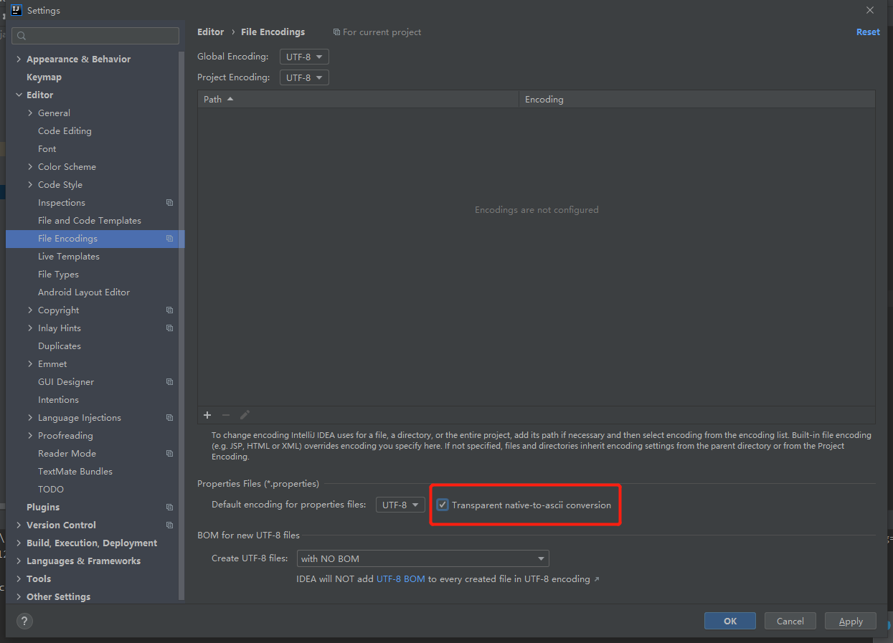

# 集合

## 1.java集合框架概述

* 集合、数组都是对多个数据进行存储操作的结构，简称java容器。存储：指内存层面的存储，不涉及到持久化的存储（.text,.jpg,数据库中等）
* 数组在存储多个数据方面的特点
  * 一旦初始化以后，其长度就确定了
  * 数组一旦定义好，其元素的类型也就确定了，我们也就只能才操作指定类型的数据
* 集合框架
  * Collection接口：单列集合、用来存储一个一个的对象
    * List接口：存储有序的可重复的数据
      * ArrayList、LinkedList、Vector
    * Set接口：存储无序的不可重复的数据
      * HashSet、LinkedHashSet、TreeSet
  * Map接口：key-value集合
    * HashMap、LinkedHashMap、TreeMap、Hashtable、Properties

  

## 2.Collection接口方法

```java
package com.tian.java;

import org.junit.jupiter.api.Test;

import java.util.*;

public class CollectionTest {
    @Test
    public void test(){
        Collection col= new ArrayList();

        //add(Object e)
        col.add("AA");
        col.add("BB");
        col.add(123);//自动装箱
        col.add(new Date());

        //size()
        System.out.println(col.size());

        //addAll()
        Collection col1=new ArrayList();
        col1.add("cc");
        col1.add(456);
        col.addAll(col1);//将col1的元素全部添加到col中
        System.out.println(col.size());
        System.out.println(col);

        //clear():清除集合元素
        col.clear();

        //isEmpty():判断当前集合是否为空
        System.out.println(col.isEmpty());


    }

    @Test
    public void test2(){
        Collection col=new ArrayList();

        col.add(123);
        col.add(456);
        col.add(new String("Tom"));
        col.add(false);
        col.add(new Person("Jerry",20));

        // 1.contains(Object obj)  在判断时会调用obj对象所在类的equals，所以向Collection接口的实现类的对象中添加数据obj时，
        // 要求obj所在的类要重写equals方法
        System.out.println(col.contains(123));//true
        System.out.println(col.contains(new String("Tom")));//true
        System.out.println(col.contains(new Person("Jerry",20)));//false->true

        // 2.containsAll(Collection col):判断col中的所有元素是否都存在于当前集合中
        Collection col1 = Arrays.asList(123,456);
        System.out.println(col.containsAll(col1));
    }

    @Test
    public void test3(){
        Collection col= new ArrayList();
        col.add(1);//自动装箱
        col.add(2);
        col.add(3);
        col.add(4);
        col.add(6);

        //3.remove(Object obj)
        col.remove(4);
        System.out.println(col);//[1,2,3]

        //4.removeAll(Collection col1):从当前集合中移除col1中所有的元素（差集）
        Collection col1=Arrays.asList(1,2);
        col.removeAll(col1);
        System.out.println(col);//[3]

        //5.交集 retainAll(Collection col)
        Collection col2=Arrays.asList(3,5,6);
        col.retainAll(col2);
        System.out.println(col);//[3]

        //6.equals：要返回true，需要当前集合的元素与形参集合的元素相同，且顺序相同
        Collection col3=new ArrayList();
        col3.add(3);
        col3.add(6);
        System.out.println(col.equals(col3));//true  如果是[6,3]为false。因为ArrayList有序

        //7.hashcode()：返回当前对象的哈希值
        System.out.println(col.hashCode());

        //8.集合--->数组.toArray()
        Object[] arr = col.toArray();

        //9.数组--->集合 调用Arrays类的静态方法asList

        //9.1 不要用于基本类型：由于Arrays.ArrayList参数为可变长泛型，而基本类型是无法泛型化的，所以它把int[] arr数组当成了一个泛型对象，所以集合中最终只有一个元素arr。
        List list = Arrays.asList(new int[]{123,456});
        System.out.println(list);//[[I@e874448]
        List<int[]> list1 = Arrays.asList(new int[]{123,456});
        System.out.println(list1);//[[I@29b5cd00]

        //9.2 返回的是 java.util.Arrays.ArrayList，Arrays.ArrayList 是工具类 Arrays 的一个内部静态类，它没有完全实现List的方法，而 ArrayList直接实现了List 接口，实现了List所有方法。
        //    产生的集合并没有重写add,remove等方法，如果调用会报错

        //9.3 由于asList产生的集合元素是直接引用作为参数的数组，所以当外部数组或集合改变时，数组和集合会同步变化.
        String[] arr2=new String[]{"AA","BB","CC"};
        List<String> list3 = Arrays.asList(arr2);
        arr2[1]="我";
        list3.set(2,"爱");
        System.out.println(Arrays.toString(arr2));//[AA, 我, 爱]
        System.out.println(list3.toString());//[AA, 我, 爱]
      
    }
}

class Person{
    private String name;
    private int age;

    public Person(String name, int age) {
        this.name = name;
        this.age = age;
    }

    public String getName() {
        return name;
    }

    public void setName(String name) {
        this.name = name;
    }

    public int getAge() {
        return age;
    }

    public void setAge(int age) {
        this.age = age;
    }

    @Override
    public String toString() {
        return "Person{" +
                "name='" + name + '\'' +
                ", age=" + age +
                '}';
    }

    @Override
    public boolean equals(Object o) {
        if (this == o) return true;
        if (o == null || getClass() != o.getClass()) return false;
        Person person = (Person) o;
        return age == person.age && Objects.equals(name, person.name);
    }

    @Override
    public int hashCode() {
        return Objects.hash(name, age);
    }
}

```

## 3.Iterator 迭代器接口

迭代器模式，为容器而生，用来遍历容器

### 3.1 常用方法

```java
package com.tian.java;

import org.junit.jupiter.api.Test;

import java.util.ArrayList;
import java.util.Collection;
import java.util.Iterator;

public class IteratorTest {
    @Test
    public void test() {
        // 10.iterator():返回Iterator接口的实例，用于遍历集合元素
        // 10.1 内部的方法：hasNext()和next()
        // 10.2 集合对象每次调用iterator()方法都会得到一个全新的迭代器对象
        // 10.3 内部定义了remove(),可以在遍历的时候，删除集合中的元素。此方法不同于集合直接调用remove()
        //       如果还未调用next()或在上一次调用next方法之后已经调用了remove方法

        Collection col = new ArrayList();
        col.add(123);
        col.add(456);
        col.add(new String("Tom"));
        col.add(false);
        Iterator iterator = col.iterator();
        //方式一
        System.out.println(iterator.next());
        System.out.println(iterator.next());
        System.out.println(iterator.next());
        System.out.println(iterator.next());
        System.out.println(iterator.next());
        System.out.println(iterator.next());
        //123
        //456
        //Tom
        //false
        //
        //java.util.NoSuchElementException

        //方式二
        for (int i = 0; i < col.size(); i++) {
            System.out.println(iterator.next());
        }

        //方式三（推荐）
        while (iterator.hasNext()){
            System.out.println(iterator.next());
        }

    }

    @Test
    public void test2(){
        // remove()的使用
        Collection col = new ArrayList();
        col.add(123);
        col.add(456);
        col.add(new String("Tom"));
        col.add(false);

        //删除集合中“Tom”
        Iterator iterator = col.iterator();
        while (iterator.hasNext()){
            Object obj = iterator.next();
            if ("Tom".equals(obj)){
                iterator.remove();
            }
        }

        //遍历集合
        Iterator iterator1 = col.iterator();
        while (iterator1.hasNext()){
            Object obj = iterator1.next();
            System.out.println(obj);
        }

    }
}

```

### 3.2新特性for循环遍历集合

```java
package com.tian.java;

import org.junit.jupiter.api.Test;

import java.util.ArrayList;
import java.util.Collection;

public class ForTest {
    @Test
    public void test(){
        Collection col=new ArrayList();
        col.add(123);
        col.add(456);
        col.add(new String("Tom"));
        col.add(false);

        // for(集合元素的类型  局部变量：集合的对象
        // 内部仍然调用的是迭代器
        for (Object obj: col){
            System.out.println(obj);
        }
    }

    @Test
    public void test2(){
        int[] arr= new int[]{1,2,3,4,5,6};
        for (int i:arr){
            System.out.println(i);
        }
    }

    @Test
    public void test3(){
        String[] arr = new String[]{"MM","MM"};

        // 方式一：普通for赋值(arr的值改变）
        for (int i = 0; i < arr.length; i++) {
            arr[i] = "GG";
        }
        // 方式二：增强for循环(arr的值不变）
        for (String s:arr){
            s="NN";
        }
    }
}

```

## 4.Collection子接口一：List

### 4.1 有序且可重复的动态的数组

* ArrayList:作为List接口的主要实现类：线程不安全的，效率高，底层使用Object[] elementData存储
* LinkedList：对于频繁的插入，删除操作，使用此类的效率比较高。底层使用双向链表存储
* Vector：作为List接口的古老实现类：线程安全的，效率低，底层使用Object[] elementData存储

### 4.2 ArrayList 的源码分析

==**jdk7中**==

* ArrayList list = new ArrayList();//底层创建了长度为10的Object[]数组elementData  
* list.add(123);//elementData[0] = new Integer(123);  
...  
* list.add(11);//此次添加导致底层elementData数组容量不都，则扩容，默认情况下，扩容为原来的1.5倍，同时需要将原有数组中的数据复制到新的数组中  

结论：建议开发中使用带参的构造器：ArrayList list = new ArrayList(int capacity)

==**jdk8中**==

* ArrayList list = new ArrayList();//底层创建的Object[]数组elementData初始化为{}，并没有创建长度
* list.add(123);//第一次调用add时，底层才创建了长度10的数组，并将数据123添加到elementData[0]，后续与jdk7相同  
...  
* list.add(11);//此次添加导致底层elementData数组容量不都，则扩容，默认情况下，扩容为原来的1.5倍，同时需要将原有数组中的数据复制到新的数组中

### 4.3 LinkedList 的源码分析

LinkedList结构  

* transient int size = 0;
* transient Node first;
* transient Node last;
* protected transient int modCount = 0;(继承的)

Node结构

* E item;
* Node next;
* Node prev;

```java
  /**
  * Links e as last element.
    */
  class LinkedList{
    void linkLast(E e) {
      final Node<E> l = last;
      final Node<E> newNode = new Node<>(l, e, null);
      last = newNode;
      if (l == null)
        first = newNode;
      else
        l.next = newNode;
      size++;
      modCount++;
    }
  }
```

### 4.4 Vector 的源码分析

* jdk7和jdk8中通过Vector()构造器创建对象时，底层都创建了长度为10的数组
* 在扩容方面，默认扩容为原来的数组长度的2倍

### 4.5 List接口中的常用方法

```java
package com.tian.java;

import org.junit.jupiter.api.Test;

import java.util.ArrayList;
import java.util.Arrays;
import java.util.List;

public class ListTest {

    @Test
    public void test(){
        ArrayList list = new ArrayList();
        list.add(123);
        list.add(456);
        list.add("AA");
        list.add(false);

        System.out.println(list);

        //1.void add(int index,Object ele):在index的位置插入ele元素
        list.add(1,"bb");
        System.out.println(list);

        //2.boolean addAll(int index,Collection eles):从index位置开始将eles中的所有元素添加到list中
        List list1 = Arrays.asList(1,2,3);
        list.addAll(list1);
        list.addAll(2,list1);
        System.out.println(list);

        //3.Object get(int index):获取指定index位置的元素
        System.out.println(list.get(2));

    }

    @Test
    public void test2(){
        ArrayList list = new ArrayList();
        list.add(123);
        list.add(456);
        list.add("AA");
        list.add(false);
        list.add(456);

        // 4.int indexOf(Object obj):返回obj在集合中首次出现的位置
        System.out.println(list.indexOf(456));
        // 5.int lastIndexOf(Object obj):返回obj在集合中最后一次出现的位置
        System.out.println(list.lastIndexOf(456));
        // 6.Object remove(int index,Object obj):移除指定index位置的元素，并返回此元素,默认是index
        Object remove = list.remove(0);
        System.out.println(remove);
        // 7.Object set(int index,Object ele):设置指定index位置的元素ele
        list.set(1,"cc");
        System.out.println(list);
        // 8.List subList(int fromIndex,int toIndex):返回左闭右开区间的子集合,原本的list不改变
        List list1 = list.subList(2, 4);
        System.out.println(list1);
        System.out.println(list);

    }
}

```

## 5.Collection子接口二：Set

### ==**set:存储无序的，不可重复的数据 ,以HashSet为例说明**==

1. 无序性：不等于随机性。存储的的数据在底层并不是按照数组索引的顺序添加的，而是根据数据的哈希值决定的。
2. 不可重复性：保证添加的元素按照equals()判断时，不能反回true，即相同的元素只能添加一个。

### ==**添加元素的过程：以HashSet为例**==

我们想HashSet中添加元素a，首先调用元素a所在类的hashCode()方法，计算元素a的哈希值  

此哈希值通过某种算法计算出在HashSet底层数组中的存放位置（即：索引位置）  

判断数组此位置上是否有其他元素：

1. 如果此位置上没有其他元素，则添加元素a
2. 如果有其他元素，则跟该位置的链表上的所有元素equals对比，如果没有相同元素，则添加a在该链表上
3. 如果有其他元素，则跟该位置的链表上的所有元素equals对比，如果有相同元素，则不添加a  

==**七上八下**==

* jDk7中：元素a放到数组中，指向原来的元素  (a)--->旧数组  
* jdk8中：原来元素还在数组中，指向元素a   （旧数据）-->a  

### 5.1 接口的框架

* HashSet：作为Set接口的主要实现类：线程不安全的，可以存储null值
  * LinkedHashSet：作为HashSet的子类，遍历其内部数据时，可以按照添加的顺序遍历
* TreeSet：使用二叉树存储，放入的数据需要是同一个类的对象，可以按照添加对象的指定属性，进行排序

### 5.2 注意

* Set接口中没有额外定义新的方法，使用的都是Collection中声明过的方法
* 要求：向Set中添加的数据，其所在的类一定要重写equals和hashcode方法（相同的对象有相同的散列码）
  * 重写小技巧：对象中用作equals()方法比较的Field，都应该用来计算hashcode值。
  
### 5.3 LinkedHashSet

* LinkedHashSet作为hashSet的子类，在添加数据的同事，每个数据还维护了两个引用，记录次数据前一个数据个后一个数据。
* 有点：对于频繁的遍历操作，LinkedHashSet效率高于HashSet

### 5.4 TreeSet

* 向TreeSet中添加的数据，要求是相同类的对象
* 两种排序方式：自然排序（实现Comparable接口） 和 定制排序（Comparator）
* 自然排序中，比较两个对象是否相同的标准为：CompareTo()返回0.不再是equals().
* 定制排序中，比较两个对象是否相同的标准为：compare()返回0，不再是equals().

#### 5.4.1 自然排序

```java
package com.tian.java;

import org.junit.jupiter.api.Test;

import java.util.TreeSet;

public class SetTest {
    @Test
    public void test1(){
        TreeSet treeSet = new TreeSet();
        treeSet.add(new User("Tome",12));
        treeSet.add(new User("Jerry",32));
        treeSet.add(new User("Mike",15));
        treeSet.add(new User("Jack",19));
        treeSet.add(new User("Jack",20));

    }
}
class User implements Comparable{
    private String name;
    private int age;

    public User(String name, int age) {
        this.name = name;
        this.age = age;
    }

    @Override
    public int compareTo(Object o) {
        if(o instanceof User){
            User user = (User) o;
            int compare =  this.name.compareTo(user.name);
            if(compare!=0){
                return compare;
            }else {
                return Integer.compare(this.age,user.age);
            }
        }else {
            throw new RuntimeException("输入的类型不匹配");
        }
    }
}

```

#### 5.4.2 定制排序

```java
package com.tian.java;

import org.junit.jupiter.api.Test;

import java.util.Comparator;
import java.util.TreeSet;

public class SetTest {
    @Test
    public void test2(){
        Comparator com = new Comparator() {
            @Override
            public int compare(Object o1, Object o2) {
                if(o1 instanceof User && o2 instanceof User){
                    User u1 = (User) o1;
                    User u2 = (User) o2;
                    return Integer.compare(u1.getAge(),u2.getAge());
                }else {
                    throw new RuntimeException("输入的数据类型不匹配");
                }
            }
        };
        TreeSet treeSet = new TreeSet(com);

    }
}
class User {
    private String name;
    private int age;

    public User(String name, int age) {
        this.name = name;
        this.age = age;
    }

    public String getName() {
        return name;
    }

    public int getAge() {
        return age;
    }
}

```

## 6.Map接口

### 6.1 双列数据，存储key-value对的数据

* HashMap:作为Map的主要实现类；线程不安全的，效率高；存储null的key和value
  * LinkedHashMap:保证在遍历map元素是，可以按住奥添加的顺序实现遍历（原因：在原有的HashMap底层结构基础上，添加一对指针，指向前一个和后一个元素，适用于频繁遍历的操作）
* TreeMap:保证按照添加的key-value对进行排序，实现排序遍历。此时考虑key的自然排序或定制排序（底层使用红黑树）  
* Hashtable：作为古老的实现类；线程安全的，效率低，不能存储null的key和value
  * Properties:常用来处理配置文件，key和value都是String类型
  
### 6.2 Map结构的理解

* Map中的key：无序的、不可重复的，使用Set存储所有的key--->key所在的类要重写equals()和hashCode()方法（以HashCode为例）
* Map中的value：无序的、可重复的，使用Collection存储所有的value--->value所在的类要重写equals()
* 一个键值对：key-value构成了一个Entry对象
* Map中的entry：无序的、不可重复的，使用Set存储所有的entry

### 6.3 HashMap的底层实现原理（JDK7为例）

HashMap map = new HashMap();  
在实例化以后，底层创建了长度是16的以为数组Entry[] table.  
map.put(key1,value1):  
首先，调用key1所在类的hashCode()计算key1哈希值，此哈希值经过某种算法计算以后，得到在Entry数组中的存放位置。  
* 如果此位置上的数据为空，添加成功。①  
* 如果此位置上的数据不为空，意味着此位置上存在一个或多个数据（以链表形式存在），比较key1和已经存在的数据的哈希值  
  * 如果key1的哈希值与其他数据都不同，添加成功。②  
  * 如果key2的哈希值与某一个数据（key2-value2）的哈希值相同，继续比较：调用key1所在类的equals（key2）
    * 如果equals()返回false：添加成功 ③
    * 如果equals()返回true，使用value1替换value2 ④

* 扩容问题：扩容为原来容量的2倍，并将原有的数据复制过来（？如何扩容）

### 6.4 jdk8相较于jdk7在底层实现方面的不同

* new HashMap()：底层没有创建一个长度为16的数组
* jdk8底层的数组是：Node[]，而非Entry[]
* 首次调用put()方法时，底层创建长度为16的数组
* jdk7底层结构只有：数组+链表。jdk8中底层结构：数组+链表+红黑树
* 当数组的某一个索引位置上的元素以链表形式存在的数据个数>8且当前数组长度>64时，此时次索引位置上的所有数组改为使用红黑树存储

### 6.5 LinkedHashMap的底层实现原理（了解）

添加了before和after属性，能够记录添加的顺序

### 6.6 Map的常用方法

**元素增删的操作**

* put(Object key,Object value); 将指定key-value添加到（或修改）当前map对象中
* putAll(Map m):将m中所有key-value对存放到当前map中
* remove(Object key):移除指定key的key-value对，并返回value
* clear()：清空当前map中的所有数据

**元素查询的操作**

* object get(key):获取指定key对应的value
* boolean containsKey(Object key):是否包含指定的key
* boolean containsValue(Object value):是否包含指定的value
* int size():返回map中key-value对的个数
* boolean isEmpty()：判断当前map是否为空
* boolean equals(Object obj):判断当前map和参数对象obj是否相等

**元视图操作的方法**

* Set keySet():返回所有的key构成的Set集合
* Collection values():返回所有value构成的Collection集合
* Set entrySet():返回所有key-value对构成的Set集合

### 6.7 TreeMap的使用

向TreeMap中添加Key-value,要求key必须是由同一个类创建的对象

**自然排序** 

* 需要User实现comparable，重写compareTo方法

```java
package com.tian.java;

import org.junit.jupiter.api.Test;

import java.util.Comparator;
import java.util.Iterator;
import java.util.Set;
import java.util.TreeMap;

public class TreeMapTest {
    //向TreeMap中添加Key-value,要求key必须是由同一个类创建的对象
    //因为要按照key进行排序：自然排序、定制排序

    //自然排序
    //需要User实现comparable，重写compareTo方法
    @Test
    public void test1(){
        TreeMap treeMap = new TreeMap();
        User tom = new User("Tom", 23);
        User jerry = new User("Jerry", 26);
        User jack = new User("Jack", 21);
        User rose = new User("Rose", 19);
        treeMap.put(tom,98);
        treeMap.put(jerry,89);
        treeMap.put(jack,76);
        treeMap.put(rose,100);

        Set set = treeMap.entrySet();
        Iterator iterator = set.iterator();
        while (iterator.hasNext()){
            System.out.println(iterator.next());
        }
    }
}

```

**定制排序**

```java
package com.tian.java;

import org.junit.jupiter.api.Test;

import java.util.Comparator;
import java.util.Iterator;
import java.util.Set;
import java.util.TreeMap;

public class TreeMapTest {
    //向TreeMap中添加Key-value,要求key必须是由同一个类创建的对象
    //因为要按照key进行排序：自然排序、定制排序
  
    //定制排序
    //根据key的CompareTo排序
    @Test
    public void test2(){
        TreeMap treeMap = new TreeMap(new Comparator() {
            @Override
            public int compare(Object o1, Object o2) {
                if(o1 instanceof User && o2 instanceof User){
                    User u1 = (User) o1;
                    User u2 = (User) o2;
                    return Integer.compare(u1.getAge(),u2.getAge());
                }
                throw new RuntimeException("输入的类型不匹配");
            }
        });

        User tom = new User("Tom", 23);
        User jerry = new User("Jerry", 26);
        User jack = new User("Jack", 21);
        User rose = new User("Rose", 19);
        treeMap.put(tom,98);
        treeMap.put(jerry,89);
        treeMap.put(jack,76);
        treeMap.put(rose,100);

        Set set = treeMap.entrySet();
        Iterator iterator = set.iterator();
        while (iterator.hasNext()){
            System.out.println(iterator.next());
        }
    }
}

```

### 6.8 Properties
jdbc.properties文件
```properties
name=Tom甜甜
age=123
```
乱码问题的解决


```java
package com.tian.java;

import java.io.FileInputStream;
import java.io.IOException;
import java.util.Properties;

public class PropertiesTest {
    public static void main(String[] args) {
        FileInputStream fileInputStream = null;
        try {
            Properties properties = new Properties();
            fileInputStream = new FileInputStream("jdbc.properties");
            properties.load(fileInputStream);
            String name = properties.getProperty("name");
            String age = properties.getProperty("age");
            System.out.println("name:"+name+",age:"+age);
        } catch (IOException e) {
            e.printStackTrace();
        } finally {
            if(fileInputStream!=null){
                try {
                    fileInputStream.close();
                } catch (IOException e) {
                    e.printStackTrace();
                }
            }
        }
    }
}
```

## 7.Collections工具类

Collections是操作Collection（Set、List）、Map的工具类

**常用方法**

* reverse(List):反转List中元素的顺序
* shuffle(List):对List集合元素进行随机排序
* sort(List):根据元素的自然顺序对指定List集合元素按升序排序
* sort(List,Comparator):根据指定的Comparator产生的顺序对List集合元素进行排序
* swap(List,int,int):将指定List集合中的i处的元素与j处的元素进行交换

* Object max(Collection):根据元素的自然排序，返回给定集合中的最大元素
* Object max(Collection,Comparator):根据Comparator指定的排序，返回给定集合中的最大元素
* Object min(Collection):根据元素的自然排序，返回给定集合中的最小元素
* Object min(Collection,Comparator):根据Comparator指定的排序，返回给定集合中的最小元素
* int frequency(Collection,Object):返回指定集合中指定元素的出现次数
* void copy(List dest, List src):将src中的内容复制到dest中
* boolean replaceAll(List ist, Object oldVal,Object newVal):使用新值替换list对应的旧值


