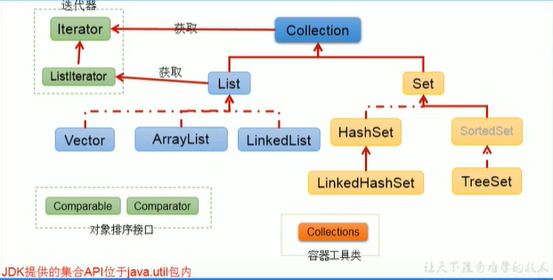

# 集合

## 1.java集合框架概述

* 集合、数组都是对多个数据进行存储操作的结构，简称java容器。存储：指内存层面的存储，不涉及到持久化的存储（.text,.jpg,数据库中等）
* 数组在存储多个数据方面的特点
  * 一旦初始化以后，其长度就确定了
  * 数组一旦定义好，其元素的类型也就确定了，我们也就只能才操作指定类型的数据
* 集合框架
  * Collection接口：单列集合、用来存储一个一个的对象
    * List接口：存储有序的可重复的数据
      * ArrayList、LinkedList、Vector
    * Set接口：存储无序的不可重复的数据
      * HashSet、LinkedHashSet、TreeSet
  * Map接口：key-value集合
    * HashMap、LinkedHashMap、TreeMap、Hashtable、Properties

  

## 2.Collection接口方法

```java
package com.tian.java;

import org.junit.jupiter.api.Test;

import java.util.*;

public class CollectionTest {
    @Test
    public void test(){
        Collection col= new ArrayList();

        //add(Object e)
        col.add("AA");
        col.add("BB");
        col.add(123);//自动装箱
        col.add(new Date());

        //size()
        System.out.println(col.size());

        //addAll()
        Collection col1=new ArrayList();
        col1.add("cc");
        col1.add(456);
        col.addAll(col1);//将col1的元素全部添加到col中
        System.out.println(col.size());
        System.out.println(col);

        //clear():清除集合元素
        col.clear();

        //isEmpty():判断当前集合是否为空
        System.out.println(col.isEmpty());


    }

    @Test
    public void test2(){
        Collection col=new ArrayList();

        col.add(123);
        col.add(456);
        col.add(new String("Tom"));
        col.add(false);
        col.add(new Person("Jerry",20));

        // 1.contains(Object obj)  在判断时会调用obj对象所在类的equals，所以向Collection接口的实现类的对象中添加数据obj时，
        // 要求obj所在的类要重写equals方法
        System.out.println(col.contains(123));//true
        System.out.println(col.contains(new String("Tom")));//true
        System.out.println(col.contains(new Person("Jerry",20)));//false->true

        // 2.containsAll(Collection col):判断col中的所有元素是否都存在于当前集合中
        Collection col1 = Arrays.asList(123,456);
        System.out.println(col.containsAll(col1));
    }

    @Test
    public void test3(){
        Collection col= new ArrayList();
        col.add(1);//自动装箱
        col.add(2);
        col.add(3);
        col.add(4);
        col.add(6);

        //3.remove(Object obj)
        col.remove(4);
        System.out.println(col);//[1,2,3]

        //4.removeAll(Collection col1):从当前集合中移除col1中所有的元素（差集）
        Collection col1=Arrays.asList(1,2);
        col.removeAll(col1);
        System.out.println(col);//[3]

        //5.交集 retainAll(Collection col)
        Collection col2=Arrays.asList(3,5,6);
        col.retainAll(col2);
        System.out.println(col);//[3]

        //6.equals：要返回true，需要当前集合的元素与形参集合的元素相同，且顺序相同
        Collection col3=new ArrayList();
        col3.add(3);
        col3.add(6);
        System.out.println(col.equals(col3));//true  如果是[6,3]为false。因为ArrayList有序

        //7.hashcode()：返回当前对象的哈希值
        System.out.println(col.hashCode());

        //8.集合--->数组.toArray()
        Object[] arr = col.toArray();

        //9.数组--->集合 调用Arrays类的静态方法asList

        //9.1 不要用于基本类型：由于Arrays.ArrayList参数为可变长泛型，而基本类型是无法泛型化的，所以它把int[] arr数组当成了一个泛型对象，所以集合中最终只有一个元素arr。
        List list = Arrays.asList(new int[]{123,456});
        System.out.println(list);//[[I@e874448]
        List<int[]> list1 = Arrays.asList(new int[]{123,456});
        System.out.println(list1);//[[I@29b5cd00]

        //9.2 返回的是 java.util.Arrays.ArrayList，Arrays.ArrayList 是工具类 Arrays 的一个内部静态类，它没有完全实现List的方法，而 ArrayList直接实现了List 接口，实现了List所有方法。
        //    产生的集合并没有重写add,remove等方法，如果调用会报错

        //9.3 由于asList产生的集合元素是直接引用作为参数的数组，所以当外部数组或集合改变时，数组和集合会同步变化.
        String[] arr2=new String[]{"AA","BB","CC"};
        List<String> list3 = Arrays.asList(arr2);
        arr2[1]="我";
        list3.set(2,"爱");
        System.out.println(Arrays.toString(arr2));//[AA, 我, 爱]
        System.out.println(list3.toString());//[AA, 我, 爱]
      
    }
}

class Person{
    private String name;
    private int age;

    public Person(String name, int age) {
        this.name = name;
        this.age = age;
    }

    public String getName() {
        return name;
    }

    public void setName(String name) {
        this.name = name;
    }

    public int getAge() {
        return age;
    }

    public void setAge(int age) {
        this.age = age;
    }

    @Override
    public String toString() {
        return "Person{" +
                "name='" + name + '\'' +
                ", age=" + age +
                '}';
    }

    @Override
    public boolean equals(Object o) {
        if (this == o) return true;
        if (o == null || getClass() != o.getClass()) return false;
        Person person = (Person) o;
        return age == person.age && Objects.equals(name, person.name);
    }

    @Override
    public int hashCode() {
        return Objects.hash(name, age);
    }
}

```

## 3.Iterator 迭代器接口

迭代器模式，为容器而生，用来遍历容器

### 3.1 常用方法

```java
package com.tian.java;

import org.junit.jupiter.api.Test;

import java.util.ArrayList;
import java.util.Collection;
import java.util.Iterator;

public class IteratorTest {
    @Test
    public void test() {
        // 10.iterator():返回Iterator接口的实例，用于遍历集合元素
        // 10.1 内部的方法：hasNext()和next()
        // 10.2 集合对象每次调用iterator()方法都会得到一个全新的迭代器对象
        // 10.3 内部定义了remove(),可以在遍历的时候，删除集合中的元素。此方法不同于集合直接调用remove()
        //       如果还未调用next()或在上一次调用next方法之后已经调用了remove方法

        Collection col = new ArrayList();
        col.add(123);
        col.add(456);
        col.add(new String("Tom"));
        col.add(false);
        Iterator iterator = col.iterator();
        //方式一
        System.out.println(iterator.next());
        System.out.println(iterator.next());
        System.out.println(iterator.next());
        System.out.println(iterator.next());
        System.out.println(iterator.next());
        System.out.println(iterator.next());
        //123
        //456
        //Tom
        //false
        //
        //java.util.NoSuchElementException

        //方式二
        for (int i = 0; i < col.size(); i++) {
            System.out.println(iterator.next());
        }

        //方式三（推荐）
        while (iterator.hasNext()){
            System.out.println(iterator.next());
        }

    }

    @Test
    public void test2(){
        // remove()的使用
        Collection col = new ArrayList();
        col.add(123);
        col.add(456);
        col.add(new String("Tom"));
        col.add(false);

        //删除集合中“Tom”
        Iterator iterator = col.iterator();
        while (iterator.hasNext()){
            Object obj = iterator.next();
            if ("Tom".equals(obj)){
                iterator.remove();
            }
        }

        //遍历集合
        Iterator iterator1 = col.iterator();
        while (iterator1.hasNext()){
            Object obj = iterator1.next();
            System.out.println(obj);
        }

    }
}

```

### 3.2新特性for循环遍历集合

```java
package com.tian.java;

import org.junit.jupiter.api.Test;

import java.util.ArrayList;
import java.util.Collection;

public class ForTest {
    @Test
    public void test(){
        Collection col=new ArrayList();
        col.add(123);
        col.add(456);
        col.add(new String("Tom"));
        col.add(false);

        // for(集合元素的类型  局部变量：集合的对象
        // 内部仍然调用的是迭代器
        for (Object obj: col){
            System.out.println(obj);
        }
    }

    @Test
    public void test2(){
        int[] arr= new int[]{1,2,3,4,5,6};
        for (int i:arr){
            System.out.println(i);
        }
    }

    @Test
    public void test3(){
        String[] arr = new String[]{"MM","MM"};

        // 方式一：普通for赋值(arr的值改变）
        for (int i = 0; i < arr.length; i++) {
            arr[i] = "GG";
        }
        // 方式二：增强for循环(arr的值不变）
        for (String s:arr){
            s="NN";
        }
    }
}

```

## 4.Collection子接口一：List

### 4.1 有序且可重复的动态的数组

* ArrayList:作为List接口的主要实现类：线程不安全的，效率高，底层使用Object[] elementData存储
* LinkedList：对于频繁的插入，删除操作，使用此类的效率比较高。底层使用双向链表存储
* Vector：作为List接口的古老实现类：线程安全的，效率低，底层使用Object[] elementData存储

### 4.2 ArrayList 的源码分析

==**jdk7中**==

* ArrayList list = new ArrayList();//底层创建了长度为10的Object[]数组elementData  
* list.add(123);//elementData[0] = new Integer(123);  
...  
* list.add(11);//此次添加导致底层elementData数组容量不都，则扩容，默认情况下，扩容为原来的1.5倍，同时需要将原有数组中的数据复制到新的数组中  

结论：建议开发中使用带参的构造器：ArrayList list = new ArrayList(int capacity)

==**jdk8中**==

* ArrayList list = new ArrayList();//底层创建的Object[]数组elementData初始化为{}，并没有创建长度
* list.add(123);//第一次调用add时，底层才创建了长度10的数组，并将数据123添加到elementData[0]，后续与jdk7相同  
...  
* list.add(11);//此次添加导致底层elementData数组容量不都，则扩容，默认情况下，扩容为原来的1.5倍，同时需要将原有数组中的数据复制到新的数组中

### 4.3 LinkedList 的源码分析

LinkedList结构  

* transient int size = 0;
* transient Node first;
* transient Node last;
* protected transient int modCount = 0;(继承的)

Node结构

* E item;
* Node next;
* Node prev;

```java
  /**
  * Links e as last element.
    */
  class LinkedList{
    void linkLast(E e) {
      final Node<E> l = last;
      final Node<E> newNode = new Node<>(l, e, null);
      last = newNode;
      if (l == null)
        first = newNode;
      else
        l.next = newNode;
      size++;
      modCount++;
    }
  }
```

### 4.4 Vector 的源码分析

* jdk7和jdk8中通过Vector()构造器创建对象时，底层都创建了长度为10的数组
* 在扩容方面，默认扩容为原来的数组长度的2倍

### 4.5 List接口中的常用方法


## 5.Collection子接口二：Set


## 6.Map接口

## 7.Collections工具类