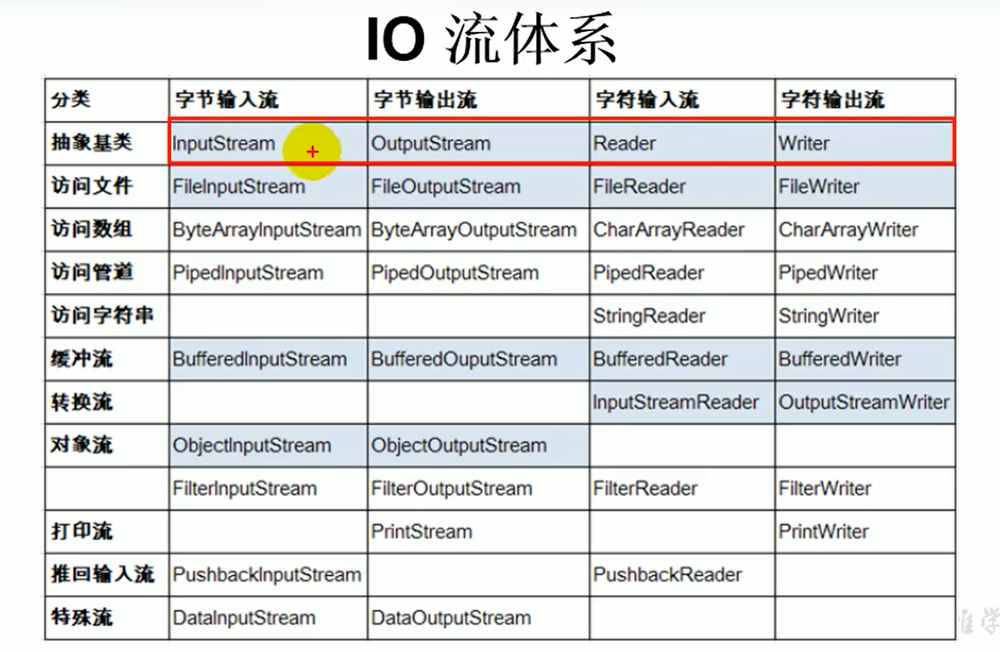
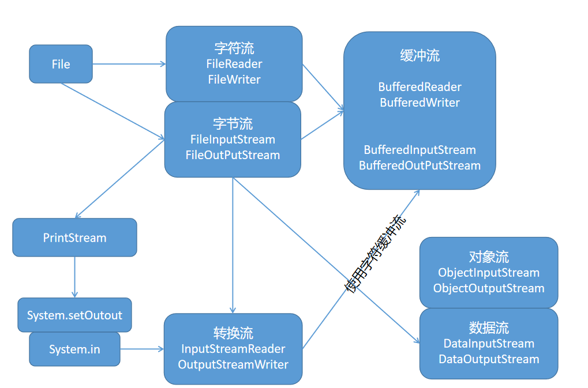
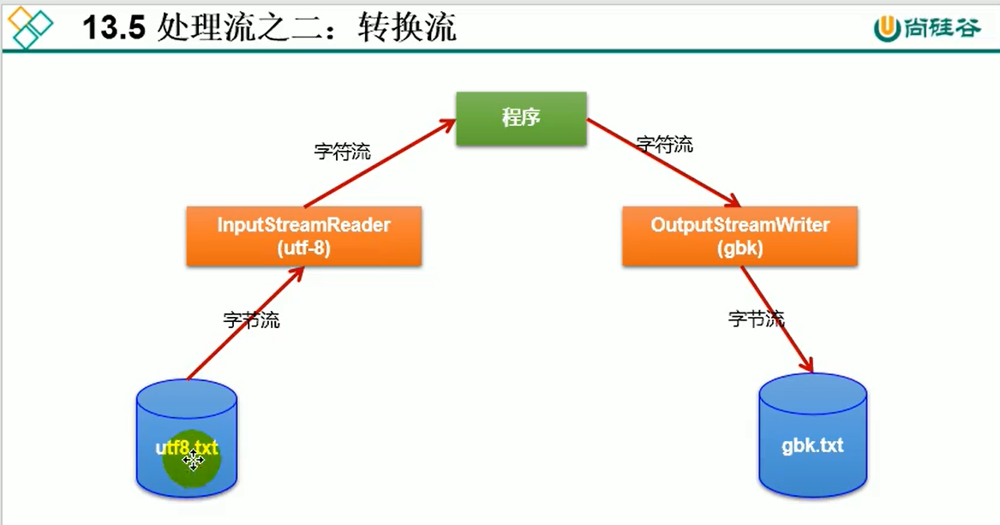

# IO 流

## 1.File类的使用

* File类的一个对象，代表一个文件或一个文件目录（俗称：文件夹）
* File类声明在java.io包下

### 路径的注意事项
* 如果使用的是JUnit中的单元测试方法测试，相对路径即为当前Module下。
* 如果是在main方法中，相对路径即为当前的Project中。

### 路径分隔符

* windows和DOS用'\'
* Unix和URL使用'/'
* public static final String separator 可以获取当前系统的分隔符

### 实例化

```java
public class FileTest {
    @Test
    public void test1(){

        //构造器1
        File file = new File("hello.txt");//相对于当前module
        File file1 =new File("D:\\Desktop\\studyNote\\studyNote\\java\\JavaSenior\\Day13_IO\\hello.txt");
        System.out.println(file);
        System.out.println(file1);

        //构造器2
        File hello = new File("D:\\Desktop\\studyNote\\studyNote\\java\\JavaSenior\\Day13_IO\\", "hello");

        //构造器3
        File file2 = new File(hello, "hello.txt");
    }
}
```

### 常用方法

* public String getAbsolutePath():获取绝对路径
* public String getPath():获取路径
* public String getName():获取名称
* public String getParent():获取上层文件目录路径。若无，返回null
* public long length():获取文件长度
* public long lastModified():最后一次修改的时间，毫秒值
* public String[] list():获取指定目录下的所有文件或者文件目录的名称数组
* public File[] listFiles():获取指定目录下的所有文件或者文件目录的File数组
* public boolean renameTo(File dest):把文件重命名为指定的文件路径（file1.renameTo(file2):要保证file1存在，file2不存在,执行成功后，file不存在了，file2存在）

* public boolean isDirectory():判断是否是文件目录
* public boolean isFile():判断是否是文件
* public boolean exists():判断是否存在
* public boolean canRead():判断是否可读
* public boolean canWrite():判断是否可写
* public boolean isHidden():判断是否隐藏

创建硬盘中对应的文件或文件目 录
* public boolean createNewFile():创建文件，若文件存在，则不创建，返回false
* public boolean mkdir():创建文件目录，如文件目录存在，就不创建，如果此文件目录上层目录不存在，也不创建
* public boolean mkdirs():创建文件目录，如果上层文件不存在，一并创建
删除磁盘中的文件或文件目录
* public boolean delete():删除文件或者文件夹（注意：删除不走回收站，且文件夹中不能有文件或文件目录，必须是空文件夹）

## 2.IO流体系



### 流的分类

* 按操作数据单位：字节流，字符流
* 数据的流向：输入流，输出流
* 流的角色：字节流，处理流

### 流的体系结构

抽象基类            字节流（或文件流）                                       缓冲流（处理流的一种）
InputStream         FileInputStream(read(byte[] buffer))                  BufferedInputStream(read(byte[] buffer))
OutPutStream        FileOutPutStream(write(byte[] buffer,0,len))          BufferedOutPutStream(write(byte[] buffer,0,len))
Reader              FileReader(read(char[] cbuf))                         BufferedReader(read(char[] cbuf)/readLine())
Writer              FileWriter(write(char[] cbuf,0,len))                  BufferedWriter(write(char[] cbuf,0,len)/newLine())

### FileReader,FileWriter

FileReader读文件

* read()的理解：返回读入的一个字符。如果达到文件末尾，返回-1
* 异常的处理：为了保证流资源一定可以执行关闭操作，需要使用try-catch-finally处理
* 读入的文件一定要存在，否则会报异常

```java
class IOTest{
    @Test
    public void test2() throws IOException {
        FileReader fileReader = null;
        try {
            //1.实例化File类的对象，指明要操作的文件
            File file = new File("src\\com\\file\\hello.txt");
            //2.提供具体的流
            fileReader = new FileReader(file);
            //3.数据的读入
//        int data = fileReader.read();
//        while (data!=-1){
//            System.out.print((char) data);
//            data = fileReader.read();
//        }

            int data;
            while ((data=fileReader.read())!=-1){
                System.out.print((char) data);
            }
        } catch (IOException e) {
            e.printStackTrace();
        } finally {
            //4.流的关闭
            try {
                if(fileReader!=null)
                    fileReader.close();
            } catch (IOException e) {
                e.printStackTrace();
            }
        }

    }
}
```

对read()操作升级：使用read的重载方法

```java
class Test{
    @Test
    public void test3() throws IOException {
        //1.File的实例化
        File file = new File("hello.txt");
        //2.FileReader流的实例化
        FileReader fileReader = new FileReader(file);
        //3.读入的操作
        char[] cbuf = new char[5];
        int len;
        while ((len=fileReader.read(cbuf))!=-1){
//            方式1
//            for (int i = 0; i < len; i++) {
//                System.out.println(cbuf[i]);
//            }
//            方式2
            String s = new String(cbuf,0,len);
            System.out.println(s);
        }
        //4.流的关闭
        fileReader.close();
    }
}
```

从内存中写出数据到硬盘的文件

* 输出操作，对应的File可以不存在
* 如果不存在，创建并写入
* 如果存在，FileWriter(file,false)对原有文件覆盖,FileWriter(file,true)不覆盖原有，而是追加，默认是前者

```java
class Test{
    @Test
    public void test4() throws IOException {
        //1、提供File类的对象，指明写出到的文件
        File file = new File("hello1.text");
        //2.提供FileWriter的对象，用于数据的写出
        FileWriter fileWriter = new FileWriter(file);
        //3.写出操作
        fileWriter.write("Hello ya");
        //4.流资源的关闭
        fileWriter.close();
    }
}
```

先读取再写出

```java
class Test{
    @Test
    public void test5(){
        FileReader fileReader=null;
        FileWriter fileWriter=null;
        try {
            //1.创建File类的对象，指明读入和写出的文件
            File srcfile = new File("src\\com\\file\\hello.txt");
            File destFile = new File("hello1.txt");
            //2.提供FIleWriter的对象，用于数据的写出
            fileReader = new FileReader(srcfile);
            fileWriter = new FileWriter(destFile);
            //3.写出操作
            char[] cbuf = new char[5];
            int len;
            while ((len=fileReader.read(cbuf))!=-1){
                fileWriter.write(cbuf,0,len);
            }
        } catch (IOException e) {
            e.printStackTrace();
        } finally {
            //4.流资源的关闭
            try {
                if(fileReader!=null)
                    fileReader.close();
            } catch (IOException e) {
                e.printStackTrace();
            }
            try {
                if(fileWriter!=null)
                    fileWriter.close();
            } catch (IOException e) {
                e.printStackTrace();
            }
        }
    }
}
```

### FileInputStream,FileOutPutStream

* 使用方法与 FileReader，FileWriter基本相同
* 文本文件不能用FileInputStream,FileOutPutStream，如果中途new String看了下，就可能会乱码（文本文件：.txt,.java,.c,.php)，如果直接复制不会乱码
* 非文本文件只能用FileInputStream,FileOutPutStream(非文本文件：.jpg,mp3,mp4,avi,doc,ppt……)

### 处理流：BufferedInputStream和BufferedOutPutStream，BufferedReader和BufferedWriter

* 作用：提高流的读取、写入的速度
* 原因：内部提供了一个缓冲区
* 处理流：就是“套接”在已有流的基础上

```java
class Test {
    @Test
    public void test6(){
        BufferedInputStream bufferedInputStream = null;
        BufferedOutputStream bufferedOutputStream = null;
        try {
            //1.造文件
            File srcFile = new File("img.png");
            File destFile = new File("img2.png");
            //2.造流
            //2.1 造节点流（直接连接文件的流）
            FileInputStream fileInputStream = new FileInputStream(srcFile);
            FileOutputStream fileOutputStream = new FileOutputStream(destFile);
            //2.2 造缓冲流
            bufferedInputStream = new BufferedInputStream(fileInputStream);
            bufferedOutputStream = new BufferedOutputStream(fileOutputStream);
            //3.复制细节
            byte[] buffer = new byte[10];
            int len ;
            while ((len=bufferedInputStream.read(buffer))!=-1){
                bufferedOutputStream.write(buffer,0,len);
            }
        } catch (IOException e) {
            e.printStackTrace();
        } finally {
            //4.关闭流
            //要求：先关闭外层的流，再关闭内层的流
            //说明：关闭外层流的同时，内层流也会自动的进行关闭。关于内层流的关闭可以省略
            if (bufferedOutputStream!=null){
                try {
                    bufferedOutputStream.close();
                } catch (IOException e) {
                    e.printStackTrace();
                }
            }
            if(bufferedInputStream!=null){
                try {
                    bufferedInputStream.close();
                } catch (IOException e) {
                    e.printStackTrace();
                }
            }
        }

    }
}
```

## 3.转换流 InputStreamReader 和 OutputStreamWriter



* 属于字符流
* 作用：提供字节流与字符流之间的转换
* InputStreamReader：字节流-->字符流  /   OutputStreamWriter：字符流-->字节流
* 解码：字节-->字符  /    编码：字符-->字节

InputStreamReader的使用，实现字节的输入流到字符的输入流的转换

```java
class Test {
    @Test
    public void test7() throws IOException {
        FileInputStream fileInputStream = new FileInputStream(new File("hello1.txt"));
        InputStreamReader inputStreamReader = new InputStreamReader(fileInputStream, "UTF-8");

        OutputStreamWriter gbk = new OutputStreamWriter(new FileOutputStream(new File("hello2.txt")), "gbk");
        char[] chars = new char[20];
        int len;
        while ((len=inputStreamReader.read(chars))!=-1){
            gbk.write(chars,0,len);
        }
        inputStreamReader.close();
    }
}
```

## 4.其他流

* 标准的输入、输出流
* 打印流
* 数据流

### 标准的输入、输出流

System.in:标准的输入流，默认从键盘输入（也可以使用Scanner实现，调用next()返回一个字符串
System.out:标准的输出流，默认从控制台输出

```java
public class FileTest {
    public static void main(String[] args) throws IOException {
        InputStreamReader inputStreamReader = new InputStreamReader(System.in);
        BufferedReader bufferedReader = new BufferedReader(inputStreamReader);
        while (true) {
            System.out.println("请输入字符串");
            String s = bufferedReader.readLine();
            if ("e".equalsIgnoreCase(s) || "exis".equalsIgnoreCase(s)) {
                System.out.println("程序结束");
                break;
            }
            String s1 = s.toUpperCase();
            System.out.println(s1);
        }
    }
}
```

* InputStreamReader()参数不是文件了，而是System.in
* bufferedReader.readLine();在回车的时候读取一整行，返回的值就是键盘输入的字符串
* 在单元测试中不能执行，除非进行了配置

###  打印流

System类的setIn(InputStream is)/setOut(PrintStream ps)方式重新指定输入和输出的流。

打印内容到一个文件中
```java
class Test {
    @Test
    public void test8(){
        PrintStream printStream = null;
        try {
            FileOutputStream fileOutputStream = new FileOutputStream(new File("io.txt"));
            printStream = new PrintStream(fileOutputStream, true);
            if (printStream!=null){
                System.setOut(printStream);
            }
            for (int i = 0; i < 255; i++) {
                System.out.print((char) i);
                if (i%50==0){
                    System.out.println();
                }
            }
        } catch (FileNotFoundException e) {
            e.printStackTrace();
        } finally {
            if (printStream!=null){
                try {
                    printStream.close();
                } catch (Exception e) {
                    e.printStackTrace();
                }
            }
        }

    }
}
```

### 数据流

* DataInputStream 和 DataOutputStream
* 作用：用于读取或写出基本类型的变量或字符串

```java
class Test {
    @Test
    public void test9() throws IOException {
        //写入
        DataOutputStream dataOutputStream = new DataOutputStream(new FileOutputStream("data.txt"));
        dataOutputStream.writeUTF("tian");
        dataOutputStream.flush();
        dataOutputStream.writeInt(18);
        dataOutputStream.flush();
        dataOutputStream.writeBoolean(true);
        dataOutputStream.flush();
        dataOutputStream.close();

        //读取（读取的数据要与写入的数据一致）
        DataInputStream dataInputStream = new DataInputStream(new FileInputStream("data.txt"));
        String s = dataInputStream.readUTF();
        int i = dataInputStream.readInt();
        boolean b = dataInputStream.readBoolean();
        System.out.println(s);
        System.out.println(i);
        System.out.println(b);
    }
}
```

### 对象流

* ObjectInputStream 和ObjectOutputStream

序列化过程：将内存中的java对象保存到磁盘中或通过网络传输出去

```java
class Test {
    @Test
    public void test10(){
        ObjectOutputStream objectOutputStream = null;
        try {
            objectOutputStream = new ObjectOutputStream(new FileOutputStream(new File("data.txt")));
            objectOutputStream.writeObject(new String("天安门"));
            objectOutputStream.flush();
        } catch (IOException e) {
            e.printStackTrace();
        } finally {
            if (objectOutputStream!=null){
                try {
                    objectOutputStream.close();
                } catch (IOException e) {
                    e.printStackTrace();
                }
            }
        }

    }
}
```

反序列化过程:将磁盘文件中的对象还原为内存中的一个java对象，使用ObjectInputStream实现

```java
class Test {
    @Test
    public void test11(){
        ObjectInputStream objectInputStream = null;
        try {
            objectInputStream = new ObjectInputStream(new FileInputStream(new File("data.txt")));
            Object o = objectInputStream.readObject();
            String str = (String) o;
            System.out.println(str);
        } catch (IOException e) {
            e.printStackTrace();
        } catch (ClassNotFoundException e) {
            e.printStackTrace();
        } finally {
            if (objectInputStream!=null){
                try {
                    objectInputStream.close();
                } catch (IOException e) {
                    e.printStackTrace();
                }
            }
        }
    }
}
```

自定义类的序列化个反序列化
* 类需要实现以下两个接口之一才可以序列化
  * 实现标识接口Serializable
  * 需要补一个序列版本号
  * 除了当前的类需要实现Serializable接口之外，还必须保证其内部所有属性也必须是可序列化的。（默认情况下，基本数据类型可序列化）
* 不能序列化和反序列化static和transient修饰的成员变量    
```java
public class Person implements Serializable {
    private static final long serialVersionUID=1233333444449234385L;
}
```

## 5.RandomAccessFIle的使用
1.RandomAccessFIle直接继承于java.lang.Object，实现了DataInput和DataOutput
2.RandomAccessFIle既可以作为输入流，也可以作为输出流
3，如果RandomAccessFIle作为输出流时，如果文件不存在，则在执行时创建文件，如果文件已经存在，则从头覆盖。
seek(int num);默认是0，表示从什么位置开始覆盖。

## 6.NIO概述
* Path是File的升级版本，也可以表示文件或文件目录
* 如何实例化Path:使用Paths（Paths.get("路径"))
* 可以与File进行相互转换
