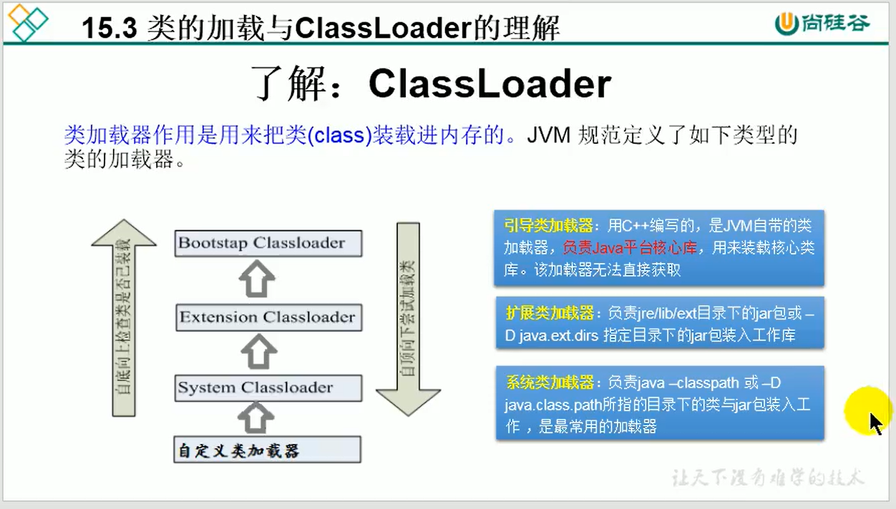

# 15 Java 反射机制

## 1.反射的概述
从对象获取对象的类

## 2.使用场景

* 建议直接new
* 在运行之后才能确定实例化什么类的时候使用反射
* 反射机制与面向对象中的封装性是不是矛盾？答：不矛盾，封装性只是建议，不是限制

关于java.lang.Class的理解
* 1.类的加载过程：程序经过javac.exe命令以后，会生成一个或多个字节码文件，接着我们使用java.exe命令对某个字节码进行解释运行，相当于将某个字节码文件加载到内存中。
  此过程称为类的加载。加载到内存中类，我们就称为运行时类，此运行时类，就作为Class的一个实例。
  
* 2.Class的实例就对应着运行时类。
* 3.加载到内存中的运行时类，会缓存一段时间，在此时间内，我们可以通过不同的方式来获取此运行时类。（4种获取实例方式,推荐第三种）

```java
class Test{
    @Test
    public void test3() throws ClassNotFoundException {
        //方式1：调用运行时类的属性.class
        Class aClass = Person.class;
        //方式2：通过运行时类的对象，调用getClass()
        Person person = new Person();
        Class aClass1 = person.getClass();
        //方式3：调用Class的静态方法：forName（String classPath）
        Class aClass3 = Class.forName("Person");
        //方法4：使用类的加载器 ClassLoader
        ClassLoader classLoader = ReflectionTest.class.getClassLoader();
        Class aCLass4 = classLoader.loadClass("Person");
    }
}
```

## 3.反射的使用

```java
import org.junit.Test;

import java.lang.reflect.Constructor;
import java.lang.reflect.Field;
import java.lang.reflect.Method;

public class ReflectionTest {
    //反射之前对Person的操作
    @Test
    public void test1(){
        //构造器
        Person tom = new Person("Tom", 12);
        //属性
        tom.age = 10;
        //方法
        tom.show();
    }
    //有反射之后
    @Test
    public void test2() throws Exception{
        Class clazz = Person.class;
        //构造器
        Constructor constructor = clazz.getConstructor(String.class, int.class);
        Object tom = constructor.newInstance("Tom", 12);
        Person p = (Person) tom;
        //属性
        Field age = clazz.getDeclaredField("age");
        age.set(p,10);
        //方法
        Method show = clazz.getDeclaredMethod("show");
        show.invoke(p);

        System.out.println("----------------------------------------------------------");
        //调用私有结构
        //构造器
        Constructor constructor1 = clazz.getDeclaredConstructor(String.class);
        constructor1.setAccessible(true);
        Object Jerry = constructor1.newInstance("Jerry");
        Person j = (Person) Jerry;
        //属性
        Field name = clazz.getDeclaredField("name");
        name.setAccessible(true);
        name.set(j,"tian");
        //方法
        Method showNation = clazz.getDeclaredMethod("showNation", String.class);
        showNation.setAccessible(true);
        String nation = (String) showNation.invoke(j, "中国");
        System.out.println(nation);
    }
}

```

## 4.Class的实例可以是哪些结构

* class:外部类，成员（成员内部类，静态内部类），局部类。匿名内部类
* interface：接口
* []：数组
* enum：枚举
* annotation：注解@interface
* primitive type：基本类型
* void
* 注意：只要数组的元素类型与维度一样，就会同一个Class

## 5.类的加载过程

* 1.类的加载（Load）：类加载器将类的文件读入内存，并创建一个java.lang.Class对象
* 2.类的链接（Link）：将类的二进制数据合并到JRE中（对static变量设置默认初始值）
* 3.类的初始化（Initialize）：JVM负责对类进行初始化（由编译期收集类中所有类变量的赋值动作和静态代码块中的语句合并产生的）（对static变量设置初始值）

### 5.1类加载器的作用：
将class文件字节码内容加载到内存中，并将这些静态数据转换成方法区的运行时数据结构，然后再堆中生成一个代表这个类的java.lang.Class对象，作为方法区中类数据的访问入口。
类缓存：类会维持一段时间。

### 5.2 加载器的分类


