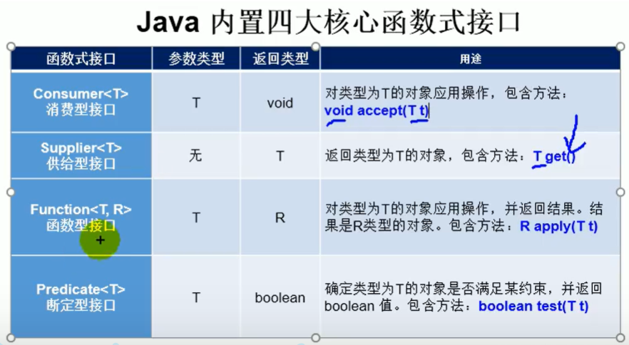
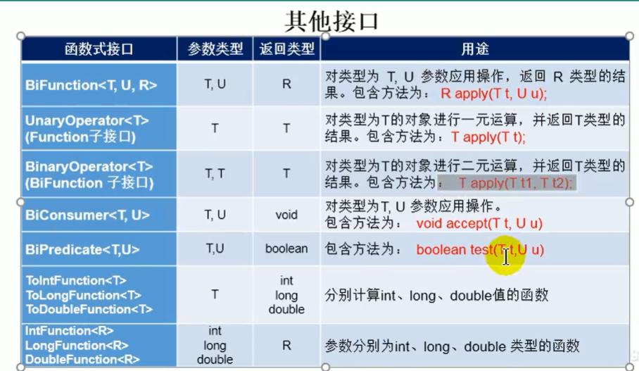

# Java8 新特性

## 1.Lambda表达式

* 本质：作为接口的匿名实例类
* 要求：函数式接口（只有一个抽象方法的接口）
* @FunctionInnovation

```java
import org.junit.Test;

import java.util.Comparator;
import java.util.function.Consumer;

public class LambdaTest {
    //语法格式1：午无参，无返回值
    @Test
    public void test1(){
        Runnable r1 = new Runnable() {
            @Override
            public void run() {
                System.out.println("真棒");
            }
        };
        r1.run();

        System.out.println("--------------------------");
        Runnable r2 = ()-> {
            System.out.println("真棒");
        };
        r2.run();
    }

    //语法格式2：一个参数，没有返回值
    @Test
    public void test2(){
        Consumer<String> con = new Consumer<String>() {
            @Override
            public void accept(String s) {
                System.out.println(s);
            }
        };
        con.accept("哈哈哈哈哈哈哈");
        System.out.println("-----------------------------------------");
        Consumer<String> con1 = (String s)-> {
            System.out.println(s);
        };
        con1.accept("哈哈哈哈哈哈哈");
    }

    //语法格式3：数据类型可以省略，因为可以由编译器推断得出，称为类型推断
    @Test
    public void test3(){
        Consumer<String> con1 = (s)-> {
            System.out.println(s);
        };
        con1.accept("哈哈哈哈哈哈哈");
    }
    //语法格式4：参数只有一个时，可以省略括号
    @Test
    public void test4(){
        Consumer<String> con1 = s-> {
            System.out.println(s);
        };
        con1.accept("哈哈哈哈哈哈哈");
    }
    //语法格式5：需要两个或以上的参数，多条执行语句，并且可以有返回值
    @Test
    public void test5(){
        Comparator<Integer> com = new Comparator<Integer>() {
            @Override
            public int compare(Integer o1, Integer o2) {
                return o1.compareTo(o2);
            }
        };
        System.out.println(com.compare(12, 21));
        System.out.println("-------------------------");
        Comparator<Integer> com1 = (o1, o2) -> {
            return o1.compareTo(o2);
        };
        System.out.println(com1.compare(12, 21));
    }
    //语法格式6：只有一条语句时，可以省略{}和return
    @Test
    public void test6(){
        Comparator<Integer> com1 = (o1, o2) ->o1.compareTo(o2);
        System.out.println(com1.compare(12, 21));
    }
}

```

## 2.函数式接口




## 3.实际使用场景

```java
class Test {
    //根据给定的规则，过滤集合中的字符串。此规则由Predicate的方法决定
    public List<String> filterString(List<String> list, Predicate<String> pre){
        ArrayList<String> filterList = new ArrayList<>();
        for (String s:list){
            if (pre.test(s)){
                filterList.add(s);
            }
        }
        return filterList;
    }
    @Test
    public void test7(){
        List<String> list = Arrays.asList("北京","天津","南京");
        List<String> list1 = filterString(list, s -> s.contains("京"));
        System.out.println(list1);
    }
}
```

## 4.方法引用

Lambda表达式的语法糖
* 使用情景：当要传递给Lambda体的操作，已经有实现的方法了，可以使用方法引用
* 使用格式：类（或对象）::方法名
* 具体分为如下3种情况
    * 对象::非静态方法
    * 类::静态方法
    * 类::非静态方法
    
* 要求：接口抽象方法的返回类型和参数类型与已经有实现的方法的返回类型和参数类型一样

