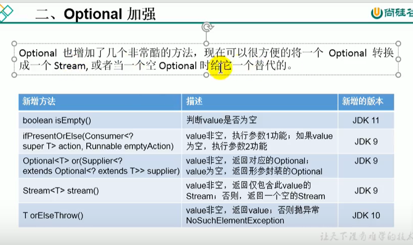

# java11新特性

## 1.字符串新增方法

```java
import org.junit.Test;

public class Java11Test {
    @Test
    public void test(){
        //isBlank()判断字符串是否为空白
        System.out.println("    ".isBlank());//true
        //strip()去除首尾的空白，包含\t,\n
        System.out.println("-----"+"  \t  a bc  \n  ".strip()+"-----");//-----a bc-----
        System.out.println("-----"+"  \t  a bc  \n  ".trim()+"-----");//-----a bc-----
        //stripTrailing()去除尾部空白
        System.out.println("-----"+"  \t  a bc  \n  ".stripTrailing()+"-----");//-----  	  a bc-----
        //stripLeading()去除首部空白
        System.out.println("-----"+"  \t  a bc  \n  ".stripLeading()+"-----");//-----a bc
                                                                                //-----
        //repeat()
        System.out.println("abc".repeat(2));//abcabc
        //lines().count()行数
        String str= "111\n111\n111";
        System.out.println(str.lines().count());//3
    }
}
```

## 2.Optional 加强



```java
class Test{
    @Test
    public void test2(){
        Optional<Object> empty = Optional.empty();
        System.out.println(empty.isPresent());//判断内部的value是否存在  false
        System.out.println(empty.isEmpty());//判断内部的value是否为空    true

        //orElseThrow()没有value时会抛出异常，有value时不抛出异常
        //Object obj = empty.orElseThrow();
        //System.out.println(obj);

        //or
        Optional<String> hello = Optional.of("Hello");
        //or:value非空，返回对应的Optional，value为空，返回形参封装的Optional
        Optional<Object> optional = empty.or(() -> hello);
        System.out.println(optional);
    }
}
```

## 3.局部变量类型推断的升级

```java
class Test{
    @Test
    public void test3(){
        //错误写法
        //Consumer<String> con1 = (@Deprecated t)-> System.out.println(toString().toUpperCase());
        Consumer<String> con1 = (@Deprecated var t)-> System.out.println(toString().toUpperCase());
    }
}
```

## 4.全新的HTTP客户端api
使用HttpClient替换原有的HttpURLConnection

```java
class Test{
    @Test
    public void test4(){
        try {
            HttpClient httpClient = HttpClient.newHttpClient();
            HttpRequest request = HttpRequest.newBuilder(URI.create("http://127.0.0.1:8080/test/")).build();
            HttpResponse.BodyHandler<String> stringBodyHandler = HttpResponse.BodyHandlers.ofString();
            HttpResponse<String> response = httpClient.send(request, stringBodyHandler);
            String body = response.body();
            System.out.println(body);
        } catch (IOException e) {
            e.printStackTrace();
        } catch (InterruptedException e) {
            e.printStackTrace();
        }
    }
}
```

## 5.更简化的编译运行程序
直接用java执行文件（java JavaTest.java）

注意：
* 只执行文件中第一个类的main方法
* 可调用当前文件中的类，但是不能调用其他文件中的类

## 6.废弃Nashorn引擎

## 7.ZGC

* GC(垃圾回收)
* ZGC java11中最瞩目的特性（支持TB级内存容量，暂停时间低（<10ms））
