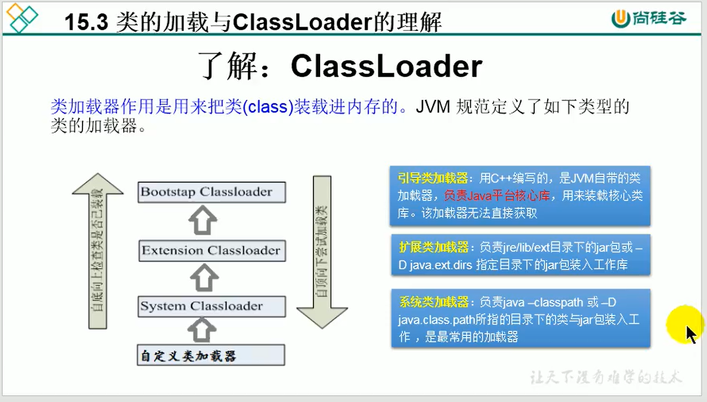
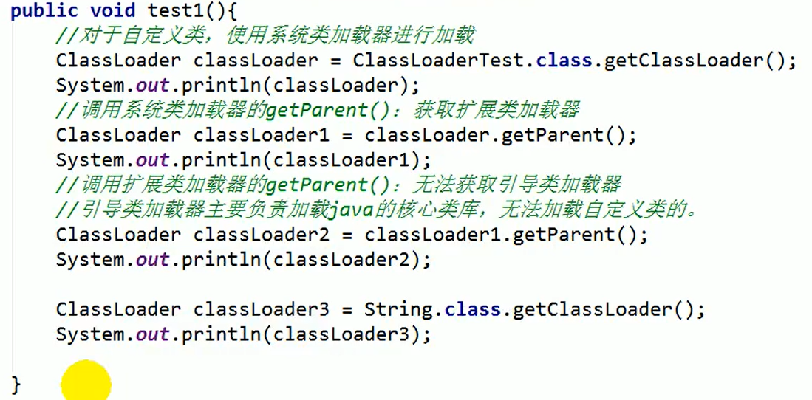

# 15 Java 反射机制

## 1.反射的概述
从对象获取对象的类

## 2.使用场景

* 建议直接new
* 在运行之后才能确定实例化什么类的时候使用反射
* 反射机制与面向对象中的封装性是不是矛盾？答：不矛盾，封装性只是建议，不是限制

关于java.lang.Class的理解
* 1.类的加载过程：程序经过javac.exe命令以后，会生成一个或多个字节码文件，接着我们使用java.exe命令对某个字节码进行解释运行，相当于将某个字节码文件加载到内存中。
  此过程称为类的加载。加载到内存中类，我们就称为运行时类，此运行时类，就作为Class的一个实例。
  
* 2.Class的实例就对应着运行时类。
* 3.加载到内存中的运行时类，会缓存一段时间，在此时间内，我们可以通过不同的方式来获取此运行时类。（4种获取实例方式,推荐第三种）

```java
class Test{
    @Test
    public void test3() throws ClassNotFoundException {
        //方式1：调用运行时类的属性.class
        Class aClass = Person.class;
        //方式2：通过运行时类的对象，调用getClass()
        Person person = new Person();
        Class aClass1 = person.getClass();
        //方式3：调用Class的静态方法：forName（String classPath）
        Class aClass3 = Class.forName("Person");
        //方法4：使用类的加载器 ClassLoader
        ClassLoader classLoader = ReflectionTest.class.getClassLoader();
        Class aCLass4 = classLoader.loadClass("Person");
    }
}
```

## 3.反射的使用

```java
import org.junit.Test;

import java.lang.reflect.Constructor;
import java.lang.reflect.Field;
import java.lang.reflect.Method;

public class ReflectionTest {
    //反射之前对Person的操作
    @Test
    public void test1(){
        //构造器
        Person tom = new Person("Tom", 12);
        //属性
        tom.age = 10;
        //方法
        tom.show();
    }
    //有反射之后
    @Test
    public void test2() throws Exception{
        Class clazz = Person.class;
        //构造器
        Constructor constructor = clazz.getConstructor(String.class, int.class);
        Object tom = constructor.newInstance("Tom", 12);
        Person p = (Person) tom;
        //属性
        Field age = clazz.getDeclaredField("age");
        age.set(p,10);
        //方法
        Method show = clazz.getDeclaredMethod("show");
        show.invoke(p);

        System.out.println("----------------------------------------------------------");
        //调用私有结构
        //构造器
        Constructor constructor1 = clazz.getDeclaredConstructor(String.class);
        constructor1.setAccessible(true);
        Object Jerry = constructor1.newInstance("Jerry");
        Person j = (Person) Jerry;
        //属性
        Field name = clazz.getDeclaredField("name");
        name.setAccessible(true);
        name.set(j,"tian");
        //方法
        Method showNation = clazz.getDeclaredMethod("showNation", String.class);
        showNation.setAccessible(true);
        String nation = (String) showNation.invoke(j, "中国");
        System.out.println(nation);
    }
}

```

## 4.Class的实例可以是哪些结构

* class:外部类，成员（成员内部类，静态内部类），局部类。匿名内部类
* interface：接口
* []：数组
* enum：枚举
* annotation：注解@interface
* primitive type：基本类型
* void
* 注意：只要数组的元素类型与维度一样，就会同一个Class

## 5.类的加载过程

* 1.类的加载（Load）：类加载器将类的文件读入内存，并创建一个java.lang.Class对象
* 2.类的链接（Link）：将类的二进制数据合并到JRE中（对static变量设置默认初始值）
* 3.类的初始化（Initialize）：JVM负责对类进行初始化（由编译期收集类中所有类变量的赋值动作和静态代码块中的语句合并产生的）（对static变量设置初始值）

### 5.1类加载器的作用：
将class文件字节码内容加载到内存中，并将这些静态数据转换成方法区的运行时数据结构，然后再堆中生成一个代表这个类的java.lang.Class对象，作为方法区中类数据的访问入口。
类缓存：类会维持一段时间。

### 5.2 加载器的分类




### 5.3 类加载器获取配置文件

```java
class Test{
  @Test
  public void test4() throws IOException {
    Properties pros = new Properties();
    //读取配置文件的方式一:(路径相对于module）
    FileInputStream fis = new FileInputStream("src\\user.properties");
    pros.load(fis);

    //读取配置文件方式二：（路径相对于src）这里的Test是该类的名称
    ClassLoader classLoader = Test.class.getClassLoader();
    InputStream is = classLoader.getResourceAsStream("user.properties");
    pros.load(is);

    String name = pros.getProperty("name");
    String password = pros.getProperty("password");
    System.out.println("name:"+name+" password:"+password);
  }
}
```

## 6.通过反射创建对应的运行时类的对象

```java
class Test{
  @Test
  public void test6(){
    int num = new Random().nextInt(3);//0,1,2
    String classPath = "";
    switch (num){
      case 0:
        classPath = "java.util.Date";
        break;
      case 1:
        classPath = "java.lang.Object";
        break;
      case 2:
        classPath = "Person";
        break;

    }
    try {
      Object instance = getInstance(classPath);
      System.out.println(instance);
    } catch (Exception e) {
      e.printStackTrace();
    }

  }
  /*
  创建一个指定类的对象
  classpath：指定类的全类名
  */
  public Object getInstance(String classPath) throws Exception {
    Class<?> aClass = Class.forName(classPath);
    return aClass.newInstance();
  }
}
```

## 7 获取运行时类的完整结构

### 7.1属性结构

```java
class Test{
  @Test
  public void test7(){
    Class<Person> clazz = Person.class;

    //获取属性结构
    //getField():获取当前运行时类及其父类中声明为public访问权限的属性
    Field[] fields = clazz.getFields();
    for (Field f:fields){
      System.out.println(f);
    }

    //getDeclareFields（）：获取当前运行时类中声明的所有属性（不包含父类中声明的属性）
    Field[] declaredFields = clazz.getDeclaredFields();
    for (Field f : declaredFields) {
      //1.权限修饰符
      int modifiers = f.getModifiers();
      System.out.print(Modifier.toString(modifiers));
      //2.数据类型
      Class<?> type = f.getType();
      System.out.print(type);
      //3.变量名
      String name = f.getName();
      System.out.print(name);

      System.out.println();
    }
  }
}
```

### 7.2 获取运行时类的方法结构

```java
class Test{
  @Test
  public void test8(){
    Class<Person> clazz = Person.class;
    //getMethods（） 获取当前运行时类及其所有父类中声明为public的方法
    Method[] methods = clazz.getMethods();
    for (Method m :methods){
      System.out.println(m);
    }
    //getDeclareMethods（）获取当前运行时类中声明的所有方法。（不包含父类中声明的方法）
    Method[] declaredMethods = clazz.getDeclaredMethods();
    for (Method m: declaredMethods) {
      //1.获取方法声明的注释
      Annotation[] annotations = m.getAnnotations();
      for (Annotation a:annotations){
        System.out.println(a);
      }
      //2.权限修饰符
      System.out.println(Modifier.toString(m.getModifiers()));
      //3.返回值类型
      System.out.println(m.getReturnType().getName());
      //4.方法名
      System.out.println(m.getName());
      //5.形参列表
      Class<?>[] parameterTypes = m.getParameterTypes();
      if (!(parameterTypes == null || parameterTypes.length == 0)){
        for (int i=0;i<parameterTypes.length;i++){
          if (i==parameterTypes.length-1){
            System.out.println(parameterTypes[i].getName()+"args_"+i);
            break;
          }
          System.out.println(parameterTypes[i].getName()+"args_"+i+",");
        }
      }
      //6.抛出的异常
      Class<?>[] exceptionTypes = m.getExceptionTypes();
      if(!(exceptionTypes==null||exceptionTypes.length==0)){
        System.out.print("throws ");
        for (int i = 0; i < exceptionTypes.length; i++) {
          if (i==exceptionTypes.length-1){
            System.out.println(exceptionTypes[i].getName());
            break;
          }
          System.out.println(exceptionTypes[i].getName()+",");
        }
      }
    }
  }
}
```

### 7.3 获取构造器

```java
class Test{
  @Test
  public void test9(){
    Class<Person> clazz = Person.class;
    //getConstructors() 获取当前运行时类中声明为public的构造器
    Constructor<?>[] constructors = clazz.getConstructors();
    for (Constructor i:constructors){
      System.out.println(i);
    }
    //getDeclaredConstructors() 获取当前运行时类中声明的所有构造器
    Constructor<?>[] declaredConstructors = clazz.getDeclaredConstructors();
    for (Constructor i:declaredConstructors){
      System.out.println(i);
    }
  }
}
```

### 7.4 获取运行时类的父类

```java
class Test{
  //获取父类
  @Test
  public void test10(){
    Class<Person> clazz = Person.class;
    Class<? super Person> superclass = clazz.getSuperclass();
    System.out.println(superclass);
  }
  //获取带泛型的父类
  @Test
  public void test11(){
    Class<Person> clazz = Person.class;
    Type genericSuperclass = clazz.getGenericSuperclass();
    System.out.println(genericSuperclass);
  }
  //获取带泛型的父类的泛型
  @Test
  public void test12(){
    Class<Person> clazz = Person.class;
    Type genericSuperclass = clazz.getGenericSuperclass();
    ParameterizedType paramType = (ParameterizedType) genericSuperclass;
    //获取泛型类型
    Type[] actualTypeArguments = paramType.getActualTypeArguments();
    System.out.println(((Class)actualTypeArguments[0]).getName());
  }
}
```

### 7.5 获取运行时类实现的接口

```java
class Test{
  //获取运行时类实现的接口
  @Test
  public void test13(){
    Class<Person> clazz = Person.class;
    Class<?>[] interfaces = clazz.getInterfaces();
    for (Class c : interfaces) {
      System.out.println(c);
    }
    //获取父类实现的接口
    Class<?>[] interfaces1 = clazz.getSuperclass().getInterfaces();
    for (Class c : interfaces1) {
      System.out.println(c);
    }
  }
}
```

### 7.6 获取运行时类所在的包

Package pack = clazz.getPackage()

### 7.7 获取运行时类声明的注解

Annotation[] annotations = clazz.getAnnotations()

## 8 调用运行时类的指定结构

```java
class Test{
  //如何操作运行时类的指定的属性
  @Test
  public void test14() throws Exception {
    Class<Person> clazz = Person.class;
    //创建运行时类的对象
    Person person = clazz.newInstance();

    //方式1：
    //获取指定的属性(要求运行时类中属性声明为public）
    //Field id = clazz.getField("id");

    //方式2：
    //获取指定的属性
    Field id = clazz.getDeclaredField("id");
    id.setAccessible(true);
    //设置当前属性的值
    //set（）
    id.set(person,1001);
    //获取指定属性的值
    Object o = id.get(person);
    System.out.println(o);
  }

  //如何操作运行时类中指定的方法
  @Test
  public void test15() throws Exception{
    Class<Person> clazz = Person.class;
    Person person = clazz.newInstance();
    //getDeclaredMethod()：参数1：指明获取的对象的名称，参数2：调取方法的形参列表
    Method show = clazz.getDeclaredMethod("showNation", String.class);
    show.setAccessible(true);
    Object invoke = show.invoke(person, "中国");
    System.out.println(invoke);

    //如何调用静态方法
    Method show1 = clazz.getDeclaredMethod("show");
    show1.setAccessible(true);
    Object invoke1 = show1.invoke(null);
    System.out.println(invoke1);
  }

  //如何调用运行时类中的构造器
  @Test
  public void test16() throws Exception{
    Class<Person> clazz = Person.class;
    //1.获取指定的构造器
    Constructor<Person> declaredConstructor = clazz.getDeclaredConstructor(String.class);
    //2.保证此构造器是可以访问的
    declaredConstructor.setAccessible(true);
    //3.调用构造器运行时类的对象
    Person tom = declaredConstructor.newInstance("Tom");
    System.out.println(tom);
  }
}
```

## 9 反射的应用（动态代理）

```java
import java.lang.reflect.InvocationHandler;
import java.lang.reflect.Method;
import java.lang.reflect.Proxy;

public class ProxyTest {
    public static void main(String[] args) {
        //获取代理类对象
        Human proxyInstance = (Human) ProxyFactory.getProxyInstance(new SuperMan());
        String belief = proxyInstance.getBelief();
        System.out.println(belief);

        proxyInstance.eat("麻辣烫");
    }
}
interface Human{
    String getBelief();
    void eat(String food);
}
//被代理类
class SuperMan implements Human{

    @Override
    public String getBelief() {
        System.out.println("我相信");
        return "我相信";
    }

    @Override
    public void eat(String food) {
        System.out.println("我喜欢吃"+food);
    }
}
//获取代理类对象的类
class ProxyFactory{
    //调用此方法，返回一个代理类,调用该代理类的对象的方法时，会自动调用myInvocationHandler的invoke方法
    public static Object getProxyInstance(Object obj){
        MyInvocationHandler myInvocationHandler = new MyInvocationHandler();
        myInvocationHandler.bind(obj);
        return Proxy.newProxyInstance(obj.getClass().getClassLoader(),obj.getClass().getInterfaces(),myInvocationHandler);
    }
}
//代理类
class MyInvocationHandler implements InvocationHandler{
    //当通过代理类的对象，调用方法a时，就会自动的调用如下的方法：invoke()
    private Object obj;
    public void bind(Object obj){
        this.obj=obj;
    }
    @Override
    public Object invoke(Object proxy, Method method, Object[] args) throws Throwable {
        System.out.println("代理工厂的准备工作");
        Object invoke = method.invoke(obj, args);//调用被代理类的方法
        System.out.println("代理工厂的收尾工作");
        return invoke;
    }
}
```