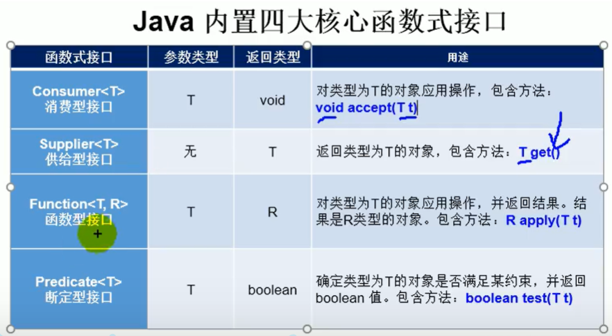
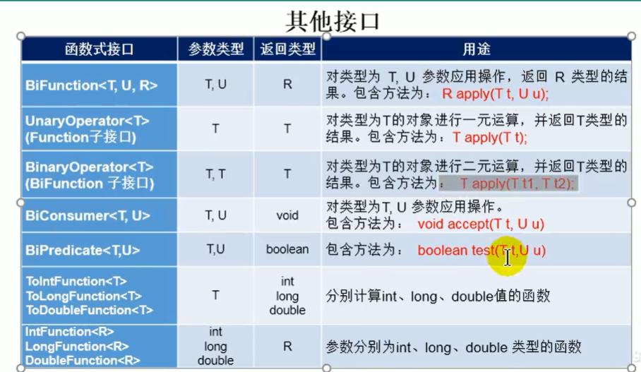

# Java8 新特性

## 1.Lambda表达式

* 本质：作为接口的匿名实例类
* 要求：函数式接口（只有一个抽象方法的接口）
* @FunctionInnovation

```java
import org.junit.Test;

import java.util.Comparator;
import java.util.function.Consumer;

public class LambdaTest {
    //语法格式1：午无参，无返回值
    @Test
    public void test1(){
        Runnable r1 = new Runnable() {
            @Override
            public void run() {
                System.out.println("真棒");
            }
        };
        r1.run();

        System.out.println("--------------------------");
        Runnable r2 = ()-> {
            System.out.println("真棒");
        };
        r2.run();
    }

    //语法格式2：一个参数，没有返回值
    @Test
    public void test2(){
        Consumer<String> con = new Consumer<String>() {
            @Override
            public void accept(String s) {
                System.out.println(s);
            }
        };
        con.accept("哈哈哈哈哈哈哈");
        System.out.println("-----------------------------------------");
        Consumer<String> con1 = (String s)-> {
            System.out.println(s);
        };
        con1.accept("哈哈哈哈哈哈哈");
    }

    //语法格式3：数据类型可以省略，因为可以由编译器推断得出，称为类型推断
    @Test
    public void test3(){
        Consumer<String> con1 = (s)-> {
            System.out.println(s);
        };
        con1.accept("哈哈哈哈哈哈哈");
    }
    //语法格式4：参数只有一个时，可以省略括号
    @Test
    public void test4(){
        Consumer<String> con1 = s-> {
            System.out.println(s);
        };
        con1.accept("哈哈哈哈哈哈哈");
    }
    //语法格式5：需要两个或以上的参数，多条执行语句，并且可以有返回值
    @Test
    public void test5(){
        Comparator<Integer> com = new Comparator<Integer>() {
            @Override
            public int compare(Integer o1, Integer o2) {
                return o1.compareTo(o2);
            }
        };
        System.out.println(com.compare(12, 21));
        System.out.println("-------------------------");
        Comparator<Integer> com1 = (o1, o2) -> {
            return o1.compareTo(o2);
        };
        System.out.println(com1.compare(12, 21));
    }
    //语法格式6：只有一条语句时，可以省略{}和return
    @Test
    public void test6(){
        Comparator<Integer> com1 = (o1, o2) ->o1.compareTo(o2);
        System.out.println(com1.compare(12, 21));
    }
}

```

## 2.函数式接口




## 3.实际使用场景

```java
class Test {
    //根据给定的规则，过滤集合中的字符串。此规则由Predicate的方法决定
    public List<String> filterString(List<String> list, Predicate<String> pre){
        ArrayList<String> filterList = new ArrayList<>();
        for (String s:list){
            if (pre.test(s)){
                filterList.add(s);
            }
        }
        return filterList;
    }
    @Test
    public void test7(){
        List<String> list = Arrays.asList("北京","天津","南京");
        List<String> list1 = filterString(list, s -> s.contains("京"));
        System.out.println(list1);
    }
}
```

## 4.方法引用

Lambda表达式的语法糖
* 使用情景：当要传递给Lambda体的操作，已经有实现的方法了，可以使用方法引用
* 使用格式：类（或对象）::方法名
* 具体分为如下3种情况
    * 对象::非静态方法
    * 类::静态方法
    * 类::非静态方法
    
* 要求：接口抽象方法的返回类型和参数类型与已经有实现的方法的返回类型和参数类型一样

```java
import org.junit.Test;

import java.util.Comparator;
import java.util.function.BiPredicate;
import java.util.function.Consumer;
import java.util.function.Function;

public class MethodRefTest {
    //情况1：对象::非静态方法
    //Consumer中的void accept(T t)
    //PrintStream 中的void println(T t)
    @Test
    public void test1(){
        Consumer<String> con = str -> System.out.println(str);
        con.accept("北京");
        System.out.println("---------------------------------------");
        Consumer<String> con1 = System.out::println;
        con1.accept("北京");
    }
    //情况2：类::静态方法
    @Test
    public void test2(){
        Comparator<Integer> com1 = (t1,t2)->Integer.compare(t1,t2);
        int compare = com1.compare(12, 21);
        System.out.println(compare);
        System.out.println("--------------------------------------");
        Comparator<Integer> com2 = Integer::compare;
        int compare1 = com2.compare(12, 21);//相当于Integer.compare(12, 21)
        System.out.println(compare1);
    }
    //情况3：类::非静态方法
    @Test
    public void test3(){
        Comparator<Integer> com1 = (t1,t2)->t1.compareTo(t2);
        int compare = com1.compare(12, 22);
        System.out.println(compare);

        System.out.println("--------------------------------------");

        Comparator<Integer> com2 = Integer::compareTo;
        int compare1 = com2.compare(12, 22);//相当于12.compareTo(22)
        System.out.println(compare1);

        System.out.println("-----------------------------------------");

        BiPredicate<String,String> pre = String::equals;
        boolean test = pre.test("abc", "abc");
        System.out.println(test);

        System.out.println("-------------------------------------------");

        Person tom = new Person("Tom", 12);
        Function<Person,String> pre1 = Person::getName;
        String apply = pre1.apply(tom);
        System.out.println(apply);
    }
}
```

## 5.构造器引用

和方法引用类似，函数式接口的抽象方法的形参列表和构造器的形参列表一致，
抽象方法的返回值类型即为构造器所属的类

```java
import org.junit.Test;

import java.util.function.BiFunction;
import java.util.function.Function;
import java.util.function.Supplier;

public class ConstructorRefTest {
    @Test
    public void test1(){
        Supplier<Person> per = ()->new Person();
        per.get();
        System.out.println("--------------------------------");
        Supplier<Person> per1 = Person::new;
        per1.get();
    }
    @Test
    public void test2(){
        Function<Integer,Person> per = Person::new;
        Person apply = per.apply(12);
        System.out.println(apply);
    }
    @Test
    public void test3(){
        BiFunction<String,Integer,Person> per = Person::new;
        Person tom = per.apply("tom", 12);
        System.out.println(tom);
    }
}
```

## 6.数组引用
把数组看做是特殊的类，就相当于构造器引用

```java
class Test{
  @Test
  public void test4(){
    Function<Integer,String[]> func1 = length -> new String[length];
    func1.apply(12);
    System.out.println("---------------------------");
    Function<Integer,String[]> func2 = String[]::new;
    func2.apply(12);
  }
}
```

## 7.强大的Stream API

### 概念
Stream关注的是对数据的运算，与CPU打交道，集合关注的是数据的存储，与内存打交道

### Stream特点
1. Stream自己不会存储元素
2. Stream不会改变源对象，相反，会返回一个持有结果的新Stream
3. Stream 操作是延迟执行的，这意味着他们会等到需要结果的时候才执行

### Stream的执行流程
1. Stream的实例化
2. 一系列的中间操作（过滤、映射、。。。）

### Stream说明
* 一个中间操作链，对数据源的数据进行处理
* 一旦执行终止操作，就执行中间操作链，并产生结果，之后，不会再被使用

### 1. Stream的实例化
```java
import org.junit.Test;

import java.util.Arrays;
import java.util.List;
import java.util.stream.IntStream;
import java.util.stream.Stream;

public class StreamAPITest {
    //创建Stream方式一：通过集合
    @Test
    public void test1(){
        List<Employee> employees = EmployeeData.getEmployees();
        //stream（）:返回一个顺序流
        Stream<Employee> stream = employees.stream();
        //parallelStream()返回一个并行流
        Stream<Employee> employeeStream = employees.parallelStream();
    }
    //创建Stream方式二：通过数组
    @Test
    public void test2(){
        //Arrays.stream(T[] array):返回一个流
        int[] arr = new int[]{1,2,3,4,5};
        IntStream stream = Arrays.stream(arr);

        Employee tom = new Employee(1001, "Tom", 12, 122);
        Employee Jerry = new Employee(1001, "Jerry", 12, 122);
        Employee[] employees = {tom, Jerry};
        Stream<Employee> stream1 = Arrays.stream(employees);
    }
    //创建Stream方式三：Stream.of();
    @Test
    public void test3(){
        Stream<Integer> integerStream = Stream.of(1, 2, 3, 4);
    }
    //创建Stream方式四：创建无限流
    @Test
    public void test4(){
        //迭代
        //遍历前10个偶数
        Stream.iterate(0,t->t+2).limit(10).forEach(System.out::println);

        //生成
        //Stream.generate(Supplier<T> s)
        Stream.generate(Math::random).limit(10).forEach(System.out::println);
    }
}

```

### 2. Stream的中间操作

```java
class Test{
  //1.筛选与切片
  @Test
  public void test5(){
    List<Employee> employees = EmployeeData.getEmployees();
    Stream<Employee> stream = employees.stream();
    //过滤
    stream.filter(e->e.getSalary()>601).forEach(System.out::println);
    System.out.println();

    //截断
    employees.stream().limit(3).forEach(System.out::println);
    System.out.println();

    //跳过数据
    employees.stream().skip(2).forEach(System.out::println);
    System.out.println();

    //筛选:通过流所生成元素的hashCode和equals去除重复元素
    employees.stream().distinct().forEach(System.out::println);
  }
  //2.映射
  @Test
  public void test6(){
    //map(Function f) 接受一个函数作为参数，将元素转换成其他形式或提取信息，该函数会被应用到每个元素上，并将其映射成一个新的元素
    List<String> list = Arrays.asList("aa", "bb", "cc");
    list.stream().map(str->str.toUpperCase()).forEach(System.out::println);

    //练习1：获取员工姓名长度大于3的员工
    List<Employee> employees = EmployeeData.getEmployees();
    Stream<String> nameStream = employees.stream().map(Employee::getName);
    nameStream.filter(e->e.length()>3).forEach(System.out::println);

    //练习2：
    Stream<Stream<Character>> streamStream = list.stream().map(StreamAPITest::fromStringToStream);
    streamStream.forEach(s->s.forEach(System.out::println));
    //flatMap(Function f)接受一个函数作为参数，将流中的每个值都换成另一个流，然后把所有流连接成一个流
    Stream<Character> characterStream = list.stream().flatMap(StreamAPITest::fromStringToStream);
    characterStream.forEach(System.out::println);
  }
  //将字符串中的多个字符构成的集合转换为对应的Stream的实例
  public static Stream<Character> fromStringToStream(String str){
    ArrayList<Character> list = new ArrayList<>();
    for (Character c:str.toCharArray()) {
      list.add(c);
    }
    return list.stream();
  }
  //3.排序（排序的类需要实现Comparable接口或者定制排序）
  @Test
  public void test7(){
    List<Integer> integers = Arrays.asList( 34, 56,12, 78, 90);
    integers.stream().sorted().forEach(System.out::println);

    //定制排序
    List<Employee> employees = EmployeeData.getEmployees();
    employees.stream().sorted((e1,e2)->Integer.compare(e1.getAge(),e2.getAge())).forEach(System.out::println);
  }
}
```

### 3. Stream的终止操作

```java
import org.junit.Test;

import java.util.*;
import java.util.stream.Collector;
import java.util.stream.Collectors;
import java.util.stream.Stream;

public class StreamTest1 {
    //1.匹配与查找
    @Test
    public void test1(){
        List<Employee> employees = EmployeeData.getEmployees();
        //allMatch(Predicate p) 检查是都匹配所有的元素
        //练习：是否所有的员工的年龄都大于18
        boolean allMatch = employees.stream().allMatch(employee -> employee.getAge() > 18);
        System.out.println(allMatch);
        //anyMatch(Predicate p) 检查是否有一个满足的元素
        boolean b = employees.stream().anyMatch(employee -> employee.getSalary() > 602);
        System.out.println(b);
        //noneMatch(Predicate p) 检查是否没有匹配的元素
        boolean t = employees.stream().noneMatch(employee -> employee.getName().startsWith("s"));
        System.out.println(t);
        //findFirst() 返回第一个元素
        Optional<Employee> first = employees.stream().findFirst();
        System.out.println(first);
        //findAny() 返回任意一个
        Optional<Employee> any = employees.parallelStream().findAny();
        System.out.println(any);
        //count() 求个数
        long count = employees.stream().filter(employee -> employee.getSalary() > 600).count();
        System.out.println(count);
        //max(Comparator c)返回流中的最大值
        //返回最高的工资
        Stream<Double> doubleStream = employees.stream().map(Employee::getSalary);
        Optional<Double> max = doubleStream.max(Double::compare);
        System.out.println(max);
        //min(Comparator c)返回流中的最小值
        //练习：返回最低工资的员工
        Optional<Employee> min = employees.stream().min((e1, e2) -> Double.compare(e1.getSalary(), e2.getSalary()));
        System.out.println(min);
        //forEach(Consumer c)内部迭代
        employees.stream().forEach(System.out::println);
        //集合的遍历操作
        employees.forEach(System.out::println);
    }
    //2.归约
    @Test
    public void test2(){
        //reduce(T identity,BinaryOperation)可以将流中元素反复结合起来，得到一个只。返回T
        //练习：求1-10的自然数的和
        List<Integer> integers = Arrays.asList(1, 2, 3, 4, 5, 6, 7, 8, 9, 10);
        Integer reduce = integers.stream().reduce(100, Integer::sum);
        System.out.println(reduce);
        //练习2：计算员工的总工资
        List<Employee> employees = EmployeeData.getEmployees();
        //有初始值
        Stream<Double> doubleStream = employees.stream().map(Employee::getSalary);
        Double reduce1 = doubleStream.reduce(1000.0, Double::sum);
        System.out.println(reduce1);
        //无初始值
        Stream<Double> doubleStream2 = employees.stream().map(Employee::getSalary);
        Optional<Double> reduce2 = doubleStream2.reduce(Double::sum);
        System.out.println(reduce2);
        //自定义
        Stream<Double> doubleStream3 = employees.stream().map(Employee::getSalary);
        Optional<Double> reduce3 = doubleStream3.reduce((e1, e2) -> e1 + e2);
        System.out.println(reduce3);
    }

    //3.收集
    @Test
    public void test7(){
        // collect(Collector c) 将流转换为其他形式。接受一个Collector接口的实现，用于给Stream中元素做汇总
        //练习：查找工资大于600的员工
        List<Employee> employees = EmployeeData.getEmployees();
        List<Employee> collect = employees.stream().filter(e -> e.getSalary() > 600).collect(Collectors.toList());
        collect.forEach(System.out::println);
        System.out.println();
        Set<Employee> collect1 = employees.stream().filter(e -> e.getSalary() > 600).collect(Collectors.toSet());
        collect1.forEach(System.out::println);
    }
}
```

