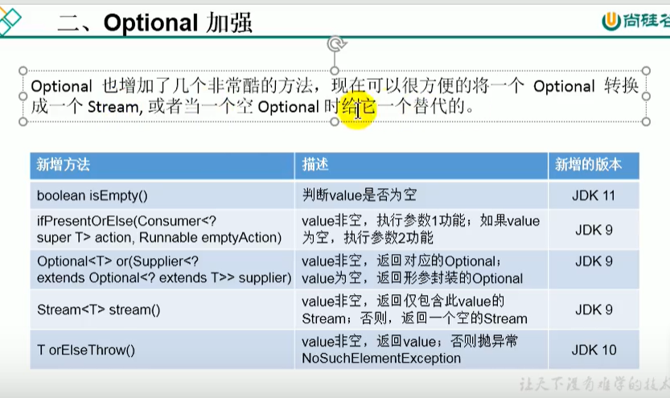

# java11新特性

## 1.字符串新增方法

```java
import org.junit.Test;

public class Java11Test {
    @Test
    public void test(){
        //isBlank()判断字符串是否为空白
        System.out.println("    ".isBlank());//true
        //strip()去除首尾的空白，包含\t,\n
        System.out.println("-----"+"  \t  a bc  \n  ".strip()+"-----");//-----a bc-----
        System.out.println("-----"+"  \t  a bc  \n  ".trim()+"-----");//-----a bc-----
        //stripTrailing()去除尾部空白
        System.out.println("-----"+"  \t  a bc  \n  ".stripTrailing()+"-----");//-----  	  a bc-----
        //stripLeading()去除首部空白
        System.out.println("-----"+"  \t  a bc  \n  ".stripLeading()+"-----");//-----a bc
                                                                                //-----
        //repeat()
        System.out.println("abc".repeat(2));//abcabc
        //lines().count()行数
        String str= "111\n111\n111";
        System.out.println(str.lines().count());//3
    }
}
```

## 2.Optional 加强



