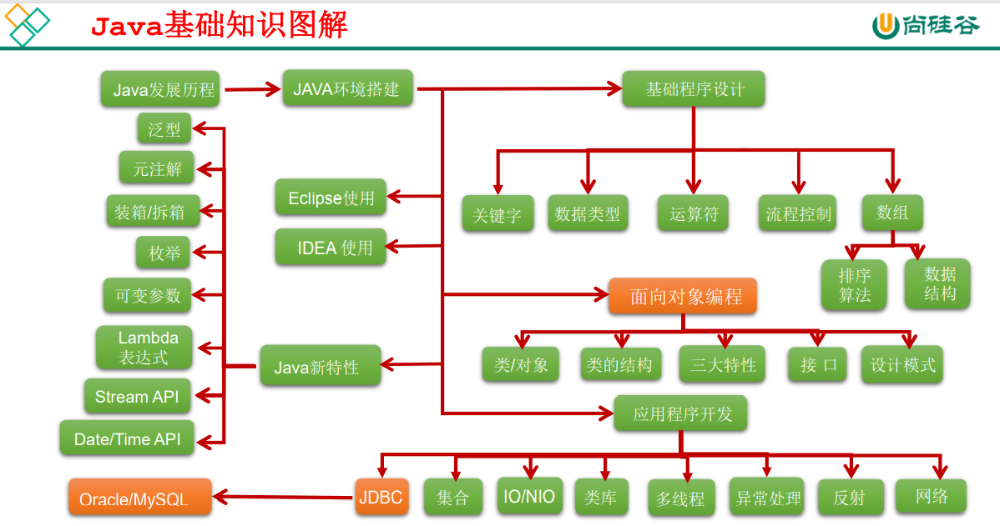

# Day01

## HelloWord

### 1.编写:HelloWorld.java文件

```java
/**
 @author tiantian
 @version v1.0
 这是我的第一个程序
 */
public class HelloWorld {
    /**
     * main(),作用：程序的入口
     * @param args
     */
    public static void main(String[] args){
        System.out.println("hello world");
    }
}
```

### 2.编译：javac -encoding UTF-8 源文件名.java

### 3.运行：java 类名

### 4.生成doc文件

javadoc -d myDoc -encoding utf-8 -author -version HelloWorld.java

## 注意事项

* 在一个java源文件中可以声明多个class。但最多有一个public class
* 且public class 类名需要与文件名相同
* 程序的入口是main()方法，格式是固定的
* 输出语句 println()输出并换行   print()只输出数据
* 每一行执行语句都以“;”结尾
* 编译以后，会生成一个或多个字节码文件，文件名与源文件中类名一致
* JDK = JRE + java开发工具（javac.exe,java.exe,javadoc.exe)
* JRE = JVM(java virtual machine) + javaSE 核心类库

  
