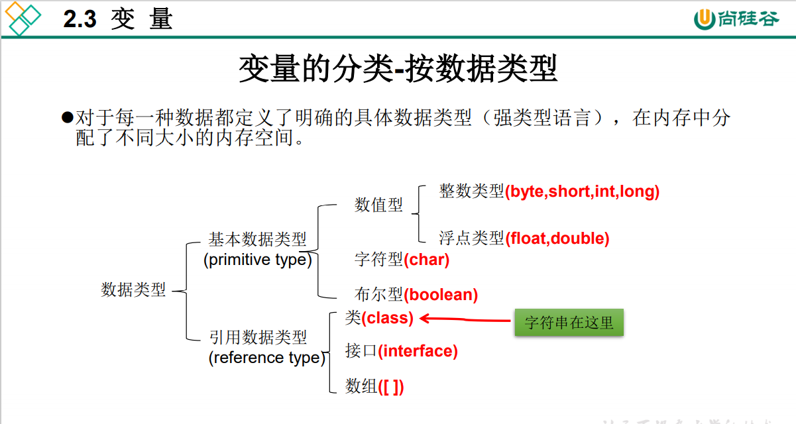
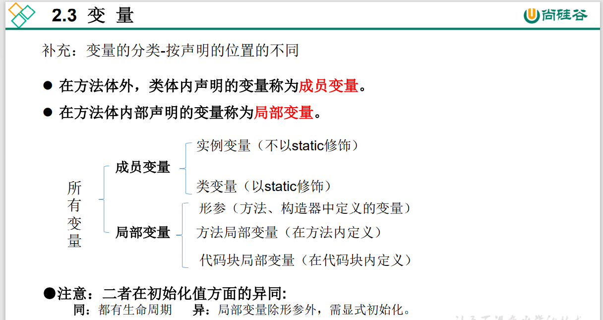
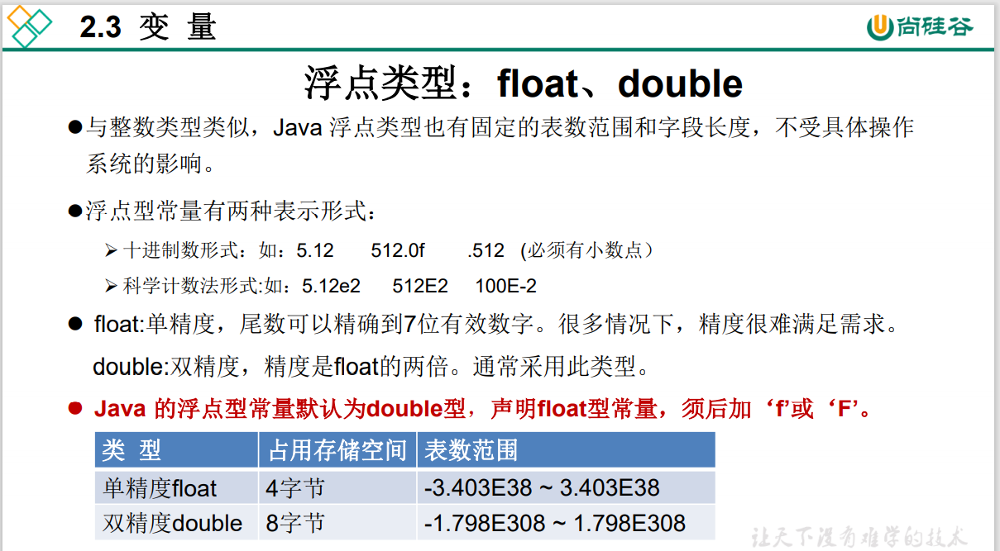
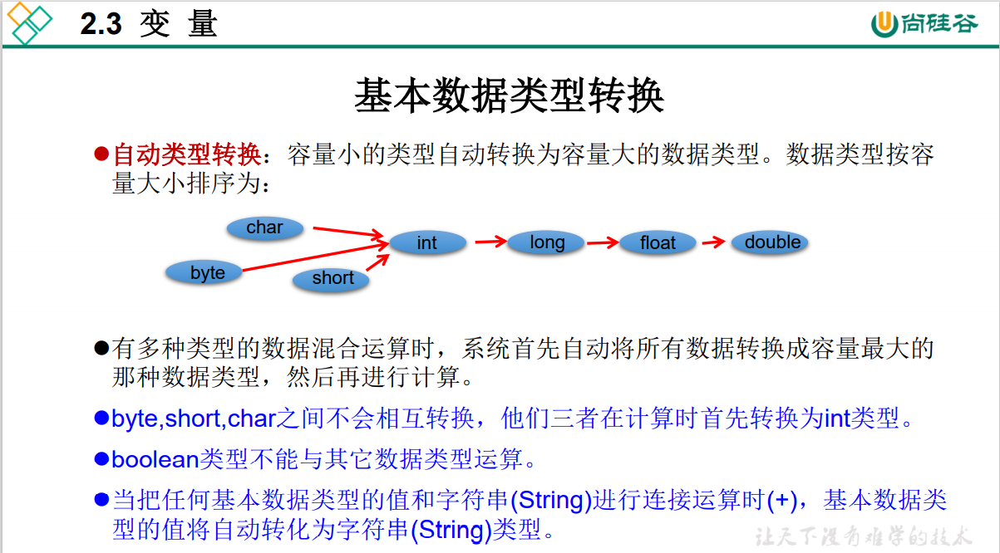
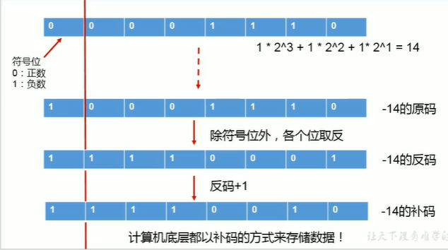
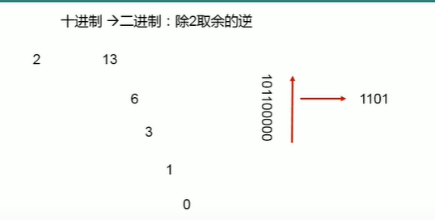
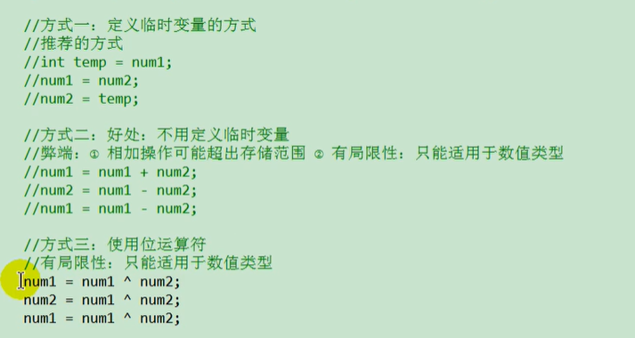
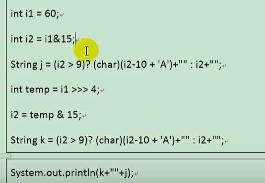
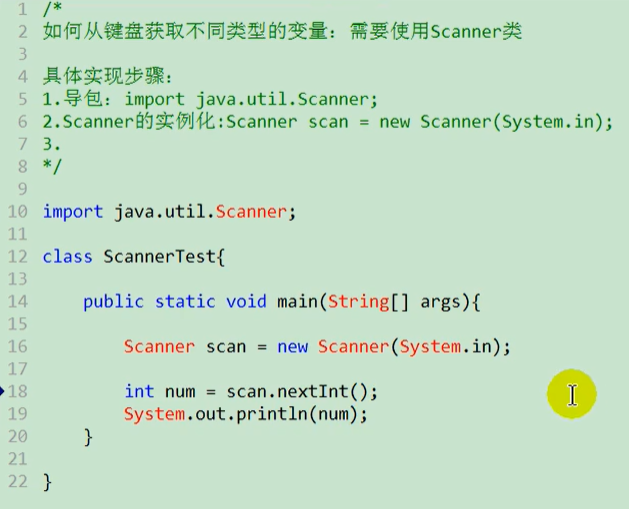
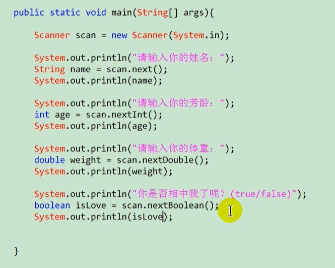

# day02 java基本语法

## 1. 标识符的命名规范

* 包名：xxxyyyzzz
* 类名、接口名：XxxYyyZzz
* 变量名、方法名：xxxYyyZzz
* 常量名：XXX_YYY_ZZZ

## 2. 变量

  

  

  

```java
//仅在声明时会强转,且不能包含变量
byte a=3;//√
byte b=3+4;//√
byte c=a;//√ 包含变量但不需要强转
byte d=3+a;//× 包含变量且需要强转
byte e=(byte)(3+a);//√
byte f=(byte)3+a;//×
System.out.println(a);
```

  

**char型数据**用来表示通常意义上“字符”(2字节)

  

**String**不是基本数据类型，属于引用数据类型

## 3. 进制

### 二进制->十进制（正数）

  

### 二进制->十进制（负数）

直接将所有位取反，末尾+1，所得数字就是该负数的绝对值，再用上述方法转成十进制

### 十进制->二进制

  

## 4. 运算

### 取余运算 %

结果的符号与被模数的符号相同（a%b  结果符号与a的符号相同）

### ++ 自增

不会改变变量的类型

### += 赋值运算符

不会改变变量本身的类型

### 左移右移运算符

* << : 在一定范围内，每向左移1位，相当于 * 2

* \>> : 在一定范围内，每向右移1位，相当于 / 2

注意：

* << 空缺位补0
* \>> 若最高位是0，空缺位补0，最高位是1，空缺位全补1
* \>>> 空缺位都补0（与最高位无关）

### 异或

公式：m=（m^n)^n

## 4. 流程控制

* switch结构中的表达式，只能是如下6种数据类型之一：byte、short、char、int、枚举类型（jdk5.0新增）、String类型（jdk7.0新增）
* 不在循环条件部分限制次数的结构：for(;;) 或 while(true)
* continue和break后都不可以跟执行语句，否则编译报错
* break，continue默认跳出包裹此关键字最近的一层循环

### 带标签的break和continue(跳出指定的循环)

```java
    label:for(int i=0;i<3;i++){
        for(int j=0;j<3;j++){
            if(j==1){
                break label;//结束指定标识的一层循环结构
                //continue label;//结束指定标识的一层循环结构的当次循环
            }
            System.out.println(i+" "+j);
        }
    }
```

## 5. 例题

### 实现a,b交换

  

### 将60转换成16进制

  
  
注意：&15的原因是15的二进制为0000 1111，a&15操作之后只保留a二进制的后4位

### 获取键盘输入的内容

  
  

### 输出100以内所有的质数(素数)

```java
    long start = System.currentTimeMillis();
    label:for(int i=2;i<100;i++){
        // 优化2：对所有数有效：（比如36  2,18   3,12   4,9   6,6--->最大值到开根号就可以）
        for(int j=2;j<=Math.sqrt(i);j++){    
            if(i%j==0){
                continue label;//优化1: 对非质数有效，已经判断为质数的跳出循环
            }
        }
        System.out.println(i);
    }
    long end =System.currentTimeMillis();
    System.out.println("time:"+(end-start));
```
