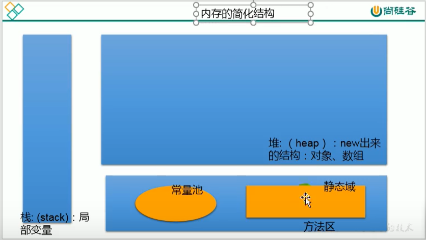

# day03 数组

## 数组的特点

* 数组属于引用数据类型，
* 创建数组的对象会在内存中开辟一整块连续的空间
* 数组的长度一旦确定，就不能修改

## 数组的声明

```java
public class StringStudy {
    public static void main(String[] args){
        // 1.静态初始化：数组初始化和数组的赋值操作同时进行
        int[] ids;
        ids = new int[]{1001,1002,1003};
        // 2.动态初始化：数组的初始化和数组元素的赋值操作分开进行
        String[] name = new String[5]; 
        // 3.其他奇怪的正确写法：
        String name1[] = new String[5]; 
        int[] ids2 = {1001,1002,1003};//类型推断。换行时不能省略
    }
}
```

## 一维数组的默认初始化

```java
public class StringStudy {
    public static void main(String[] args){
        String[] arr = new String[3];
        System.out.println(arr); //[I@279f2327
    }
}
```

## 一维数组元素的默认初始化

* 数组元素是整型：0
* 数组元素是浮点型：0.0
* 数组元素是char型：0或'\u0000',而非'0'
* 数组boolean型：false

-----------------------------

* 数组元素是引用数组类型：null

## 数组的内存结构

* 栈：存放局部变量
* 堆：new出来的结构（对象，数组）
* 方法区（常量池，静态域）

  

## 二维数组

### 1.二维数组的声明和初始化

```java
public class StringStudy {
    public static void main(String[] args){
        // 1.静态初始化
        int[][] arr1 = new int[][]{{1,2,3},{4,5},{6,7,8}};
        // 2.动态初始化1
        String[][] arr2 = new String[3][2];
        // 3.动态初始化2
        String[][] arr3 = new String[3][];
        // 4.其他奇怪的正确写法：
        String arr4[][] = new String[3][];
        String[] arr5[] = new String[3][];
        int[][] arr6 = {{1,2,3},{4,5},{6,7,8}};//类型推断
        String arr7[][]={{"123"},{"123"},{"123"}};//类型推断
    }
}
```

### 2.二维数组元素的调用

```java
public class StringStudy {
    public static void main(String[] args){
        String[][] arr3 = new String[3][];
        System.out.println(arr3[1][0]); //会报错
    }
}
```

### 3.二维数组元素的默认初始化

```java
public class StringStudy {
    public static void main(String[] args){
        int[][] arr = new int[4][3];
        System.out.println(arr); //[[I@279f2327
        System.out.println(arr[0]); // [I@2ff4acd0
        System.out.println(arr[0][0]); //0

        int[][] arr2 = new int[4][];
        System.out.println(arr2); //[[I@54bedef2
        System.out.println(arr2[0]); //null
        System.out.println(arr2[0][0]); //报错

        int[][] arr1 = new int[][]{{1,2,3},{4,5},{6,7,8}};
        System.out.println(arr1); //[[I@27716f4
        System.out.println(arr1[0]); // [I@8efb846
        System.out.println(arr1[0][0]); //1
    }
}
```

### 4.二维数组例题

创建一个长度为6的int型数组，要求数组元素的值都在1-30之间，且是随机赋值。同时要求元素的值各不相同。

* 方法1

```java
int[] arr4=new int[6];
label:for(int i=0;i<arr4.length;i++){
    int a=(int)(Math.random()*6+1);
    for(int j=0;j<arr4.length;j++){
        if(arr4[j]==a){
            i--;
            continue label;
        }
    }
    arr4[i]=a;
    System.out.println(arr4[i]);
}
```

* 方法2

```java
int[] arr5 = new int[50000];
for (int i = 0; i < arr5.length; i++) {
    arr5[i] = i + 1;
}
int[] arr6 = new int[50000];
for(int i=0;i<arr6.length;i++){
    reverse(arr5);//将数组降序排序
    int a=(int)(Math.random()*(arr5.length-i));
    arr6[i]=arr5[a];
    arr5[a]=0;
}
```
