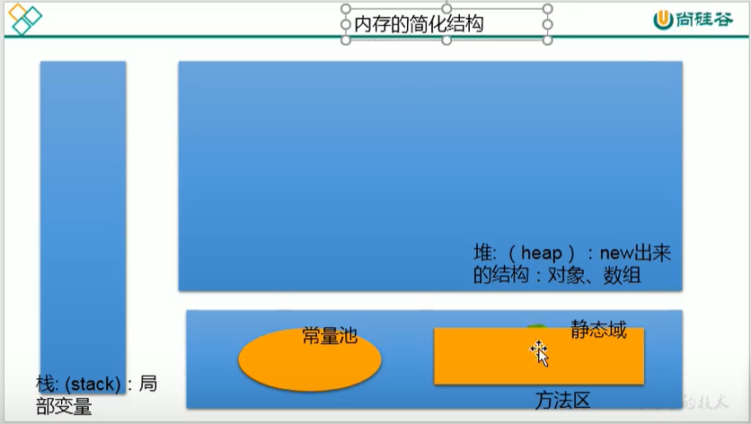

# day03 数组

## 一、一维数组

### 1.数组的特点

* 数组属于引用数据类型，
* 创建数组的对象会在内存中开辟一整块连续的空间
* 数组的长度一旦确定，就不能修改

### 2.数组的声明

```java
public class StringStudy {
    public static void main(String[] args){
        // 1.静态初始化：数组初始化和数组的赋值操作同时进行
        int[] ids;
        ids = new int[]{1001,1002,1003};
        // 2.动态初始化：数组的初始化和数组元素的赋值操作分开进行
        String[] name = new String[5]; 
        // 3.其他奇怪的正确写法：
        String name1[] = new String[5]; 
        int[] ids2 = {1001,1002,1003};//类型推断。换行时不能省略
    }
}
```

### 3.一维数组的默认初始化

```java
public class StringStudy {
    public static void main(String[] args){
        String[] arr = new String[3];
        System.out.println(arr); //[I@279f2327
    }
}
```

==**特别的**==
char[\]的println方法与其他数组的println方法不是同一个（重载），char[]的println输出的是拼接的char，而不是地址值

```java
public class StringStudy {
    public static void main(String[] args){
        char[] arr = new char[]{'A','b','c'};
        System.out.println(arr); //Abc
    }
}
```

### 4.一维数组元素的默认初始化

* 数组元素是整型：0
* 数组元素是浮点型：0.0
* 数组元素是char型：0或'\u0000',而非'0'
* 数组boolean型：false

-----------------------------

* 数组元素是引用数组类型：null

## 二、数组的内存结构

* 栈：存放局部变量
* 堆：new出来的结构（对象，数组）
* 方法区（常量池，静态域）

  

## 三、二维数组

### 1.二维数组的声明和初始化

```java
public class StringStudy {
    public static void main(String[] args){
        // 1.静态初始化
        int[][] arr1 = new int[][]{{1,2,3},{4,5},{6,7,8}};
        // 2.动态初始化1
        String[][] arr2 = new String[3][2];
        // 3.动态初始化2
        String[][] arr3 = new String[3][];
        // 4.其他奇怪的正确写法：
        String arr4[][] = new String[3][];
        String[] arr5[] = new String[3][];
        int[][] arr6 = {{1,2,3},{4,5},{6,7,8}};//类型推断
        String arr7[][]={{"123"},{"123"},{"123"}};//类型推断
    }
}
```

### 2.二维数组元素的调用

```java
public class StringStudy {
    public static void main(String[] args){
        String[][] arr3 = new String[3][];
        System.out.println(arr3[1][0]); //会报错
    }
}
```

### 3.二维数组元素的默认初始化

```java
public class StringStudy {
    public static void main(String[] args){
        int[][] arr = new int[4][3];
        System.out.println(arr); //[[I@279f2327
        System.out.println(arr[0]); // [I@2ff4acd0
        System.out.println(arr[0][0]); //0

        int[][] arr2 = new int[4][];
        System.out.println(arr2); //[[I@54bedef2
        System.out.println(arr2[0]); //null
        System.out.println(arr2[0][0]); //报错

        int[][] arr1 = new int[][]{{1,2,3},{4,5},{6,7,8}};
        System.out.println(arr1); //[[I@27716f4
        System.out.println(arr1[0]); // [I@8efb846
        System.out.println(arr1[0][0]); //1
    }
}
```

### 4.二维数组例题

==创建一个长度为6的int型数组，要求数组元素的值都在1-30之间，且是随机赋值。同时要求元素的值各不相同。==

* 方法1

```java
int[] arr4=new int[6];
label:for(int i=0;i<arr4.length;i++){
    int a=(int)(Math.random()*6+1);
    for(int j=0;j<arr4.length;j++){
        if(arr4[j]==a){
            i--;
            continue label;
        }
    }
    arr4[i]=a;
    System.out.println(arr4[i]);
}
```

* 方法2

```java
int[] arr5 = new int[50000];
for (int i = 0; i < arr5.length; i++) {
    arr5[i] = i + 1;
}
int[] arr6 = new int[50000];
for(int i=0;i<arr6.length;i++){
    reverse(arr5);//将数组降序排序
    int a=(int)(Math.random()*(arr5.length-i));
    arr6[i]=arr5[a];
    arr5[a]=0;
}
```

==创建一个杨辉三角==

```java
// 杨辉三角
int[][] arr3=new int[10][];
    for(int i=0;i<arr3.length;i++){
    arr3[i]=new int[(i+1)];
    for(int j=0;j<arr3[i].length;j++){
        if(j==0||j==arr3[i].length-1){
        arr3[i][j]=1;
        }else{
        arr3[i][j]=arr3[i-1][j-1] +arr3[i-1][j];
        }
        System.out.print(arr3[i][j]+" ");
    }
    System.out.println();
}
```

==快速排序==

```java
import java.util.Arrays;
// 快速排序
public class Sort {
    public static void main(String[] args) {
        // 快速排序
        int[] arr = { 5, 2, 9, 3,10, 8,2,4,20,18,14, 0, 1, 6, 7,0 };
        System.out.println(Arrays.toString(arr));
        quick_sort(arr,0,arr.length-1);
        System.out.println(Arrays.toString(arr));
    }
    public static void quick_sort(int[] arr, int start, int end) {
        if(start<end){
            int flag = start;
            int low= start;
            int high = end;
            while (true) {
                while (low < end && arr[low] - arr[flag] <= 0){low++;};
                while (high > start && arr[high] - arr[flag] >= 0){high--;};
                if (low < high) {
                    int temp = arr[low];
                    arr[low] = arr[high];
                    arr[high] = temp;
                }else{
                    break;
                }
            }
                int tmp = arr[high];
                arr[high] = arr[flag];
                arr[flag] = tmp;
                quick_sort(arr, start, high-1); // 递归调用 
                quick_sort(arr, high+1, end);
        }
    }
}
```

## 四、字符串的比较

```java
s1 = new String("abc");
s2 = new String("abc");
s1==s2;   //是 false
s1.equals(s2) //是 true    
```

* ==
判断两个变量的内存地址是否一致，即是否指向同一个对象

* equals()
判断两个变量的value是否一致，即包含的内容是否一致

```java
s1 = "abc";
s2 = "abc";
s1==s2;   //是 true
s1.equals(s2) //是 true    
```

s1\==s2的原因是：这事的s1和s2都指向常量池中的abc，是指向同一个对象，所以\==返回true

## 五、use of Arrays utility class

* boolean Arrays.equals()

```java
    int arr1[]={1,2,3,4};
    int arr2[]={1,2,3,4};
    boolean equal=Arrays.equals(arr1, arr2);
    System.out.println(equal);
```

* String Arrays.toString()

```java
    System.out.println(Arrays.toString(arr1));
```

* void Arrays.fill()

```java
    Arrays.fill(arr1, 10);
    System.out.println(Arrays.toString(arr1));
```

* void Arrays.sort()

```java
    Arrays.sort(arr2);
    System.out.println(Arrays.toString(arr2));
```

* int Arrays.binarySearch()

```java
    int arr3[]={1,2,3,4,5};
    int get=Arrays.binarySearch(arr3,4);
    int noget=Arrays.binarySearch(arr3, 17);
    System.out.println(get+" "+noget);
```

## 六、ArrayException

* ArrayIndexOutOfBoundsException

* NullPointerException

==condition 1==

```java
int[] arr1=null;
System.out.println(arr1[0]);
```

==condition 2==

```java
String[] arr={null,"AA","bb"};
System.out.println(arr[0].toString());
```
