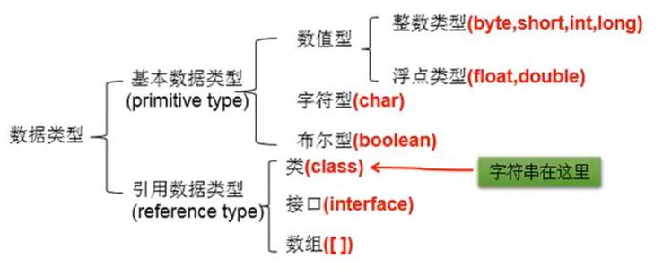
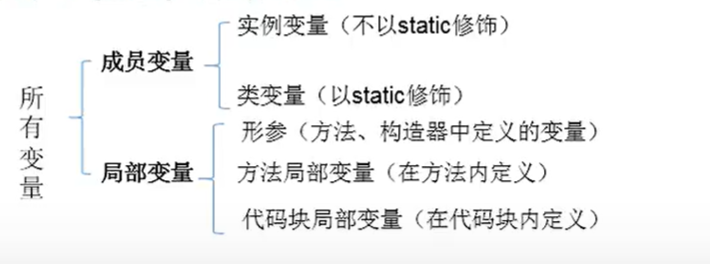
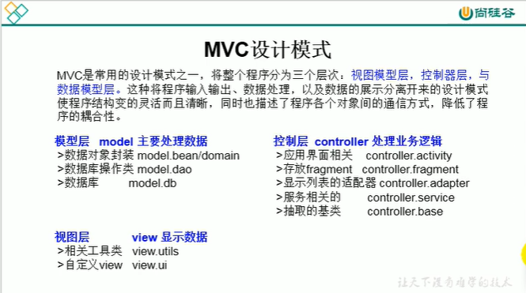

# object-oriented Programming

## 1. class & object

### the point of object-oriented Programming is designing class

### How to use?

1. create class
2. create object
3. use property or methods

```java
public class OppTest{
    public static void main(String[] args) {
        Person p1=new Person();
        p1.name="Sweety";//property
        p1.run();//method
    }
}
class Person{
    String name;
    int age;
    Boolean isMale;

    public void eat(){
        System.out.println("eat");
    }
    public void run(){
        System.out.println("run");
    }
}
```

### memory structure

==**vm stack**==

* local variable

==**pile**==

* the structure which be newed（like：Array，Object）
* the attribute of object（non-static）

==**methods area**==

* Loading information for the class
* constant pool
* static field

### anonymous object

```java
new Phone().sendEmail();
```

## 2. one of the structure of class：attribute

### differences between  atrributes and variables

* atrributes can be decorated by modifier like public,private and protected,but variables can not be.

* atrributes have initial values,but variables do not.

* Non-static properties are loaded into the heap space and variables into the stack space.

## 3.one of the structure of class ：methods

### use of methods

* can call properties and methods in current class

### classification of variables

==**by type**==

  

==**by location**==

  

### method overloading

* in same class
* methods with the same name
* different parameters
* not related to permission,return type,name of parameter variable and method content.
* preference is given to methods with a smaller range,regardless of the order of the methods.

 ==**Varargs（variable number of argument）**==

* The number of arguments could be 0~n.
* Varargs need to come last.
* a method most have one vararg.

```java
public void show(String ... strs){
}
```

* They can't coexist.

```java
public void show(String ... strs){
}
public void show(String[] strs){
}
```

## 4. one of the structure of class：constructors

* constructor can't have return type.
* the permission of  default parameterless constructor same as current class.
* If a constructor is defined,the system no longer provides the default parameterless constructor.

```java
public class Encapsulation{
    public static void main(String[] args) {
        Animal a=new Animal();
    }
}
class Animal{
    String name;
    int age;
    public Animal(){
        System.out.println("constructor");
    }
    public Animal(String n){
        name=n;
        System.out.println("constructor");
    }
    public Animal(String n,int m){
        name=n;
        age=m;
        System.out.println("constructor");
    }
}
```

### The order of initialization

default -> explicit -> constructor -> object.filed

## 5. key words

### this

* This can decorate attributes,methods,constructors.

==**attributes,methods**==

```java
public class Encapsulation{
    public static void main(String[] args) {
        Animal a=new Animal();
    }
}
class Animal{
    String name;
    int age;
    public Animal(){
        System.out.println("constructor");
    }
    public Animal(String name){
        this.name=name;
        System.out.println("constructor");
    }
}
```

==**constructors**==

```java
class Animal{
    String name;
    int age;
    public Animal(){
        System.out.println("constructor");
    }
    public Animal(String name){
        this();//must be the first statement in a constructor
        this.name=name;
    }
    public Animal(String name,int age){
        this(name);
        this.age=age;
    }
}
```

### package

### mvc

  

### import

* import java.util.*;
* java.lang can be omited.
* if using classes under the same package,can omit import.
* if using classes same name,should use all-name classes.

```java
com.atguigu.exer3.Account a1=new com.atguigu.exer3.Account();
```

* if using a subpackage,should import instead of xxx.*
* import static:import the static constructions of classes,and the class's name can be omited.

```java
import static java.lang.System.*;
import static java.lang.Math.*;
out.println("hello");//System can be omited
long num=round(112.34); //Math can be omited
```
