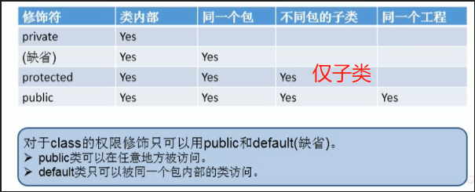
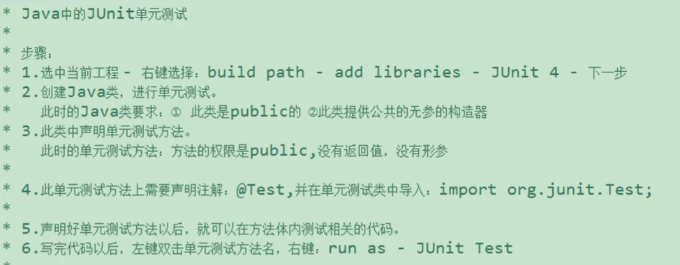
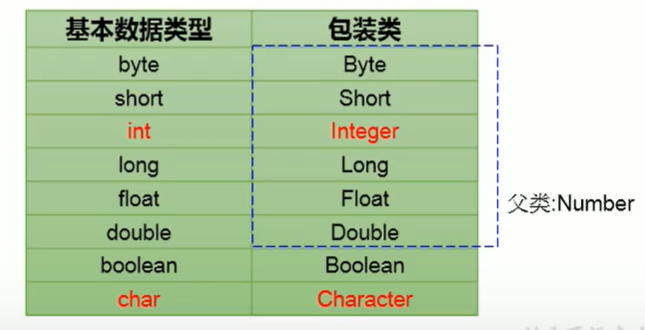

# the characteristics of object orientation

## 1. Encapsulation

### case

* private methods just can be used by other methods in same class.
* changing the number of legs must be done through the method of setLeg.

```java
public class Encapsulation{
    public static void main(String[] args) {
        Animal a=new Animal();
        a.setLeg(6);
        a.getLeg();
    }
}
class Animal{
    private int leg;
    public void setLeg(int n){
        leg=n>=0?n:0;
    }
    public int getLeg(){
        return leg;
    }
}
```

### Permissions

* private,default,protected,public

  

* **Four kind of permissions can decorate attribute,methods,constructors,inner classes**.
* **But just public and default can decorate classes**.

### JavaBean

* class is public
* have a public constructor
* have attributes with get and set methods

## 2. Succession

* subclass inherits all attributes(conclude private attribute) and methods(conclude private private methods) of its parent class.

* java.lang.Object class is all class's parent.

## 3. Ploymorphism(just methods ,no attribute)

* only the methods of superclass can be called ,but the methods of subclass are executed

```java
public class Person {
    int id=1001;
    public void walk(){
        System.out.println("走路");
    }
}
public class Student extends Person {
    int id=1002;
    public void walk() {
        System.out.println("走很多路");
    }
    public void eat() {
        System.out.println("吃很多");
    }
}
public class Test {
    public static void main(String[] args) {
        Person stu=new Student();//superclass name= new subclass()
        stu.walk();//走很多路(right)
        // stu.eat();//报错
        System.out.println(stu.id);//1001(left)
    }
}
```

### precondition

* superclass and subclass
* override methods

### exp1

```java
public class Test {
    public static void main(String[] args) {
        Test test=new Test();
        test.func(new Men());//走很多路 吃很多饭
        test.func(new Student());//走很少路  吃很少饭
    }
    public void func(Person person){
        person.walk();
        person.eat();
    }
}

public class Person {
    public void walk(){
        System.out.println("走路");
    }
    public void eat(){
        System.out.println("吃饭");
    }
}
public class Men extends Person {
    public void walk() {
        System.out.println("走很多路");
    }
    public void eat() {
        System.out.println("吃很多饭");
    }
}
public class Student extends Person {
    public void walk() {
        System.out.println("走很少路");
    }
    public void eat() {
        System.out.println("吃很少饭");
    }
}
```

### exp2

```java
class Order{
    public void method(Object obj)
}
```

### downward transition

* Men m1 = (Men)p1;
(may classCastException)

```java
public class Person {
    public void eat(){
        System.out.println("吃饭");
    }
}
public class Men extends Person {
    boolean isSmoking=true;
    public void eat() {
        System.out.println("吃很多饭");
    }
    public void work() {
        System.out.println("工作");
    }
}
public class Student extends Person {
    boolean isGreat=true;
    public void eat() {
        System.out.println("吃很少饭");
    }
     public void study() {
        System.out.println("写作业");
    }
}
public class Test {
    public static void main(String[] args) {
        Person p1=new Men();
        p1.eat();//吃很多饭
        // p1.work();//报错

        Men m1=(Men)p1;
        m1.work();//工作
        m1.isSmoking;//true

        Student s1 = (Student)p1;
        s1.study();//编译通过，执行报错
        s1.isGreat;//编译通过，执行报错
    }
}

```

* instanceof

```java
public class Person {
    public void eat(){
        System.out.println("吃饭");
    }
}
public class Men extends Person {
    boolean isSmoking=true;
    public void eat() {
        System.out.println("吃很多饭");
    }
    public void work() {
        System.out.println("工作");
    }
}
public class Student extends Person {
    public void eat() {
        System.out.println("吃很少饭");
    }
     public void study() {
        System.out.println("写作业");
    }
}
public class Test {
    public static void main(String[] args) {
        Person p1=new Men();
        p1.eat();//吃很多饭
        // p1.work();//报错

        if(p1 instanceof Men){ //true
            Men m1=(Men)p1;
            m1.work();//工作
            m1.isSmoking;//true
        }

        if(p1 instanceof Student){ //false
            Student s1 = (Student)p1;
            s1.Study();
            s1.isGreat;
        }
    }
}
```

>p1 instanceof Men;//true
p1 instanceof Person;//true
p1 instanceof Object;//true

## 4. Override/overwrite(permission bigger,error smaller)

### permission

* the permission of override methods should bigger than superclass.
* if the permission of superclass methods is private,the methods can't be overrided by subclass.

```java
// superclass
public class Person {
    public void eat(){
        System.out.println("吃饭");
    }
    private void walk(){//can't be overrided because the permission is private
        System.out.println("走路");
    }
    public void test(){
        eat();
        walk();
    }
}
// subclass
public class Student extends Person {
    public void eat(){
        System.out.println("吃很多饭");
    }
    public void walk(){
        System.out.println("走很多路");
    }
}
// test
public class Test {
    public static void main(String[] args) {
        Student stu=new Student();
        stu.test();
    }
}
// result
// 吃很多饭
// 走路
```

### return type

* if the return type of superclass is void,the subclass should be the same.
* if the return type of superclass is A,the subclass should return A or the subclass of A.
* if the return type of superclass is basic data type,the subclass should be the same.

### error type

* the error type of superclass should smaller than override methods  of subclass.

### about static

* If the methods of superclass(non-static) and the methods of subclass(no-static),then may be a override methods.

* if both static methods of superclass and subclass,it is not override.

## 5. Super

### super can call the attributes,methods and constructor of superclass

* attriute can not be cover.so the class have two attribute width same name,and need super to calling the attribute.

```java
public class Person {
    int id=100;
    String name="tian";
}
public class Student extends Person {
    int id =200;
    public void show(){
        System.out.println(this.id); //200
        System.out.println(super.id);//100(only the id of superclass is public or defualt)
        System.out.println(name);//no need super because no attribute in subclass have the same name attribute.
    }
}
public class Test {
    public static void main(String[] args) {
        Student stu=new Student();
        stu.show();
    }
}
```

* methods of superclass need to call the methods of superclass which had been overrided.

```java
public class Person {
    public void walk(){
        System.out.println("走路");
    }
}
public class Student extends Person {
    public void walk(){
        System.out.println("走很多路");
    }
    public void show(){
        this.walk(); //走很多路
        super.walk();//走路
    }
}
public class Test {
    public static void main(String[] args) {
        Student stu=new Student();
        stu.show();
    }
}
```

* super() can call the constructor of superclass

```java
public class Person {
    private String name;
    private int age;
    public Person(){

    }
    public Person(String name,int age){
        this.name=name;
        this.age=age;
    }
}
public class Student extends Person {
    String major;
    public Student(){

    }
    public Student(String name,int age,String major){
        super(name,age);//call Person(String name,int age)
        this.major=major;
    }
}
public class Test {
    public static void main(String[] args) {
        Student stu=new Student("tian",18,"computer");
    }
}
```

### Tips

* super() should on first line
* this() and  super() can just use one.
* Neither this() and super(),default a non-paramter super()

## 6. case

```java
class Base{
    public void add(int a,int... arr){
        System.out.println("Base");
    }
}
class Sub extends Base{
    public void add(int a,int[] arr){// （int[] arr） and （int... arr） override
        System.out.println("Sub1");
    }
    public void add(int a,int b,int c){
        System.out.println("Sub2");
    }
}

public class Test{
    public static void main(String[] args){
        Base base = new Sub();//多态
        base.add(1,2,3);//Sub1

        // 重载
        Sub sub = new Sub();
        base.add(1,2,3);//Sub2
    }
}
```

## 7.Object

==**order.getClass().getSuperclass()**==

```java
public class Test{
    public static void main(String[] args){
        Order order= new Order();
        SYstem.out.println(order.getClass().getSuperclass());
    }
}
class Order{

}
```

### clone

return a project

```java
Animal a1 = new Animal("小花");
Animal a2 = (Animal) a1.clone();
a2.setName("小猫");

System.out.println(a1.getName());//小花
```

* finalize
The finalize method is called before the object is collected.

### equals & ==

==**\==**==

* base type(exception boolean) compare the value of variable
* "String" can regard as base type

* reference data variable compare the address
* new String("String") is reference data variable

```java
//i==j==c==c2
int i=65;
double j=65.0;
char c=65;
char c2='A';
```
  
==**equals**==

* equals() in Object like ==(compare value)

```java
// source code
public boolean equals(Object obj){
    return (this == obj);
}
```

* equals in String,Date,File,Wrapper is overwrote,then compared by value.

### toString()

* println(obj) default call obj.toString()
* toString() in String,Date,File,Wrapper is overwrote,return value.

```java
// resource code
public String toString(){
    return getClass().getName()+"@"+Integer.toHexString(hashCode());
}
```

## 8. unitTest

  

```java
import org.junit.Test;
public vlass JUnitTest {
    @Test
    public void testEquals(){

    } 
}
```

## 9.Wrapper

  

* base type--->wrapper

```java
int num1 = 10;
Integer int1 = new Integer(num1);
System.out.println(int1.toSting());

Integer int2 = new Integer("123");
System.out.println(int2.toString());

Integer int3 = new Integer("123abc");//报错
System.out.println(int3.toString());

Boolean b1 = new Boolean(true);
System.out.println(b1);//true

Boolean b2 = new Boolean("true");
System.out.println(b2);//true

Boolean b3 = new Boolean("true123");
System.out.println(b3);//false


class Order{
    boolean isMale;
    Boolean isFemale;
}
Order order = new Order();
System.out.println(isMale);//false
System.out.println(isFemale);//null
```

* wrapper--->base type(xxxValue)

```java
Integer in1=new Integer(12);
int i1 = intValue();

Float f1 = new Float(12.3);
float f2=f1.floatValue();
```

* auto

```java
// base type--->wrapper
int num1=10;
Integer int1 = num1;

boolean b1 = true;
Boolean b2 = b1;

// wrapper--->base type
int num3 = int1;
```

## 10. base type,wrapper <--->String

* base type,wrapper --->String

```java
    // 1.
    int num1 = 10;
    String str1 = num1 + "";
    // 2.
    float f1 = 12.3f;
    String str2 = String.valueOf(f1);

```

* String ---> base type /wrapper(parseXxx)

```java
    String str1 = "123";
    int num1 =  Integer.parseInt(str1);

    boolean b1 = Boolean.parseBoolean("true");//true
    boolean b1 = Boolean.parseBoolean("true1");//false
```

## 11.InterviewTest

```java
Object o1 = true ? new Integer(1) : new Double(2.0);//new Integer(1)&new Double(2.0) will variable ascension
System.out.println(o1);//1.0

Integer i = new Integer(1);
Integer j = new Integer(1);
i==j;//false

// Integer内容定义了IntegerCache的结构，IntegerCache中定义了Integer[]（-128~127）
// -128~127,不需要再new Integer
// 如果出了这个范围，会重新new一个Integer

Interger m = 1;
Interger n = 1;
m == n;//true

Interger x = 128;
Interger y = 128;
x == y;//false

Vector vector=new Vector<>();
vector.addElement(123);//123自动装箱为Integer+多态
Object obj = vector.elementAt(0);
// int score = (int) obj;//强转为int
int score = (Integer) obj;//强转为Integer+自动拆箱
System.out.println(score-100);
```
