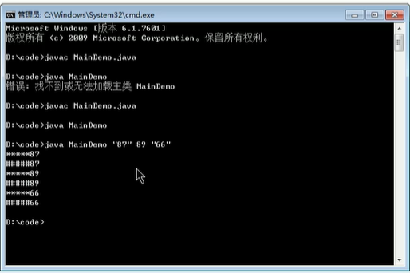

# OOP

## 1. static

==**可以修饰：属性，方法，代码块，内部类**==

### 使用static修饰属性：静态变量（或类变量）

* 创建了类的多个对象，多个对象共享同一个对象。
* 静态变量随着类的加载而加载。（早于对象创建）
* 由于类只会加载一次，则静态变量在内存中也只会存在一份，存在方法区的静态域中。
* 使用场景：1.属性是共享的，2.常量

```java
public class StaticPerson{
    public static void main(String[] args) {
        Chinese c1=new Chinese();
        Chinese c2=new Chinese();
        c1.nation="China";
        System.out.println(c2.nation);//China
    }
}
class Chinese{
    public static String nation;
    String name;
    int age;
}
```

```java
public class StaticPerson{
    public static void main(String[] args) {
        Chinese.nation="China";
    }
}
class Chinese{
    public static String nation;
}
```

### 使用static修饰方法

* 静态方法中，只能调用静态方法或属性
* 非静态方法中，可以调用静态和非静态属性。
* 在静态方法中，不能使用this和super关键字。
* 什么时候使用：1.操作静态属性的方法，2.工具类中的方法

```java
public class StaticPerson{
    public static void main(String[] args) {
        Chinese.show();
    }
}
class Chinese{
    public static nation;
    public static void show(){
        System.out.println(nation);//省略的是Chinese.nation
    }
}
```

## 2. 单例设计模式

* 饿汉式

```java
public class Singleton {
    public static void main(String[] args) {
        Bank bank1 = Bank.getInstance();
        Bank bank2 = Bank.getInstance();
        System.out.println(bank1==bank2);//true
    }
}
class Bank{
    // 1.构造器私有化
    private Bank(){

    }
    // 2.内部创建类的对象
    private static Bank instance = new Bank();
    // 3.提供公共的方法，返回类的对象
    public static Bank getInstance(){
        return instance;
    }
}
```

* 懒汉式(暂时不安全)

```java
public class SingletonTest {
    public static void main(String[] args) {
        Order order1 = Order.getInstance();
        Order order2 = Order.getInstance();
        System.out.println(order1 == order2); //true
    }
}

class Order {
    // 1.私有化构造器
    private Order() {

    }

    // 2.声明当前对象，没有初始化
    private static Order instance = null;

    // 3.返回类对象
    public static Order getInstance() {
        if (instance == null) {
            instance = new Order();
        }
        return instance;
    }
}
```

### 应用场景

* 网站的计数器
* 应用程序的日志应用
* 数据库连接池
* 读取配置文件的类
* Application 也是单例的典型应用
* windows的任务管理器
* 回收站

## 3. main方法的理解

* main() 方法作为程序的入口
* 也是一个普通的静态方法
* main方法的形参也可以作为与控制台交互的方式

```java
public class MainDemo {
    public static void main(String[] args) {//setConfigure中可以设置该参数
        for(int i=0;i<args.length;i++){
            System.out.println(args[i]);
        }
    }
}
```

  

## 4. 代码块（初始化块）

* 1.作用：用来初始化类、对象
* 2.代码块如果有修饰的话只能是static
* 3.代码块分为：静态代码块和非静态代码块
* 4.代码块中可以输出语句

### 静态代码块

* 随着类的加载而执行（只执行一次）
* 多个静态代码块，按照声明的先后顺序执行
* 只能使用静态方法和属性
* 静态属性赋值顺序 ==**默认赋值->显示赋值/静态代码块(按先后顺序)->类.属性/类.方法**==

### 非静态代码块

* 随着对象的创建而执行
* 每创建一个对象就执行一次
* 作用：可以在创建对象时，对对象的属性进行初始化
* 普通属性赋值顺序 ==**默认赋值->显式赋值/非静态代码块(按先后顺序)->构造器->对象.属性/对象.方法**==
* 多个非静态代码块，按照声明的先后顺序执行
* 可以使用静态方法和属性或者非静态方法和属性

### 加载顺序

* 父静态代码块 --> 中静态代码块 --> 子静态代码块
* main方法
* 父代码块 父无参构造器 --> 中代码块 中无参构造器 --> 子代码块 子无参构造器

## 5. final

==**final 可以用来修饰的结构：类、方法、变量**==

* final类不能被继承，如：String类，system类，StringBuffer类
* final方法不能被重写，例如：Object.getClass();
* final变量就是一个常量了
  * 修饰属性可以赋值的位置有：显式初始化，代码块中赋值，构造器中赋值
  * 修饰局部变量，1.常量形参 2.方法中常量

```java
public class FinalTest {
    final int FIRST = 0;// 显式赋值，每个对象的属性值都一样
    final int SECOND;
    {
        SECOND=2;//每个对象的属性值都一样，但是赋值需要调用多行方法
    }

    final int THIRD;
    public FinalTest(){
        THIRD=1;
    }
    public FinalTest(int n){//每个对象的属性值不一样
        THIRD=n;
    }
}
```

> **1.static final只能修饰属性和方法**
属性：全局常量
方法：不能重写的static方法
**2.native代表要调用底层c，c++的东西了**

## 6. abstract

==**可以修饰：类、方法**==

### 修饰类（抽象类）

* 抽象类不能实例化（造对象）
* 抽象类中仍然有构造器，便于子类实例化时调用
* 开发中，都会提供抽象类的子类，子类对象实例化完成相关操作

### 修饰方法（抽象方法）

* 只有方法的声明，没有方法体
* 包含抽象方法的类一定是一个抽象类
* 非抽象子类需要重写父类中所有的抽象方法

```java
abstract class Person{
    String name;
    int age;
    public Person(){

    }
    public abstract void eat();
}
class Student extends Person{
    public void eat(){
        System.out.println("tian");
    }
}
```

* abstract（需要重写或继承）：所以不能用来修饰私有化方法，静态方法，final方法，final的类

## 7. 抽象类的匿名子类

```java
class AbstractTest{
    public static void main(String[] args) {
        Person p=new Person(){
            public void eat(){
                System.out.println("吃东西");
            }
        };
    }
}
abstract class Person{
    public abstract void eat();
}
```

## 8. 模板方法设计模式

```java
public class TemplateTest {
    public static void main(String[] args) {
        SubTemplate sub = new SubTemplate();
        sub.spendTime();
    }
}

abstract class Template {
    public void spendTime() {
        long start = System.currentTimeMillis();
        this.code();
        long end = System.currentTimeMillis();
        System.out.println("time:" + (end - start));
    }

    public abstract void code();
}

class SubTemplate extends Template {

    @Override
    public void code() {
        for (int i = 0; i < 100; i++) {
            System.out.println(i);
        }
    }
}
```

## 9. 接口

> * 由于java不支持多继承，但有时需要从多个类中派生出一个子类，所以有了接口，可以达到多重继承的效果
> * 一个类可以实现多个接口
有时必须从多个类中提取相同的特征，而且他们之间并没有is-a的关系，仅仅是有相同的行为特征，比如：鼠标，键盘，打印机，手机等都支持usb连接
> * 接口实际上可以看做是一种规范
> * 接口的具体使用，体现多态性
接口和抽象类都態实例化，那么如果方法的形参是抽象类或者声明成一个接口，那么传实参就必须要用多态了

```java
public class InterfaceTest {
    public static void main(String[] args) {
        InterfaceTest test=new InterfaceTest();
        Flyable flyable= new Bullet();
        test.method(flyable);
    }
    public void method(Flyable flyable){
        flyable.fly();
    }
}
interface Flyable{
    // 全局常量
    public static final int MAX_SPEED=7900;
    int MIN_SPEED=1;//书写时public static final可以省略,但其实仍然存在

    // 抽象方法
    public abstract void fly();
    void stop();//public abstract 可以省略，但其实仍然存在
}
interface Attackable{
    void attack();
}
class Bullet implements Flyable,Attackable{

    @Override
    public void fly() {
        System.out.println("飞");
    }

    @Override
    public void stop() {
        System.out.println("停");
    }

    @Override
    public void attack() {
        System.out.println("攻击");
    }
}
```

* 使用interface来定义
* java中接口和类是并列的两个结构

### 如何定义接口：定义接口的成员

* JDK7：==**只能定义全局常量和抽象方法**==
* JDK8：除了定义全局常量和抽象方法之外，还可以定义静态方法、默认方法

#### 定义接口

* 全局常量：public static final
* 抽象方法：public abstract的

```java
interface Flyable{
    // 全局常量
    public static final int MAX_SPEED=7900;
    int MIN_SPEED=1;//书写时public static final可以省略,但其实仍然存在

    // 抽象方法
    public abstract void fly();
    void stop();//public abstract 可以省略，但其实仍然存在
}
```

#### 实现接口

* 接口不能定义构造器，所以接口不能实例化
* java开发中，接口通过让类实现（implements）接口
如果实现类覆盖了接口中的所有抽象方法，则实现类才可以实例化，否则，此实现类仍然为一个抽象类

```java
// 没有全部重写，仍然是个抽象类
abstract class Plane implements Flyable{
    @Override
    public void fly() {
        // TODO Auto-generated method stub
    }
}
```

```java
// 实现了接口中的全部抽象方法，该类就可以实例化了
public class InterfaceTest {
    public static void main(String[] args) {
        Plane plane=new Plane();
        plane.fly();
    }
}
interface Flyable{
    // 全局常量
    public static final int MAX_SPEED=7900;
    int MIN_SPEED=1;//书写时public static final可以省略,但其实仍然存在

    // 抽象方法
    public abstract void fly();
    void stop();//public abstract 可以省略，但其实仍然存在
}
class Plane implements Flyable{

    @Override
    public void fly() {
        System.out.println("飞");
    }

    @Override
    public void stop() {
        System.out.println("停");
    }

}
```

* 一个类可以实现多个接口
格式：class AA extends BB implements CC,DD{}

```java
interface Flyable{
    // 全局常量
    public static final int MAX_SPEED=7900;
    int MIN_SPEED=1;//书写时public static final可以省略,但其实仍然存在

    // 抽象方法
    public abstract void fly();
    void stop();//public abstract 可以省略，但其实仍然存在
}
interface Attackable{
    void attack();
}
class Bullet implements Flyable,Attackable{

    @Override
    public void fly() {
        System.out.println("飞");
    }

    @Override
    public void stop() {
        System.out.println("停");
    }

    @Override
    public void attack() {
        System.out.println("攻击");
    }
}
```

#### 接口继承

* 接口可以继承
* 且可以继承多个接口

```java
interface AA{
    void method1();
}
interface BB{
    void method2();
}
interface CC extends AA,BB{
    void method3();
}
class DD implements CC{
    @Override
    public void method1() {
        // TODO Auto-generated method stub
    }
    @Override
    public void method2() {
        // TODO Auto-generated method stub
    }
    @Override
    public void method3() {
        // TODO Auto-generated method stub
    }
}
```
