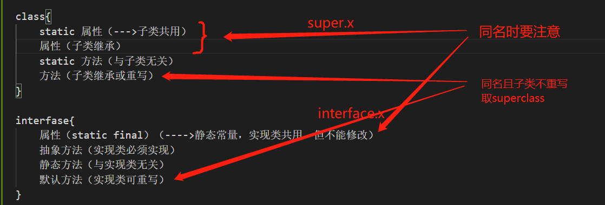

# OOP

## 1. static

==**可以修饰：属性，方法，代码块，内部类**==

### 使用static修饰属性：静态变量（或类变量）

* 创建了类的多个对象，多个对象共享同一个对象。
* 静态变量随着类的加载而加载。（早于对象创建）
* 由于类只会加载一次，则静态变量在内存中也只会存在一份，存在方法区的静态域中。
* 使用场景：1.属性是共享的，2.常量

```java
public class StaticPerson{
    public static void main(String[] args) {
        Chinese c1=new Chinese();
        Chinese c2=new Chinese();
        c1.nation="China";
        System.out.println(c2.nation);//China
    }
}
class Chinese{
    public static String nation;
    String name;
    int age;
}
```

```java
public class StaticPerson{
    public static void main(String[] args) {
        Chinese.nation="China";
    }
}
class Chinese{
    public static String nation;
}
```

### 使用static修饰方法

* 静态方法中，只能调用静态方法或属性
* 非静态方法中，可以调用静态和非静态属性。
* 在静态方法中，不能使用this和super关键字。
* 什么时候使用：1.操作静态属性的方法，2.工具类中的方法

```java
public class StaticPerson{
    public static void main(String[] args) {
        Chinese.show();
    }
}
class Chinese{
    public static nation;
    public static void show(){
        System.out.println(nation);//省略的是Chinese.nation
    }
}
```

## 2. 单例设计模式

* 饿汉式

```java
public class Singleton {
    public static void main(String[] args) {
        Bank bank1 = Bank.getInstance();
        Bank bank2 = Bank.getInstance();
        System.out.println(bank1==bank2);//true
    }
}
class Bank{
    // 1.构造器私有化
    private Bank(){

    }
    // 2.内部创建类的对象
    private static Bank instance = new Bank();
    // 3.提供公共的方法，返回类的对象
    public static Bank getInstance(){
        return instance;
    }
}
```

* 懒汉式(暂时不安全)

```java
public class SingletonTest {
    public static void main(String[] args) {
        Order order1 = Order.getInstance();
        Order order2 = Order.getInstance();
        System.out.println(order1 == order2); //true
    }
}

class Order {
    // 1.私有化构造器
    private Order() {

    }

    // 2.声明当前对象，没有初始化
    private static Order instance = null;

    // 3.返回类对象
    public static Order getInstance() {
        if (instance == null) {
            instance = new Order();
        }
        return instance;
    }
}
```

### 应用场景

* 网站的计数器
* 应用程序的日志应用
* 数据库连接池
* 读取配置文件的类
* Application 也是单例的典型应用
* windows的任务管理器
* 回收站

## 3. main方法的理解

* main() 方法作为程序的入口
* 也是一个普通的静态方法
* main方法的形参也可以作为与控制台交互的方式

```java
public class MainDemo {
    public static void main(String[] args) {//setConfigure中可以设置该参数
        for(int i=0;i<args.length;i++){
            System.out.println(args[i]);
        }
    }
}
```

  

## 4. 代码块（初始化块）

* 1.作用：用来初始化类、对象
* 2.代码块如果有修饰的话只能是static
* 3.代码块分为：静态代码块和非静态代码块
* 4.代码块中可以输出语句

### 静态代码块

* 随着类的加载而执行（只执行一次）
* 多个静态代码块，按照声明的先后顺序执行
* 只能使用静态方法和属性
* 静态属性赋值顺序 ==**默认赋值->显示赋值/静态代码块(按先后顺序)->类.属性/类.方法**==

### 非静态代码块

* 随着对象的创建而执行
* 每创建一个对象就执行一次
* 作用：可以在创建对象时，对对象的属性进行初始化
* 普通属性赋值顺序 ==**默认赋值->显式赋值/非静态代码块(按先后顺序)->构造器->对象.属性/对象.方法**==
* 多个非静态代码块，按照声明的先后顺序执行
* 可以使用静态方法和属性或者非静态方法和属性

### 加载顺序

* 父静态代码块 --> 中静态代码块 --> 子静态代码块
* main方法
* 父代码块 父无参构造器 --> 中代码块 中无参构造器 --> 子代码块 子无参构造器

## 5. final

==**final 可以用来修饰的结构：类、方法、变量**==

* final类不能被继承，如：String类，system类，StringBuffer类
* final方法不能被重写，例如：Object.getClass();
* final变量就是一个常量了
  * 修饰属性可以赋值的位置有：显式初始化，代码块中赋值，构造器中赋值
  * 修饰局部变量，1.常量形参 2.方法中常量

```java
public class FinalTest {
    final int FIRST = 0;// 显式赋值，每个对象的属性值都一样
    final int SECOND;
    {
        SECOND=2;//每个对象的属性值都一样，但是赋值需要调用多行方法
    }

    final int THIRD;
    public FinalTest(){
        THIRD=1;
    }
    public FinalTest(int n){//每个对象的属性值不一样
        THIRD=n;
    }
}
```

> **1.static final只能修饰属性和方法**
属性：全局常量
方法：不能重写的static方法
**2.native代表要调用底层c，c++的东西了**

## 6. abstract

==**可以修饰：类、方法**==

### 修饰类（抽象类）

* 抽象类不能实例化（造对象）
* 抽象类中仍然有构造器，便于子类实例化时调用
* 开发中，都会提供抽象类的子类，子类对象实例化完成相关操作

### 修饰方法（抽象方法）

* 只有方法的声明，没有方法体
* 包含抽象方法的类一定是一个抽象类
* 非抽象子类需要重写父类中所有的抽象方法

```java
abstract class Person{
    String name;
    int age;
    public Person(){

    }
    public abstract void eat();
}
class Student extends Person{
    public void eat(){
        System.out.println("tian");
    }
}
```

* abstract（需要重写或继承）：所以不能用来修饰私有化方法，静态方法，final方法，final的类

## 7. 抽象类的匿名子类

```java
class AbstractTest{
    public static void main(String[] args) {
        Person p=new Person(){
            public void eat(){
                System.out.println("吃东西");
            }
        };
    }
}
abstract class Person{
    public abstract void eat();
}
```

## 8. 模板方法设计模式

```java
public class TemplateTest {
    public static void main(String[] args) {
        SubTemplate sub = new SubTemplate();
        sub.spendTime();
    }
}

abstract class Template {
    public void spendTime() {
        long start = System.currentTimeMillis();
        this.code();
        long end = System.currentTimeMillis();
        System.out.println("time:" + (end - start));
    }

    public abstract void code();
}

class SubTemplate extends Template {

    @Override
    public void code() {
        for (int i = 0; i < 100; i++) {
            System.out.println(i);
        }
    }
}
```

## 9. 接口

> * 由于java不支持多继承，但有时需要从多个类中派生出一个子类，所以有了接口，可以达到多重继承的效果
> * 一个类可以实现多个接口
有时必须从多个类中提取相同的特征，而且他们之间并没有is-a的关系，仅仅是有相同的行为特征，比如：鼠标，键盘，打印机，手机等都支持usb连接
> * 接口实际上可以看做是一种规范
> * 接口的具体使用，体现多态性
接口和抽象类都態实例化，那么如果方法的形参是抽象类或者声明成一个接口，那么传实参就必须要用多态了

```java
public class InterfaceTest {
    public static void main(String[] args) {
        InterfaceTest test=new InterfaceTest();
        Flyable flyable= new Bullet();
        test.method(flyable);
    }
    public void method(Flyable flyable){
        flyable.fly();
    }
}
interface Flyable{
    // 全局常量
    public static final int MAX_SPEED=7900;
    int MIN_SPEED=1;//书写时public static final可以省略,但其实仍然存在

    // 抽象方法
    public abstract void fly();
    void stop();//public abstract 可以省略，但其实仍然存在
}
interface Attackable{
    void attack();
}
class Bullet implements Flyable,Attackable{

    @Override
    public void fly() {
        System.out.println("飞");
    }

    @Override
    public void stop() {
        System.out.println("停");
    }

    @Override
    public void attack() {
        System.out.println("攻击");
    }
}
```

* 使用interface来定义
* java中接口和类是并列的两个结构

### ==**JDK7：只能定义全局常量和抽象方法**==

#### 定义接口

* 全局常量：public static final
* 抽象方法：public abstract的

```java
interface Flyable{
    // 全局常量
    public static final int MAX_SPEED=7900;
    int MIN_SPEED=1;//书写时public static final可以省略,但其实仍然存在

    // 抽象方法
    public abstract void fly();
    void stop();//public abstract 可以省略，但其实仍然存在
}
```

#### 实现接口

* 接口不能定义构造器，所以接口不能实例化
* java开发中，接口通过让类实现（implements）接口
如果实现类覆盖了接口中的所有抽象方法，则实现类才可以实例化，否则，此实现类仍然为一个抽象类

```java
// 没有全部重写，仍然是个抽象类
abstract class Plane implements Flyable{
    @Override
    public void fly() {
        // TODO Auto-generated method stub
    }
}
```

```java
// 实现了接口中的全部抽象方法，该类就可以实例化了
public class InterfaceTest {
    public static void main(String[] args) {
        Plane plane=new Plane();
        plane.fly();
    }
}
interface Flyable{
    // 全局常量
    public static final int MAX_SPEED=7900;
    int MIN_SPEED=1;//书写时public static final可以省略,但其实仍然存在

    // 抽象方法
    public abstract void fly();
    void stop();//public abstract 可以省略，但其实仍然存在
}
class Plane implements Flyable{

    @Override
    public void fly() {
        System.out.println("飞");
    }

    @Override
    public void stop() {
        System.out.println("停");
    }

}
```

* 一个类可以实现多个接口
格式：class AA extends BB implements CC,DD{}

```java
interface Flyable{
    // 全局常量
    public static final int MAX_SPEED=7900;
    int MIN_SPEED=1;//书写时public static final可以省略,但其实仍然存在

    // 抽象方法
    public abstract void fly();
    void stop();//public abstract 可以省略，但其实仍然存在
}
interface Attackable{
    void attack();
}
class Bullet implements Flyable,Attackable{

    @Override
    public void fly() {
        System.out.println("飞");
    }

    @Override
    public void stop() {
        System.out.println("停");
    }

    @Override
    public void attack() {
        System.out.println("攻击");
    }
}
```

#### 接口继承

* 接口可以继承
* 且可以继承多个接口

```java
interface AA{
    void method1();
}
interface BB{
    void method2();
}
interface CC extends AA,BB{
    void method3();
}
class DD implements CC{
    @Override
    public void method1() {
        // TODO Auto-generated method stub
    }
    @Override
    public void method2() {
        // TODO Auto-generated method stub
    }
    @Override
    public void method3() {
        // TODO Auto-generated method stub
    }
}
```

#### 父类与接口中属性的重名问题

```java
interface A{
    int x = 0;
}
class B {
    int x = 1;
}
class C extends B implements A{
    public void fun(){
        System.out.println(x);  //报错，x不能确定
        System.out.println(A.x);//0 且A.x不能修改
        System.out.println(super.x);//1
    }
    public static void main(String[] args){
        new C().fun();
    }
}
```

C中会出现两个级别相同的x（一个是public static void int x，另个是int x），所以不能确定是哪个x

### ==**JDK8：除了定义全局常量和抽象方法之外，还可以定义静态方法、默认方法**==

* 静态方法(只能通过接口调用) ：public static
* 默认方法（通过实现类的对象调用，且可以重写）：（public）default

```java

public class InterfaceTest8 {
    public static void main(String[] args) {
        CompareA.method();//compareA--01
        SubClass.method();//subclass--01(这里不是重写，而是另外一个方法)
        SubClass s=new SubClass();
        s.method2();//subclass--02
        s.method3();//compareA--03
    }
}

interface CompareA{
    // 静态方法
    public static void method(){
        System.out.println("compareA--01");
    }
    // 默认方法 这里的default不能省略
    public default void method2(){
        System.out.println("compareA--02");
    }
    // 默认方法 public可以省略
    default void method3(){
        System.out.println("compareA--03");
    }

}

class SubClass implements CompareA{
    public static void method(){
        System.out.println("subclass--01");
    }
    public void method2(){
        System.out.println("subclass--02");
    }
}
```

#### 父类与接口中出现同名方法的问题

* 类优先原则（仅针对于方法）：如果子类（或实现类）继承的父类和实现的接口中声明了同名同参数的方法，且子类没有重写，则调用的是父类中的同名同参数方法

* 实现多个接口，且多个接口中有同名默认方法，会报错，所以实现类必须重写该默认方法

```java
public void mymethod(){
    method();//调用自己定义的重写方法
    super.method();//调用的是父类声明的方法
    CompareA.super.method();//调用的是CompareA中的method方法
    CompareB.super.method();//调用的是CompareB中的method方法
}
```

  

### demo

```java
public class  Demo{
    public static void main(String[] args) {
        Demo demo=new Demo();

        // 方法1
        Printer printer = new Printer();
        demo.func(printer);

        // 方法2
        demo.func(new Printer());

        // 方法3
        USB usb=new USB(){
            @Override
            public void start() {
                System.out.println("匿名实现类 start");
            }
            @Override
            public void stop() {
                System.out.println("匿名实现类 stop");
            }
        };
        demo.func(usb);

        // 方法4
        demo.func(new USB(){
            @Override
            public void start() {
                System.out.println("匿名实现类 start");
            }
            @Override
            public void stop() {
                System.out.println("匿名实现类 stop");
            }
        });

    }
    public void func(USB usb){
        usb.start();
        usb.stop();
    }
}

interface USB{
    public void start();
    public void stop();
}

class Printer implements USB{

    @Override
    public void start() {
        System.out.println("printer start");
    }

    @Override
    public void stop() {
        System.out.println("printer stop");
    }

}
```

### 接口与抽象类的共同点和区别

* 共同点
  * 不能实例化
  * 都可以定义抽象方法
* 不用点
  * 抽象类有构造器，接口没有构造器
  * 抽象类单继承，接口多继承

## 10. 设计模式之代理模式

```java
public class NetWorkTest {
    public static void main(String[] args) {
        Servers servers=new Servers();
        ProxyServer proxyServer=new ProxyServer(servers);
        proxyServer.browse();// 联网前的检查工作// 真实服务器联网
    }
}

interface NetWork{
    public void browse();
}

class Servers implements NetWork{
    @Override
    public void browse() {
       System.out.println("真实服务器联网");
    }
}

class ProxyServer implements NetWork{
    private NetWork work;
    public ProxyServer(NetWork work){
        this.work=work;
    }
    @Override
    public void browse() {
        check();
        work.browse();
    }
    public void check(){
        System.out.println("联网前的检查工作");
    }
}
```

* 应用场景：1.安全代理，2.远程代理，3.延迟加载
* 分类：静态代理，动态代理

## 11. 设计模式之工厂模式

> 实现创建者与调用者分离，即将创建对象的具体过程屏蔽隔离起来，达到提高灵活性的目的。

### 分类

* 简单工厂模式
* 工厂方法模式
* 抽象工厂模式

### 简单工厂模式

* 方法1

```java

class CarFactory {
    public static Car getCar(String type){
        if("奥迪".equals(type)){
            return new Audi();
        }else if("BYD".equals(type)){
            return new BYD();
        }else{
            return null;
        }
    }
}
interface Car{
    void run();
}
class Audi implements Car{

    @Override
    public void run() {
       System.out.println("奥迪在跑");
    }

}
class BYD implements Car{

    @Override
    public void run() {
        System.out.println("比亚迪在跑");
    }

}
```

* 方法2

```java

class CarFactory {
    public static Car getAudi(){
        return new Audi();
    }
    public static Car BYD(){
        return new BYD();
    }

}
interface Car{
    void run();
}
class Audi implements Car{

    @Override
    public void run() {
       System.out.println("奥迪在跑");
    }

}
class BYD implements Car{

    @Override
    public void run() {
        System.out.println("比亚迪在跑");
    }

}
```

缺点：对于新增加产品，不修改代码的话，是无法扩展的，违背了开闭原则（对扩展开放，对修改封闭）

### 工厂方法模式

```java
class CarFactory2 {
    public static void main(String[] args) {
        Car a = new AudiFactory().getCar();
        Car b = new BYDFactory().getCar();
        a.run();
        b.run();
    }
}

interface Car {
    void run();
}

class Audi implements Car {

    @Override
    public void run() {
        System.out.println("奥迪在跑");
    }

}

class BYD implements Car {

    @Override
    public void run() {
        System.out.println("比亚迪在跑");
    }

}

// 工厂接口
interface Factory {
    Car getCar();
}

// 两个工厂类
class AudiFactory implements Factory {

    @Override
    public Car getCar() {
        return new Audi();
    }

}

class BYDFactory implements Factory {

    @Override
    public Car getCar() {
        return new BYD();
    }

}
```

## 12. 内部类

1. java中允许将一个类声明再另一个类中
2. 分类：成员内部类（静态，非静态） vs 局部内部类（方法内，代码块内，构造器内）
3. 作用
    * 作为外部类的成员
        * 调用外部类的结构
        * 可以被static修饰
        * 可以被四种不同的权限修饰
    * 作为一个类：
        * 可以定义属性，方法，构造器，
        * 可以继承
        * 可以被final修饰
        * 可以被abstract修饰

    ```java

    class Person3 {
        // 成员内部类----静态
        static class Head{

        }
        // 成员内部类----非静态
        class Foot{

        }
        // 局部内部类----方法中
        public void method() {
            class AA {

            }
        }

        // 局部内部类----代码块中
        {
            class BB {

            }
        }

        // 局部内部类----构造器中
        public Person3() {
            class CC{

            }
        }
    }
    ```

4. 注意的问题
    * 如何实例化内部类的对象

    ```java
    // 静态内部类的实例化 
    Person.Head head = new Person.Head();
    // 非静态内部类的实现
    Person p = new Person();
    Person.Foot foot = p.new Foot();
    foot.walk();
    ```

    * 如何在成员内部类中区分调用外部类的结构

    ```java
    // 1.方法
    // 外部类中有eat方法
    // 成员内部类----非静态
    class Foot{
        public void walk(){
            // this 指的是Foot的对象
            System.out.println("走路");
            Person.this.eat();//可以省略 Person.this.指的是 Person类的对象的this
        }
    }
    // 2.属性
    //若外部类有name，内部类属性有name，形参也是name时
    System.out.println(name);//形参
    System.out.println(this.name);//内部类属性
    System.out.println(Person.this.name);//外部类的对象的属性
    ```

    * 开发中局部类的使用

    ```java
    public class InnerClassTest1 {
    
        // 少见
        public void method(){
            // 局部内部类
            class AA{

            }
        }

        // 常见
        // 返回一个实现了Comparable接口的类
        public Comparable getComparable(){
            class MyComparable implements Comparable{

                @Override
                public int compareTo(Object o) {
                    return 0;
                }

            }
            return new MyComparable();
        }
    }
    ```
